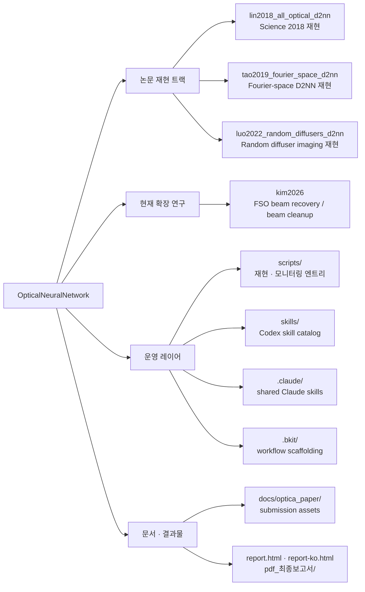

# OpticalNeuralNetwork

> Optical Neural Network 재현, 확장 연구, 보고서 생성, 에이전트 운영 레이어를 한 저장소에 묶은 D2NN/FD2NN monorepo입니다.
> 이 루트 README는 전체 지도를 제공합니다. 세부 실행 계약, CLI, 입출력 규약은 각 하위 README가 정본입니다.

## Repository Atlas



## 어디서 시작할까

| 목적 | 먼저 읽을 문서 | 이어서 볼 것 |
| --- | --- | --- |
| 최신 FSO/D2NN 빔 복원 실험을 따라가고 싶다 | [kim2026/README.md](kim2026/README.md) | `kim2026/docs/`, `kim2026/autoresearch/`, [scripts/README.md](scripts/README.md) |
| 고전 all-optical D2NN 분류/이미징부터 보고 싶다 | [lin2018_all_optical_d2nn/README.md](lin2018_all_optical_d2nn/README.md) | `configs/`, `scripts/`, `figures/` |
| Fourier-space D2NN 분류/살리언시를 재현하고 싶다 | [tao2019_fourier_space_d2nn/README.md](tao2019_fourier_space_d2nn/README.md) | `src/tao2019_fd2nn/config/`, `scripts/`, `runs/` |
| Random diffuser 기반 이미징 실험을 보고 싶다 | [luo2022_random_diffusers_d2nn/README.md](luo2022_random_diffusers_d2nn/README.md) | `configs/`, `scripts/`, `analysis/` |
| 루트에서 재현/모니터링 엔트리만 빠르게 알고 싶다 | [scripts/README.md](scripts/README.md) | `./scripts/reproduce_experiments.sh`, `./scripts/monitor_training.sh` |
| Codex/Claude skill 및 agent 구조를 이해하고 싶다 | [skills/README.md](skills/README.md) | [.claude/skills/](.claude/skills/), [.bkit/README.md](.bkit/README.md) |

## 연구 트랙 비교

| 트랙 | 핵심 질문 | 대표 진입점 | 대표 산출물 | 다음 문서 |
| --- | --- | --- | --- | --- |
| [lin2018_all_optical_d2nn](lin2018_all_optical_d2nn/README.md) | 고전 D2NN이 분류기와 이미저로 어떻게 동작하는가 | `d2nn.cli.train_classifier`, `d2nn.cli.train_imager`, heightmap export 스크립트 | 체크포인트, 광학 height map/STL, 재현 figure | [lin2018_all_optical_d2nn/README.md](lin2018_all_optical_d2nn/README.md) |
| [tao2019_fourier_space_d2nn](tao2019_fourier_space_d2nn/README.md) | Fourier plane 학습이 분류·saliency·co-saliency에 어떻게 쓰이는가 | `tao2019_fd2nn.cli.*`, 민감도/재현 스크립트 | 분류 성능, saliency map, figure/video 아티팩트 | [tao2019_fourier_space_d2nn/README.md](tao2019_fourier_space_d2nn/README.md) |
| [luo2022_random_diffusers_d2nn](luo2022_random_diffusers_d2nn/README.md) | Random diffuser와 전송행렬 기반 이미징을 어떻게 재구성하는가 | 학습·평가·figure regeneration 스크립트, bundle 비교 도구 | 복원 영상, 정량 지표, 분석 문서 | [luo2022_random_diffusers_d2nn/README.md](luo2022_random_diffusers_d2nn/README.md) |
| [kim2026](kim2026/README.md) | 난류 FSO 환경에서 D2NN/F-D2NN이 beam cleanup과 focal-plane recovery를 얼마나 수행하는가 | `./scripts/reproduce_experiments.sh`, `kim2026.cli.*`, `kim2026/autoresearch/` | run registry, 논문 figure, 보고서, 비교 sweep | [kim2026/README.md](kim2026/README.md) |

## 운영 레이어

- [scripts/README.md](scripts/README.md): 저장소 루트에서 실험 재현과 훈련 모니터링을 시작하는 운영 엔트리입니다. 현재는 `reproduce_experiments.sh`, `monitor_training.sh`가 대표 창구입니다.
- [skills/README.md](skills/README.md): 이 저장소에 특화된 Codex skill 카탈로그입니다. 각 skill은 `SKILL.md`, 보조 `agents/`, `scripts/`, `references/` 조합으로 구성됩니다.
- [.claude/settings.json](.claude/settings.json) 및 [.claude/skills/](.claude/skills/): Claude 계열 에이전트가 같은 저장소 문맥을 공유하도록 맞춘 portable 설정과 skill 모음입니다.
- [.bkit/README.md](.bkit/README.md): 협업 가능한 workflow/decision/checkpoint scaffold만 git에 유지하고, runtime/state 같은 실행 흔적은 로컬에 남기도록 분리한 운영 규약입니다.

## Top-Level Layout

```text
.
├── kim2026/                       # 최신 FSO / D2NN / F-D2NN beam recovery 연구
├── lin2018_all_optical_d2nn/      # Science 2018 all-optical D2NN 재현
├── tao2019_fourier_space_d2nn/    # Fourier-space D2NN 재현
├── luo2022_random_diffusers_d2nn/ # Random diffuser imaging 재현
├── scripts/                       # 루트 재현·모니터링 스크립트
├── skills/                        # Codex skill 카탈로그
├── .claude/                       # 공유 Claude 설정 및 skills
├── .bkit/                         # 공유 workflow scaffold
├── docs/optica_paper/             # Optica 제출 패키지
├── report.html / report-ko.html   # 루트 요약 보고서
├── pdf_최종보고서/                # PDF 산출물 보관
├── AGENTS.md                      # Codex/agent 작업 규약
└── CLAUDE.md                      # Claude 작업 규약
```

## 추천 읽기 경로

1. D2NN 계보를 위에서 아래로 훑고 싶다면: 이 문서 → [lin2018_all_optical_d2nn/README.md](lin2018_all_optical_d2nn/README.md) → [tao2019_fourier_space_d2nn/README.md](tao2019_fourier_space_d2nn/README.md) → [luo2022_random_diffusers_d2nn/README.md](luo2022_random_diffusers_d2nn/README.md) → [kim2026/README.md](kim2026/README.md)
2. 최신 결과와 논문용 figure 중심으로 보고 싶다면: 이 문서 → [kim2026/README.md](kim2026/README.md) → `kim2026/docs/04-report/` → `kim2026/figures/` → [docs/optica_paper/](docs/optica_paper/)
3. 저장소를 운영 관점에서 쓰고 싶다면: 이 문서 → [scripts/README.md](scripts/README.md) → [skills/README.md](skills/README.md) → [.claude/skills/](.claude/skills/) → [.bkit/README.md](.bkit/README.md)

## Quick Start

공통 전제는 다음 두 가지입니다.

- Python 실행 환경은 `/root/dj/D2NN/miniconda3/envs/d2nn/bin/python`입니다.
- 각 프로젝트 내부 명령은 기본적으로 `PYTHONPATH=src`를 사용합니다.

루트에서 바로 재현 가능한 엔트리는 다음과 같습니다.

```bash
./scripts/reproduce_experiments.sh list
./scripts/reproduce_experiments.sh <experiment> --gpu 0
./scripts/monitor_training.sh
```

세부 데이터 준비, 프로젝트별 CLI, 입출력 계약은 각 하위 README를 따르십시오.

- 최신 D2NN/FSO 실험: [kim2026/README.md](kim2026/README.md)
- 고전 D2NN 분류/이미징: [lin2018_all_optical_d2nn/README.md](lin2018_all_optical_d2nn/README.md)
- Fourier-space 분류/살리언시: [tao2019_fourier_space_d2nn/README.md](tao2019_fourier_space_d2nn/README.md)
- Random diffuser imaging: [luo2022_random_diffusers_d2nn/README.md](luo2022_random_diffusers_d2nn/README.md)
- 운영 스크립트: [scripts/README.md](scripts/README.md)
- 스킬/에이전트 레이어: [skills/README.md](skills/README.md)
