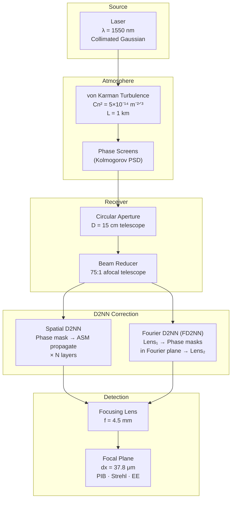
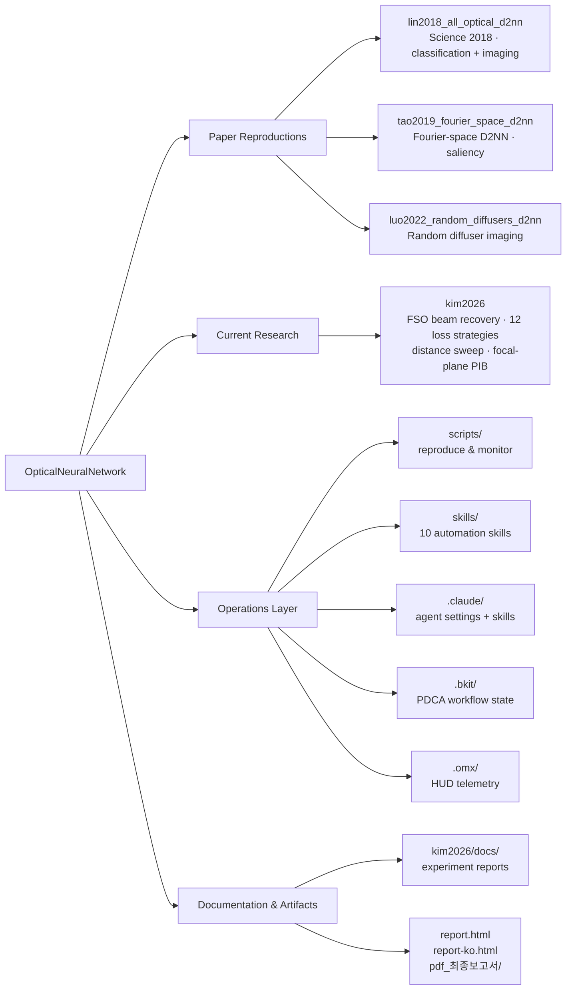
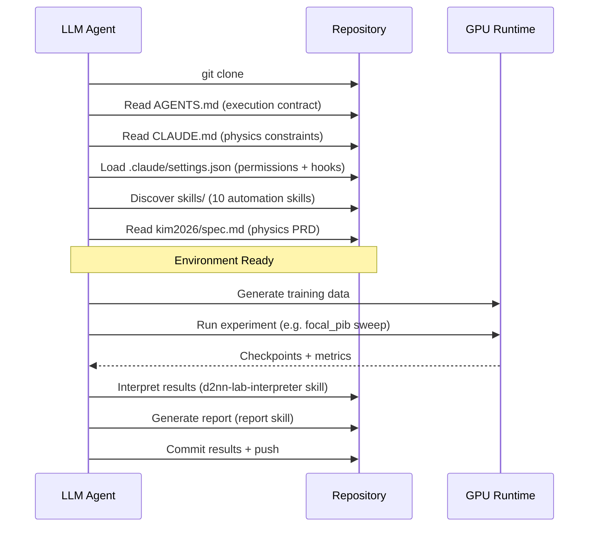
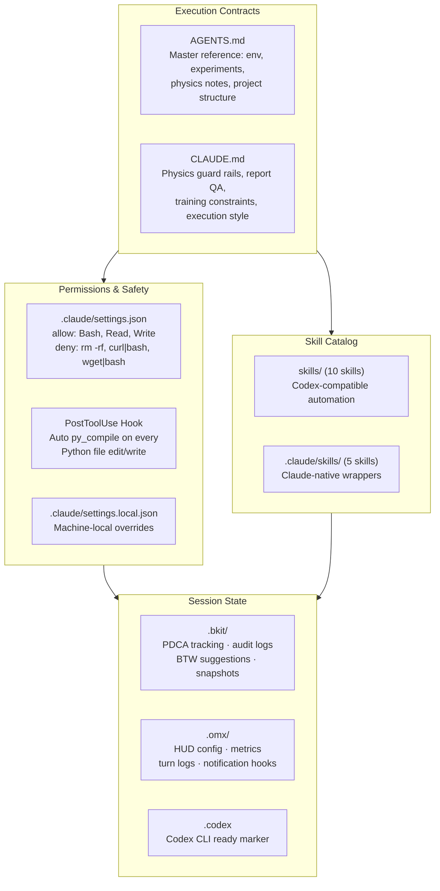
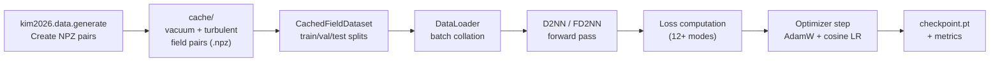

# OpticalNeuralNetwork


Monorepo for Diffractive Deep Neural Network (D2NN) research — from classic paper reproductions to FSO beam recovery under atmospheric turbulence, with full AI-agent harness engineering.

An LLM agent can clone this repo, read `AGENTS.md`, and autonomously run experiments, interpret results, and generate reports without human intervention.

---

## Optical Propagation Pipeline

The core physics simulated in this repository: a laser beam traverses atmospheric turbulence and is corrected by learnable diffractive phase masks before focusing onto a detector.



**Two model variants** share the same turbulence data and evaluation:

| Variant | Propagation between layers | Where phase is learned | Key file |
|---------|---------------------------|----------------------|----------|
| **Spatial D2NN** | Band-Limited Angular Spectrum (BL-ASM) | Real-space plane | `kim2026/src/kim2026/models/d2nn.py` |
| **Fourier D2NN** | Dual-2f lens relay (FFT-based) | Fourier plane | `kim2026/src/kim2026/models/fd2nn.py` |

**Key parameters** (kim2026 default):

| Parameter | Value | Note |
|-----------|-------|------|
| Wavelength | 1550 nm | Near-IR, FSO standard |
| Grid | 1024 × 1024 | N pixels |
| Pixel pitch | 2 μm | dx = window / N |
| Focal length | 4.5 mm (sweep) / 25 mm (Thorlabs AC127-025-C) | Configurable per experiment |
| Layers | 5 | Learnable phase masks |
| Layer spacing | 10 mm | Free-space between masks |

---

## Repository Map



### Top-Level Layout

```text
.
├── kim2026/                         # Current: FSO D2NN/FD2NN beam recovery
│   ├── src/kim2026/                 #   Core library (optics, models, training, eval)
│   ├── autoresearch/                #   Autonomous experiment scripts & runs
│   ├── configs/                     #   YAML experiment configs
│   ├── scripts/                     #   Data generation, evaluation, visualization
│   ├── tests/                       #   16 test files (optics, config, training)
│   ├── docs/                        #   Experiment catalog, reports, design docs
│   └── spec.md                      #   Physics PRD (sampling, Fried parameter, Rytov)
│
├── lin2018_all_optical_d2nn/        # Classic: Science 2018 all-optical D2NN
│   ├── src/d2nn/                    #   Physics, models, detectors, export
│   └── configs/                     #   Task-specific YAML
│
├── tao2019_fourier_space_d2nn/      # Classic: Fourier-space D2NN
│   ├── src/tao2019_fd2nn/           #   Classification, saliency, co-saliency
│   └── reports/                     #   Generated analysis
│
├── luo2022_random_diffusers_d2nn/   # Classic: Random diffuser imaging
│   ├── src/luo2022_d2nn/            #   Diffuser + imager models
│   └── analysis/                    #   Interpretation docs
│
├── scripts/                         # Root-level reproduce & monitor entry points
├── skills/                          # Codex/agent skill catalog (10 skills)
├── .claude/                         # Claude Code settings + 5 Claude-native skills
├── .bkit/                           # PDCA state, audit logs, BTW suggestions
├── .omx/                            # HUD config, metrics, turn logs
├── .codex                           # Codex CLI readiness marker
├── kim2026/docs/               # Optica journal submission assets
├── AGENTS.md                        # Agent execution contract
└── CLAUDE.md                        # Claude Code execution contract
```

### Research Track Comparison

| Track | Core Question | Entry Point | Key Output |
|-------|--------------|-------------|------------|
| [lin2018](lin2018_all_optical_d2nn/) | How does a classic D2NN work as classifier and imager? | `d2nn.cli.train_classifier` | Checkpoints, optical heightmaps, STL exports |
| [tao2019](tao2019_fourier_space_d2nn/) | Can Fourier-plane learning handle classification and saliency? | `tao2019_fd2nn.cli.*` | Classification metrics, saliency maps |
| [luo2022](luo2022_random_diffusers_d2nn/) | How to reconstruct images through random diffusers? | Training & evaluation scripts | Reconstructed images, quantitative metrics |
| [kim2026](kim2026/) | Can D2NN/FD2NN recover beams degraded by atmospheric turbulence? | `./scripts/reproduce_experiments.sh` | Run registry, paper figures, PIB/Strehl curves |

---

## Quick Start

### Prerequisites

- **GPU**: NVIDIA A100 40GB recommended (batch_size=128). Any CUDA GPU works with smaller batches.
- **Storage**: ~200 GB for full training data (`kim2026/data/`); ~2 GB for code + checkpoints.
- **OS**: Linux (tested on Ubuntu 20.04+).

### Setup

```bash
# 1. Clone
git clone https://github.com/dosigner/OpticalNeuralNetwork.git
cd OpticalNeuralNetwork

# 2. Create conda environment
conda create -n d2nn python=3.10 pytorch torchvision pytorch-cuda=12.1 -c pytorch -c nvidia
conda activate d2nn

# 3. Install kim2026 (current research track)
cd kim2026 && pip install -e ".[dev]" && cd ..
```

### Generate Training Data

```bash
cd kim2026 && PYTHONPATH=src python -m kim2026.data.generate
# Creates: kim2026/data/kim2026/1km_cn2_5e-14_tel15cm_n1024_br75/cache/
```

### Run First Experiment

```bash
# List available reproducible experiments
./scripts/reproduce_experiments.sh list

# Run the quickest one (~5 min): theorem verification
./scripts/reproduce_experiments.sh theorem_verify --gpu 0

# Run focal-plane PIB sweep (~10 hours, 4 loss strategies)
./scripts/reproduce_experiments.sh focal_pib --gpu 0
```

### Monitor Training

```bash
./scripts/monitor_training.sh
# Shows: GPU utilization, running processes, latest log tails
```

---

## Harness Engineering

This repository is designed so that an LLM agent (Claude, Codex, or any code-capable model) can clone it and autonomously operate experiments end-to-end. The harness consists of execution contracts, skill catalogs, session state, and safety hooks.

### Agent Bootstrap Sequence



### Harness Layer Architecture



### Skill Catalog

#### Root Skills (`skills/`)

| Skill | Purpose | Trigger |
|-------|---------|---------|
| `d2nn-lab-interpreter` | Parse scattered run folders into canonical registry; Korean-first comparison reports | After any experiment sweep completes |
| `fd2nn-codex-run-interpreter` | Interpret official FD2NN codex runs (02~05); map figures to claims | When analyzing historical Codex experiments |
| `fd2nn-figure-curator` | Promote run-local figures to `figures/` with `codexXX_*` naming | After d2nn-lab-interpreter identifies best runs |
| `reproduce-pib-experiments` | End-to-end Train → Eval → Analyze pipeline for kim2026 | `/reproduce-pib-experiments` slash command |
| `sweep` | Parameter sweep with physics validation (focal length, pixel pitch, NA checks) | Before launching any hyperparameter sweep |
| `autonomous-sweep` | Self-validating, self-healing sweep execution | For unattended multi-hour sweeps |
| `monitor` | Check running training state: GPU util, process list, log tails | During training to check progress |
| `physics-tests` | Generate and run optics pipeline validation tests | Before committing physics code changes |
| `report` | Generate publication-quality PDF/PPTX from results | After experiment analysis is complete |
| `parallel-report` | Multi-agent parallel report generation | For large report batches |

#### Claude-Native Skills (`.claude/skills/`)

| Skill | Purpose |
|-------|---------|
| `d2nn-lab-interpreter` | Shared wrapper → delegates to `skills/d2nn-lab-interpreter` |
| `reproduce-pib-experiments` | User-invocable slash command for guided reproduction |
| `report` | PDF/PPTX generation with LaTeX QA |
| `pptx` | PowerPoint manipulation (XML schema aware) |
| `make-slide` | HTML presentation generator with 10 themes |

### Hooks & Safety

**Automatic Python syntax check** — every `.py` file edit triggers `py_compile`:

```json
{
  "hooks": {
    "PostToolUse": [{
      "matcher": "Edit|Write",
      "hooks": [{
        "type": "command",
        "command": "if echo \"$CLAUDE_FILE\" | grep -qE '\\.py$'; then python3 -m py_compile \"$CLAUDE_FILE\" 2>&1 || echo 'SYNTAX ERROR'; fi",
        "timeout": 10
      }]
    }]
  }
}
```

**Deny rules** — dangerous commands blocked at the harness level:
- `rm -rf /*` — prevent catastrophic deletion
- `curl * | bash`, `wget * | bash` — prevent remote code execution

**Physics guard rails** (enforced by `CLAUDE.md`):
- Energy conservation: flag if >10% loss at any propagation stage
- Strehl ratio: must be ≤ 1.05 (passive device cannot amplify)
- Baseline metrics: always computed from raw input beams, never D2NN outputs
- Propagation method: confirm BL-ASM vs zoom propagate before every sweep
- Concurrent data generation: forbidden (causes `BadZipFile` corruption)

### Session State

#### `.bkit/` — PDCA Workflow Tracking

| File | Purpose |
|------|---------|
| `state/pdca-status.json` | Feature-level Plan-Do-Check-Act phase tracking (~15 active features) |
| `state/memory.json` | Session counter (95+ sessions logged) and platform metadata |
| `state/session-history.json` | Timestamped session log with reasons and progress |
| `audit/YYYY-MM-DD.jsonl` | Daily JSONL audit trail of every agent turn |
| `btw-suggestions.json` | Accumulated improvement suggestions from prior sessions |
| `snapshots/` | PDCA state checkpoints for recovery |
| `workflows/`, `decisions/`, `checkpoints/` | Git-tracked scaffold (`.gitkeep` placeholders) |

#### `.omx/` — HUD Telemetry

| File | Purpose |
|------|---------|
| `hud-config.json` | Display preset (`"focused"`) |
| `metrics.json` | Real-time turn/token counters |
| `setup-scope.json` | Harness scope (`"user"`) |
| `state/hud-state.json` | Last turn timestamp |
| `state/notify-hook-state.json` | Notification event tracking |
| `logs/turns-YYYY-MM-DD.jsonl` | Structured turn log with timestamps and thread IDs |

---

## Experiment Catalog

Six experiments are reproducible from committed configs. Binary outputs (`.pt`, `.npy`, `.npz`) are included in the repository.

| Experiment | Duration | Description |
|-----------|----------|-------------|
| `telescope_sweep` | ~2 h | D2NN loss sweep on telescope data (5 strategies: CO, CO+amp, CO+phasor, CO+FFP, ROI80) |
| `loss_sweep_prelens` | ~3 h | Pre-lens PIB/Strehl/IO/hybrid sweep (4 strategies) |
| `theorem_verify` | ~5 min | Unitary invariance theorem verification (defocus, 1 layer) |
| `co_sweep_strong` | ~2 h | Complex overlap sweep under strong turbulence (Cn²=5×10⁻¹⁴) |
| `paper_figures` | ~10 min | Generate static D2NN paper figures (fig3–fig5) |
| `focal_pib` | ~10 h | Focal-plane PIB sweep: 4 loss strategies × 100 epochs |

```bash
# List all experiments
./scripts/reproduce_experiments.sh list

# Run specific experiment
./scripts/reproduce_experiments.sh focal_pib --gpu 0

# Dry run (show commands without executing)
./scripts/reproduce_experiments.sh focal_pib --dry-run

# Monitor progress
./scripts/monitor_training.sh
```

### Experiment Run Directory Convention

All runs follow `MMDD-purpose-details` naming:

```text
kim2026/autoresearch/runs/
├── 0325-telescope-sweep-cn2-5e14-15cm/     # 5 loss strategies, beam reducer
├── 0327-theorem-verify-defocus-1layer/     # Unitary invariance proof
├── 0328-co-sweep-strong-turb-cn2-5e14/     # Strong turbulence regime
├── 0329-paper-figures-static-d2nn/         # Publication figures
├── 0330-focal-pib-sweep-4loss-cn2-5e14/    # First focal PIB attempt
├── 0401-focal-pib-sweep-clean-4loss.../    # Clean focal sweep (4 strategies)
├── 0402-focal-new-losses-pitchrescale.../  # 3 new loss strategies
├── 0403-combined-6strat-pitchrescale.../   # 6-strategy comprehensive sweep
├── 0405-distance-sweep-rawrp-f6p5mm/       # Distance sweep (100m–3km)
└── 0405-fd2nn-4f-sweep-pitchrescale/       # FD2NN with 4f relay system
```

Each run contains:
- `checkpoint.pt` — trained model weights
- `phases_wrapped.npy` — learned phase mask arrays
- `results.json` — metrics (CO, PIB, Strehl, throughput)
- `epoch_log.txt` — training loss per epoch
- `fig*.png` — visualization figures

---

## Kim2026 Source Architecture

The current research track (`kim2026/src/kim2026/`) is organized as:

```mermaid
flowchart LR
    subgraph OPTICS["optics/"]
        ASM["angular_spectrum.py<br/>Band-Limited ASM"]
        PASM["padded_angular_spectrum.py<br/>Alias-safe ASM"]
        LENS["lens_2f.py<br/>Dual-2f Fourier relay"]
        BEAM["beam_reducer.py<br/>Afocal telescope"]
        APT["aperture.py<br/>Circular aperture"]
        GAUSS["gaussian_beam.py<br/>Gaussian source"]
        ZOOM["zoom_propagate.py<br/>Fresnel zoom"]
    end

    subgraph MODELS["models/"]
        D2NN["d2nn.py<br/>BeamCleanupD2NN"]
        FD2NN["fd2nn.py<br/>BeamCleanupFD2NN<br/>CroppedFourierD2NN"]
    end

    subgraph TRAINING["training/"]
        LOSS["losses.py<br/>12+ loss modes"]
        TRAINER["trainer.py<br/>Epoch loops"]
        TARGETS["targets.py<br/>Target generation"]
    end

    subgraph TURB["turbulence/"]
        VK["von_karman.py<br/>PSD + Fried param"]
        SCREEN["phase_screens.py<br/>Deterministic screens"]
    end

    subgraph EVAL["eval/"]
        FOCAL["focal_utils.py<br/>PIB, Strehl, EE"]
        SANITY["sanity_check.py"]
    end

    TURB --> OPTICS
    OPTICS --> MODELS
    MODELS --> TRAINING
    MODELS --> EVAL
```



### Training Data Flow



---

## Reading Paths

Choose based on your goal:

1. **D2NN lineage** (top-down survey):
   This README → [lin2018/](lin2018_all_optical_d2nn/) → [tao2019/](tao2019_fourier_space_d2nn/) → [luo2022/](luo2022_random_diffusers_d2nn/) → [kim2026/](kim2026/)

2. **Latest results & paper figures**:
   This README → [kim2026/](kim2026/) → `kim2026/docs/experiment-catalog.md` → `kim2026/autoresearch/runs/` → [kim2026/docs/](kim2026/docs/)

3. **Operations & agent setup**:
   This README → [scripts/](scripts/) → [skills/](skills/) → [.claude/settings.json](.claude/settings.json) → [.bkit/](.bkit/) → `AGENTS.md`

---

## References

- Lin et al. (2018). "All-optical machine learning using diffractive deep neural networks." *Science*, 361(6406), 1004–1008.
- Tao et al. (2019). "Fourier-space Diffractive Deep Neural Network." *Physical Review Letters*, 123(2), 023901.
- Luo et al. (2022). "Computational imaging without a computer: seeing through random diffusers at the speed of light." *eLight*, 2, 4.
- Kim (2026). "Static Diffractive Neural Networks for Free-Space Optical Beam Recovery." *(in preparation for Optica)*

---

## Python Environment

```bash
# Conda environment (ships with repo at miniconda3/envs/d2nn/)
conda activate d2nn

# All project commands require PYTHONPATH=src
cd kim2026 && PYTHONPATH=src python -m kim2026.cli.train_beam_cleanup --config configs/...
```

## License

Research use only. See individual sub-project licenses for reproduction papers.
