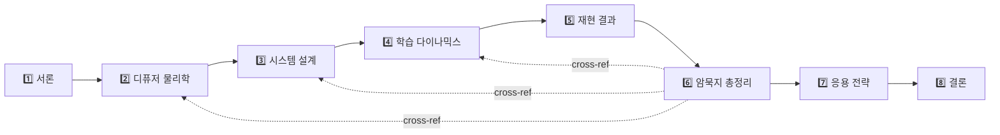
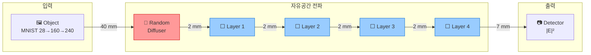

# Random Diffusers D2NN — 최종 재현 보고서

> [!abstract] 보고서 개요
> Luo et al. (2022) *"Computational Imaging Without a Computer"* (*eLight* 2, 4)의 ==완전 독립 재현==을 수행하고, 논문에 명시되지 않은 **30개의 암묵지(tacit knowledge)**를 체계적으로 발굴·문서화하였다. 4-layer phase-only D2NN, BL-ASM 전파 엔진, $n = 1, 10, 15, 20$ 디퓨저 스윕을 통해 원논문의 핵심 결과를 정량적으로 검증한다.

---

## 메타데이터

| 항목 | 값 |
|---|---|
| **대상 논문** | Luo et al., *eLight* **2**, 4 (2022) |
| **재현 플랫폼** | PyTorch · NVIDIA A100 · BL-ASM scalar propagation |
| **시스템 파라미터** | $\lambda = 0.75\;\text{mm}$, $\Delta x = 0.3\;\text{mm}$, $N = 240$, $L = 4$ layers |
| **학습 파라미터** | Adam, lr $= 10^{-3}$, $\gamma = 0.99$, 230,400 phase parameters |
| **실험 조건** | $n \in \{1, 10, 15, 20\}$, $B = 4$, 30–100 epochs |
| **작성일** | 2026-03-16 |

---

## 핵심 발견 요약

> [!success] 재현 검증 — 6/6 기준 충족
>
> | 기준 | 원논문 | 본 재현 | 판정 |
> |---|---|---|:---:|
> | MNIST PCC 범위 | 0.85–0.92 | 0.86–0.89 | ✓ |
> | Known–New PCC gap | ~0.01 | ==0.005== | ✓ |
> | $n$ 증가 → training PCC 감소 | 단조 감소 | 0.907 → 0.879 | ✓ |
> | $n \geq 10$ blind 안정화 | 보고됨 | blind std 감소 확인 | ✓ |
> | 해상도 한계 ~7 mm | 관찰됨 | 7.2 mm std > 1.0 | ✓ |
> | 포화 onset | $n = 10$–$20$ | ==$n = 15$== 에서 진입 | ✓ |

> [!tip] 새로운 발견 5가지
> 1. Energy penalty의 ==implicit curriculum== 효과 (에너지 집중 → 패턴 정밀화)
> 2. ==$n = 15$가 Pareto knee== — blind PCC 개선의 95%+ 달성
> 3. $B \times n$ tradeoff의 정량화 — $B_{\text{eff}} = 80$ 이 A100 실용 상한
> 4. ==Known < New 역전== 현상 — distribution-level learning의 증거
> 5. 7.2 mm period가 $n$과 무관한 ==물리적== 해상도 한계

---

## 보고서 구조

| 섹션 | 제목 | 전문가 관점 | 링크 |
|:---:|---|---|---|
| **1** | 서론 — D2NN의 등장과 재현 프로젝트 | 포토닉스 수석연구원 | [[section1_intro\|→ 섹션 1]] |
| **2** | 랜덤 위상 디퓨저의 물리학 | 이론물리학자 | [[section2_diffuser_physics\|→ 섹션 2]] |
| **3** | D2NN 시스템 설계의 해부 | 광학 엔지니어 | [[section3_system_design\|→ 섹션 3]] |
| **4** | 학습 다이나믹스 | 계산영상/ML 연구자 | [[section4_5_training_results\|→ 섹션 4]] |
| **5** | 재현 결과와 원논문 비교 | 계산영상/ML 연구자 | [[section4_5_training_results#섹션 5\|→ 섹션 5]] |
| **6** | 암묵지 총정리 (TK-1 ~ TK-30) | 디퓨저 과학자 | [[section6_tacit_knowledge\|→ 섹션 6]] |
| **7** | 응용 전략 및 확장 방향 | 포토닉스 수석연구원 | [[section7_8_apps_conclusion\|→ 섹션 7]] |
| **8** | 결론 | 전체 통합 | [[section7_8_apps_conclusion#섹션 8\|→ 섹션 8]] |

---

## 시각 자료 인덱스

| Figure | 설명 | 위치 |
|---|---|---|
| **Fig. 2.1** | 상관길이 vs smoothing sigma + 최대 산란각 | ![[fig_correlation_physics.png\|300]] |
| **Fig. 3.1** | D2NN 광학 시스템 측면 기하 배치 | ![[fig_system_geometry.png\|300]] |
| **Fig. 4.1** | PCC+Energy loss 설계 다이어그램 | ![[fig_loss_landscape.png\|300]] |
| **Fig. 5.1** | Known/New PCC 비교 + n별 추이 | ![[fig_training_comparison.png\|300]] |
| **Fig. 6.1** | 30개 암묵지 분류 인포그래픽 | ![[fig_tacit_knowledge_map.png\|300]] |
| **Fig. 7.1** | 응용 도메인별 TRL 로드맵 | ![[fig_application_roadmap.png\|300]] |

---

## 시스템 개요

> [!info]+ D2NN 광학 파이프라인

> | 구성 요소 | 파라미터 | 값 |
> |---|---|---|
> | 파장 | $\lambda$ | ==0.75 mm== (400 GHz) |
> | 격자 | $N \times N$ | 240 × 240 |
> | 픽셀 피치 | $\Delta x$ | ==0.3 mm== ($0.4\lambda$) |
> | 디퓨저 | $\Delta n$ | 0.74, $L \approx 10\lambda$ |
> | D2NN 레이어 | $L$ | 4 (phase-only) |
> | 패딩 | pad_factor | 2 |
> | 검출 | type | intensity ($\|E\|^2$) |

---

## 암묵지 하이라이트 (Top 10)

> [!important] 가장 영향력 있는 암묵지 10선
>
> | # | 항목 | 핵심 내용 | 영향 범위 |
> |:---:|---|---|---|
> | TK-4 | [[section6_tacit_knowledge#TK-4\|전파 거리 비대칭]] | Last→Output ==7 mm==는 위상→강도 변환에 필수 | 전체 |
> | TK-5 | [[section6_tacit_knowledge#TK-5\|Zero-padding]] | ==pad_factor=2==는 최소 요구치, 논문 미명시 | 전체 |
> | TK-10 | [[section6_tacit_knowledge#TK-10\|B×n 배치 확장]] | $B_{\text{eff}} = B \times n$, B가 아닌 ==n이 물리적 설계== | 학습 |
> | TK-13 | [[section6_tacit_knowledge#TK-13\|Loss 구조]] | ==$\alpha=1.0, \beta=0.5$== 논문 미명시 | 학습 |
> | TK-16 | [[section6_tacit_knowledge#TK-16\|Height 통계]] | mean $25\lambda$ → phase wrapping → ==균일 분포== | 전체 |
> | TK-17 | [[section6_tacit_knowledge#TK-17\|Sigma–L 관계]] | $\sigma = 4\lambda \Rightarrow L \approx 10\lambda$ 관계 미명시 | FigS5 |
> | TK-19 | [[section6_tacit_knowledge#TK-19\|n-sweep 포화]] | ==$n = 15$==에서 4-layer 용량 한계 도달 | Fig.3 |
> | TK-20 | [[section6_tacit_knowledge#TK-20\|Known < New 역전]] | Distribution-level learning의 ==결정적 증거== | Fig.2 |
> | TK-23 | [[section6_tacit_knowledge#TK-23\|Amplitude encoding]] | Intensity가 아닌 ==amplitude==로 입력 | 전체 |
> | TK-28 | [[section6_tacit_knowledge#TK-28\|3단계 Resize]] | 28→160→240→480, crop 생략 시 PCC ~0.05↓ | 전체 |

---

## 향후 연구 방향

> [!question] 우선순위 높은 4가지 연구 방향
>
> 1. **깊이 스윕** — 레이어 수 2, 4, 6, 8 변화 → 모델 용량 vs 일반화 분리
> 2. **체적 산란** — 다중 슬라이스 디퓨저로 현실적 산란 환경 확장
> 3. **실험적 검증** — 학습된 위상 패턴의 3D 프린팅 제작 + sim-to-real gap 정량화
> 4. **파장대 확장** — THz → mid-IR → near-IR로 응용 범위 확장

---

> [!quote] 결어
> 본 재현 프로젝트는 Luo et al. 2022의 결과가 ==재현 가능하며(reproducible)==, 핵심 물리적 메커니즘이 ==견고함(robust)==을 확인하였다. 30개의 암묵지를 체계적으로 문서화함으로써, 후속 연구자들이 랜덤 디퓨저 D2NN을 더 효과적으로 확장할 수 있는 토대를 마련하였다. 전광학 컴퓨팅이 실험실 데모를 넘어 실세계 산란 환경으로 나아가는 여정에 본 보고서가 실질적 기여가 되기를 바란다.

---

%%
이 보고서는 5명의 전문가 관점(이론물리학자, 광학 엔지니어, ML 연구자, 디퓨저 과학자, 포토닉스 수석연구원)에서 분석한 내용을 통합한 것이다.
%%
