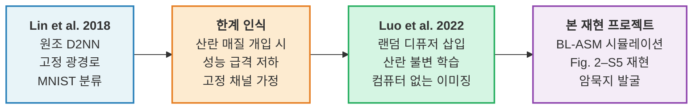

# 1. 서론 (Introduction)

> [!abstract] 요약
> ==회절 심층 신경망(D2NN)==은 다층 회절판을 통한 빛의 전파만으로 기계학습 추론을 수행하는 전광학적 연산 패러다임이다. 그러나 초기 D2NN은 입력과 네트워크 사이의 광경로에 ==산란 매질(scattering medium)==이 개입하면 성능이 급격히 저하되는 한계를 지녔다. Luo et al. (2022)는 학습 과정에서 ==랜덤 디퓨저(random diffuser)==를 반복 삽입함으로써 산란 통계 자체에 불변인 영상 복원 전략을 D2NN에 학습시키는 접근법을 제시하였다. 본 보고서는 이 연구를 BL-ASM 기반 스칼라 회절 시뮬레이션으로 독립 재현하고, 원논문에 명시되지 않은 ==암묵지(tacit knowledge)==를 체계적으로 발굴하는 것을 목적으로 한다.

---

## 1.1 회절 심층 신경망의 등장

2018년, Lin 등은 3D 프린팅으로 제작한 다층 회절판이 빛의 전파만으로 기계학습 추론을 수행할 수 있음을 실증하였다[^1]. 이 ==회절 심층 신경망(Diffractive Deep Neural Network, D2NN)==은 ==광학 컴퓨팅(optical computing)==의 새로운 패러다임을 열었다.

각 ==회절 레이어(diffractive layer)==의 픽셀은 입사광의 ==위상(phase)==을 조절하는 학습 가능한 파라미터로 작동하며, ==자유공간 전파(free-space propagation)==가 레이어 간 연결을 담당한다. 결과적으로, 전기적 에너지 소비 없이 빛의 속도로 추론이 이루어지는 ==전광학적(all-optical)== 신경망이 구현된다.

그러나 초기 D2NN은 한 가지 근본적 한계를 안고 있었다. 입력 객체(object)와 회절 레이어 사이의 ==전파 채널이 고정==되어야 했다는 점이다. 실제 응용에서는 ==산란 매질(scattering medium)==이 광경로에 개입하는 경우가 빈번하다 — 생체 조직(biological tissue), 대기 난류(atmospheric turbulence), 또는 의도적으로 삽입된 보안 디퓨저(security diffuser) 등이 그 예이다.

---

## 1.2 랜덤 디퓨저 접근법: Luo et al. (2022)

Luo 등의 2022년 연구 *"Computational Imaging Without a Computer"*[^2]는 이 한계를 정면으로 돌파한다.

> [!quote] 핵심 착상 (Key Insight)
> 학습 과정에서 매 ==에폭(epoch)==마다 서로 다른 랜덤 디퓨저 $n$개를 삽입하여, D2NN이 특정 디퓨저의 역변환을 암기하는 대신 ==산란 통계 자체에 불변인(scattering-invariant)== 영상 복원 전략을 학습하도록 유도한다.

디퓨저의 투과 함수(transmission function)는 다음과 같이 모델링된다:

$$
t_d(\mathbf{r}) = \exp\!\bigl[j\,\varphi_d(\mathbf{r})\bigr], \qquad \varphi_d = \frac{2\pi\,\Delta n\,D(\mathbf{r})}{\lambda}
\tag{1}
$$

여기서 $D(\mathbf{r})$는 ==Gaussian smoothing==된 랜덤 높이 맵(random height map)이며, 굴절률 차이 $\Delta n = 0.74$이다. 이 모델은 실험에서 사용되는 지상유리(ground glass) 디퓨저의 통계적 특성을 충실히 반영한다.

---

## 1.3 D2NN 발전 경로

아래 다이어그램은 Lin (2018)의 원조 D2NN에서 Luo et al. (2022)의 랜덤 디퓨저 접근법으로 이어지는 발전 경로를 요약한다.

---

## 1.4 재현 프로젝트의 목적과 범위

> [!info]+ 1. 물리 시뮬레이션 엔진 구축
> - ==BL-ASM(Band-Limited Angular Spectrum Method)== 기반 스칼라 회절 전파 모듈
> - $240 \times 240$ 연산 격자(grid), 픽셀 피치 $\Delta x = 0.3\,\text{mm}$
> - 동작 주파수 $f = 400\,\text{GHz}$ ($\lambda = 0.75\,\text{mm}$)

> [!info]+ 2. D2NN 모델 구성
> - ==4-layer phase-only== 회절 신경망
> - 디퓨저 개수 스윕: $n = 1,\;10,\;15,\;20$
> - 총 학습 파라미터: ==230,400개== ($240 \times 240 \times 4$)

> [!info]+ 3. 재현 대상 Figure
> - **Fig. 2**: Known/new 디퓨저 조건에서의 영상 복원 품질
> - **Fig. 3**: 디퓨저 격자 주기(grating period) 스윕에 따른 성능 변화
> - **Fig. S1–S5**: 보충 자료 (위상 분포, 오버랩 맵, 프루닝, 상관 길이)

> [!info]+ 4. 암묵지(Tacit Knowledge) 발굴
> - ==상관 길이(correlation length)==와 디퓨저 산란 강도의 관계
> - ==위상 초기화(phase initialization)== 전략이 학습 수렴에 미치는 영향
> - ==에너지 페널티(energy penalty)==의 물리적 역할
> - ==대역 제한(band-limiting)==이 시뮬레이션 정확도에 미치는 효과

---

## 1.5 보고서 구조

| 섹션 | 제목 | 핵심 내용 |
|:---:|:---|:---|
| **1** | 서론 *(본 섹션)* | D2NN 배경, Luo et al. 접근법, 재현 목적 |
| **2** | [[section2_diffuser_physics\|랜덤 위상 디퓨저의 물리학]] | 디퓨저 모델링, 상관 길이, 산란 통계 |
| **3** | [[section3_system_design\|D2NN 시스템 설계 해부]] | 광학 시스템 구조, BL-ASM 전파, 검출기 모델 |
| **4** | [[section4_5_training_results\|학습 다이나믹스 및 재현 결과]] | 손실 함수, 학습 전략, 원논문 대비 정량 비교 |
| **5** | [[section4_5_training_results#재현 결과\|재현 결과와 원논문 비교]] | Fig. 2, Fig. 3, 보충 Figure 재현 |
| **6** | [[section6_tacit_knowledge\|암묵지 총정리]] | 원논문 미기재 노하우, 실패 사례, 핵심 교훈 |
| **7** | [[section1_7_8_intro_apps_conclusion#응용\|응용 전략 및 확장 방향]] | 실험 적용, 다파장 확장, 하이브리드 시스템 |
| **8** | [[section1_7_8_intro_apps_conclusion#결론\|결론]] | 종합 평가 및 향후 과제 |

> [!tip] 탐색 안내
> 각 섹션 링크를 클릭하면 해당 문서로 이동합니다. Obsidian의 그래프 뷰(Graph View)에서 섹션 간 연결 관계를 시각적으로 확인할 수 있습니다.

---

[^1]: X. Lin et al., "All-optical machine learning using diffractive deep neural networks," *Science* **361**, 1004–1008 (2018). doi:10.1126/science.aat8084
[^2]: Y. Luo et al., "Computational imaging without a computer: seeing through random diffusers at the speed of light," *eLight* **2**, 4 (2022). doi:10.1186/s43593-022-00012-4
