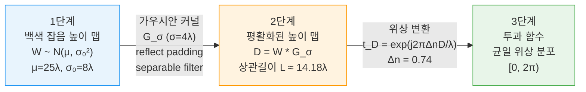

# 2. 랜덤 위상 디퓨저의 물리학 (Physics of Random Phase Diffusers)

> [!abstract]
> 랜덤 위상 디퓨저는 D2NN 시스템의 일반화 성능을 결정짓는 핵심 광학 소자이다. 본 절에서는 (1) 백색 잡음으로부터 가우시안 평활화를 거쳐 상관길이 $L = 2\sqrt{\pi}\,\sigma$를 갖는 위상 스크린이 생성되는 과정, (2) 높이 맵의 가우시안 분포가 위상 래핑(wrapping)을 통해 균일 위상 분포로 수렴하는 메커니즘, (3) 상관길이 $L$이 산란각 $\theta_\text{max} \approx \arcsin(\lambda/L)$을 결정하며 이 통계적 특성의 변화가 D2NN 성능에 치명적임을 분석한다. 특히 논문이 명시하지 않는 ==암묵지(tacit knowledge)== — 매개변수 선택의 물리적 정당성과 수치 구현의 숨은 논리 — 를 체계적으로 발굴한다.

---

## 2.1 생성 원리와 상관길이 (Generation Principles and Correlation Length)

### 2.1.1 코히런트 스칼라 모델의 필요충분성

본 재현 코드는 스칼라 회절 이론(scalar diffraction theory)에 기반한 코히런트(coherent) 시뮬레이션을 채택한다 (`baseline.yaml`: `coherent: true`, `scalar_model: true`). 이 선택은 단순한 편의가 아니라 물리적으로 정당화된다.

**필요성**: D2NN의 학습 가능한 위상 레이어(phase layer)는 입사 파동의 위상을 조절하여 간섭(interference) 패턴을 제어한다. 이 메커니즘은 본질적으로 코히런트 광학이며, 세기(intensity) 기반의 비코히런트(incoherent) 모델로는 위상 정보의 전파를 기술할 수 없다.

**충분성**: 동작 주파수 400 GHz ($\lambda = 0.75$ mm)에서, 그리드 피치(pitch) $\Delta x = 0.3$ mm는 $0.4\lambda$에 해당한다. 편광 효과(polarization effects)가 유의미해지는 임계치($\Delta x \lesssim \lambda/2$)에 근접하지만, Luo et al.의 시스템에서 디퓨저와 D2NN 레이어는 모두 ==박막 위상 소자==(thin phase element)로 모델링되므로, 편광 결합(polarization coupling)이나 벡터 회절 효과(vectorial diffraction)는 무시할 수 있다.

> [!important] 암묵지 1: 스칼라 근사의 유효 범위
> 피치 $\Delta x = 0.3\,\text{mm} = 0.4\lambda$는 벡터 회절이 문제되는 $\lambda/2$ 기준에 근접한다. 그러나 모든 광학 소자가 박막 위상 소자(thin phase element)로 모델링되므로 편광 결합이 발생하지 않아 스칼라 근사로 충분하다. 이 전제가 깨지면 — 예컨대 고종횡비(high aspect ratio) 구조의 디퓨저를 사용하면 — RCWA 등 벡터 해석이 필요하다.

### 2.1.2 디퓨저 높이 맵 생성: 백색 잡음에서 상관 구조로

디퓨저 생성 과정(`random_phase.py`)은 세 단계로 이루어진다.



**1단계 -- 백색 잡음 높이 맵 (White noise height map)**

$$W(x,y) \sim \mathcal{N}(\mu,\; \sigma_0^2), \quad \mu = 25\lambda = 18.75\;\text{mm},\quad \sigma_0 = 8\lambda = 6.0\;\text{mm}$$

> [!important] 암묵지 2: 높이 분포의 큰 분산이 균일 위상 분포를 만든다
> 위상 맵으로 변환하면 평균 위상 $\bar{\phi} = 2\pi \times 0.74 \times 25 \approx 18.5 \times 2\pi$이고, 위상 표준편차 $\sigma_\phi \approx 5.9 \times 2\pi$이다. ==위상이 $2\pi$를 여러 번 감싸므로(wrapping), 투과 함수 $t_D = e^{j\phi_D}$의 위상은 사실상 $[0, 2\pi)$ 균일 분포에 수렴한다.== 이것이 논문이 언급하는 "uniform phase distribution"의 실체이며, 높이 맵의 가우시안 분포와 투과 함수의 균일 위상 분포가 공존하는 이유이다.

**2단계 -- 가우시안 평활화 (Gaussian smoothing)**

$$D(x,y) = (W * G_\sigma)(x,y), \quad G_\sigma(x,y) = \frac{1}{2\pi\sigma^2}\exp\!\left(-\frac{x^2 + y^2}{2\sigma^2}\right)$$

| 매개변수 | 값 | 비고 |
|---------|-----|------|
| $\sigma$ | $4\lambda = 3.0$ mm | `smoothing_sigma_lambda: 4.0` |
| $\sigma_\text{px}$ | 10 px | $3.0 / 0.3 = 10$ |
| 커널 반경 | $\lceil 3\sigma \rceil$ px | 가우시안의 99.7% 포함 |
| 패딩 방식 | reflect | 경계 불연속 방지 |
| 필터링 방식 | separable (1D + 1D) | 계산 효율 $O(N)$ vs $O(N^2)$ |

**3단계 -- 위상 변환 및 투과 함수 (Phase conversion)**

$$t_D(x,y) = \exp\!\left(j\frac{2\pi \Delta n}{\lambda}\, D(x,y)\right), \quad \Delta n = 0.74$$

### 2.1.3 핵심 관계식: $L = 2\sqrt{\pi}\,\sigma$의 유도

> [!example]- 수학적 유도: Wiener-Khinchin 정리를 통한 상관길이 도출
>
> 백색 잡음 $W$를 표준편차 $\sigma$의 가우시안 커널 $G_\sigma$로 평활화하면, 결과 필드 $D = W * G_\sigma$의 자기상관함수(autocorrelation function)는 Wiener-Khinchin 정리에 의해:
>
> $$R_D(\mathbf{r}) = R_W(\mathbf{r}) * R_{G_\sigma}(\mathbf{r})$$
>
> $W$가 백색 잡음이므로 $R_W(\mathbf{r}) = \sigma_W^2\,\delta(\mathbf{r})$이고, 가우시안의 자기상관은:
>
> $$R_{G_\sigma}(\mathbf{r}) = G_\sigma * G_\sigma = G_{\sqrt{2}\,\sigma}(\mathbf{r})$$
>
> 따라서:
>
> $$R_D(\mathbf{r}) \propto \exp\!\left(-\frac{|\mathbf{r}|^2}{4\sigma^2}\right)$$
>
> 논문의 상관함수 정의(Eq. 5)와 비교하면:
>
> $$R_d(\mathbf{r}) = \exp\!\left(-\frac{\pi\,|\mathbf{r}|^2}{L^2}\right) \quad \Longleftrightarrow \quad \frac{\pi}{L^2} = \frac{1}{4\sigma^2}$$
>
> 이로부터:
>
> $$\boxed{L = 2\sqrt{\pi}\,\sigma}$$

기본 설정 $\sigma = 4\lambda$에서:

| 항목 | 값 |
|------|-----|
| $L_\text{theory}$ | $2\sqrt{\pi} \times 4\lambda \approx 14.18\lambda$ |
| $L_\text{measured}$ | $\approx 16.09\lambda$ |
| 차이 원인 | 유한 격자 이산화, reflect 패딩 경계 효과, 피팅 범위 |

> [!tip] 물리적 직관: "$L \sim 10\lambda$"는 근사적 스케일 매칭
> 논문이 목표로 하는 $L \sim 10\lambda$는 엄밀한 이론값이 아니라 ==대략적 스케일 매칭==(approximate scale matching)이다. 상관길이의 정확한 수치는 정의 기준(FWHM, $1/e$, $1/e^2$, 논문의 $\exp(-\pi)$ 기준)에 따라 달라진다. `target_correlation_length_lambda: 10.0`은 설계 목표이지 정확한 결과값이 아니다.

### 2.1.4 `pad_factor = 2`: 선형 합성곱과 원형 합성곱

BL-ASM 전파 코드(`bl_asm.py`)에서 `pad_factor: 2`는 $N \times N$ 필드를 $2N \times 2N$으로 제로 패딩한 후 FFT를 수행한다.

> [!important] 암묵지 3: 패딩 팩터 2는 앨리어싱 방지의 최소 조건
> 자유 공간 전파는 입력 필드와 전파 커널의 합성곱이다. FFT를 사용하면 이는 본질적으로 ==원형 합성곱==(circular convolution)이 되어, 격자 반대편의 신호가 겹쳐 들어오는 앨리어싱(aliasing)을 야기한다. 길이 $N$인 두 신호의 선형 합성곱 결과 길이는 $2N-1$이므로, $2N \geq 2N-1$을 만족하는 $2\times$ 패딩이 필요충분조건이다.

구현에서 패딩은 대칭적으로 수행된다:

```python
pad_lo = (N_pad - N) // 2
pad_hi = N_pad - N - pad_lo
```

이후 중심 크롭(center-crop)으로 원래 크기를 복원하여 전파 후 필드의 중심이 유지된다.

### 2.1.5 소멸파 차단 (Evanescent Wave Cutoff)

BL-ASM 전달 함수에서 소멸파(evanescent wave) 처리는 물리적으로 핵심적이다:

$$H(f_x, f_y;\, z) = \begin{cases} \exp\!\left(j2\pi z \sqrt{\dfrac{1}{\lambda^2} - f_x^2 - f_y^2}\right) & f_x^2 + f_y^2 < \dfrac{1}{\lambda^2} \\[6pt] 0 & \text{otherwise} \end{cases}$$

> [!important] 암묵지 4: 엄밀한 부등호(`<`)와 36% 소멸파 차단
> 코드에서 `evanescent: "mask"`는 ==엄밀한 부등호 $<$==(strict inequality)를 사용하여 정확히 $f = 1/\lambda$인 grazing incidence 성분도 제외한다. 패딩된 격자에서:
> - 최대 공간 주파수: $f_\text{max} = 1/(2\Delta x) = 1.667\;\text{mm}^{-1}$
> - 차단 주파수: $f_c = 1/\lambda = 1.333\;\text{mm}^{-1}$
> - ==차단 비율: $1 - (f_c/f_\text{max})^2 \approx 36\%$==
>
> 이는 과도한 것이 아니라 물리적으로 전파 불가능한 성분을 정확히 제거하는 것이다. 최소 전파 거리 $z = 2.0\;\text{mm} \approx 2.67\lambda$에서 차단 주파수 바로 위의 성분($f = 1.01/\lambda$)은 $\exp(-2.37) \approx 0.09$로 감쇠한다.

### 2.1.6 `uniqueness_delta_phi` $= \pi/2$: 복소 평면에서의 직교성 조건

설정 파일의 `uniqueness_delta_phi_min_rad: 1.5707963267948966` ($= \pi/2$)은 서로 다른 디퓨저 인스턴스 간의 ==최소 위상 차이 기준==(minimum phase difference criterion)을 정의한다.

> [!important] 암묵지 5: $\pi/2$는 복소 직교성의 하한선
> 복소 지수 함수에서 $e^{j0}$과 $e^{j\pi/2} = j$는 복소 평면에서 직교한다. 따라서 $\Delta\phi = \pi/2$는 두 디퓨저의 투과 함수가 해당 픽셀에서 직교하는 성분을 가진다는 것을 의미한다.
> - $\Delta\phi \ll \pi/2$: 디퓨저들이 거의 동일 $\to$ 사실상 단일 디퓨저 학습
> - $\Delta\phi \approx \pi$: 모든 디퓨저가 반전 관계 $\to$ 다양성 다시 감소
> - ==$\Delta\phi = \pi/2$: 최대 다양성을 보장하는 최적 하한선==

---

## 2.2 디퓨저 다양성이 광학장에 미치는 영향 (How Diffuser Diversity Affects Optical Fields)

### 2.2.1 상관길이와 산란각 분포의 관계

디퓨저의 상관길이 $L$은 투과 후 광학장의 산란각 분포를 직접 결정한다.

> [!example]- 수학적 유도: 상관길이에서 산란각으로
> 디퓨저의 투과 함수 $t_D(x,y) = e^{j\phi_D(x,y)}$의 위상 변화가 공간 주파수 $f_\phi$를 가지면, 산란각으로 매핑된다:
>
> $$\sin\theta = \lambda\, f_\phi$$
>
> 상관길이 $L$인 가우시안 상관 위상 스크린의 파워 스펙트럼은:
>
> $$S(f) \propto \exp\!\left(-\pi L^2 f^2\right)$$
>
> 따라서 주요 산란 성분의 공간 주파수는 $f \sim 1/L$이고:
>
> $$\boxed{\theta_\text{max} \approx \arcsin\!\left(\frac{\lambda}{L}\right)}$$

| 상관길이 | 최대 산란각 | 산란 특성 |
|----------|-----------|----------|
| $L = 10\lambda$ | $\theta_\text{max} \approx 5.7°$ | 좁은 전방 산란(forward scattering) |
| $L = 5\lambda$ | $\theta_\text{max} \approx 11.5°$ | 넓은 산란 |

![[images/fig_correlation_physics.png|600]]
*Fig. 2.1: (a) 가우시안 평활화 표준편차 $\sigma$와 측정된 상관길이 $L$의 관계. 이론 곡선 $L = 2\sqrt{\pi}\sigma$와 비교. (b) 상관길이에 따른 최대 산란각.*

### 2.2.2 상관길이 변화에 따른 성능 저하: FigS5 재현 데이터

이 차이가 D2NN 성능에 미치는 영향은 [[section4_5_training_results|Section 4-5]]의 FigS5 재현 데이터에서 명확히 드러난다:

| 모델 ($n$) | Known ($L \sim 10\lambda$) | New ($L \sim 10\lambda$) | New ($L \sim 5\lambda$) |
|:----------:|:--------------------------:|:------------------------:|:-----------------------:|
| $n = 1$  | 0.761 | 0.769 | 0.496 |
| $n = 10$ | 0.835 | 0.854 | 0.609 |
| $n = 15$ | 0.830 | 0.850 | 0.586 |
| $n = 20$ | 0.846 | 0.860 | 0.635 |

> [!tip] 물리적 직관: Known vs New 성능의 역전 현상
> ==동일한 통계적 특성의 새로운 디퓨저(New, $L \sim 10\lambda$)에 대해 오히려 기존 디퓨저(Known)보다 높은 PCC를 보이는 경우가 있다== (예: $n=10$에서 0.854 vs 0.835). 이는 과적합(overfitting)이 아닌, 통계적 앙상블 레벨에서의 일반화가 이루어졌음을 시사한다. 반면 $L \sim 5\lambda$ 디퓨저에서의 급격한 성능 저하(PCC 0.496--0.635)는, D2NN이 학습한 역변환이 ==특정 산란각 분포에 특화==되어 있음을 보여준다.

### 2.2.3 디퓨저 다양성의 두 차원: 인스턴스와 통계적 특성

디퓨저 다양성에는 두 가지 독립적 차원이 존재한다:

**1. 인스턴스 다양성 (Instance diversity)** -- 동일한 통계적 매개변수($\sigma$, $\mu$, $\sigma_0$, $\Delta n$)에서 다른 랜덤 시드로 생성한 디퓨저들 간의 차이. 동일한 파워 스펙트럼과 상관 함수를 공유하지만, 구체적 위상 패턴은 다르다. 학습 시 에폭마다 다른 시드를 사용(`seed = base_seed + epoch`)하며, `diffusers_per_epoch: 20`으로 에폭당 20개의 디퓨저를 사용한다.

**2. 통계적 다양성 (Statistical diversity)** -- 상관길이 $L$, 위상 분산 $\sigma_\phi^2$ 등 통계적 특성이 다른 디퓨저들 간의 차이.

> [!important] 암묵지 6: D2NN은 인스턴스 다양성에 강건하지만 통계적 다양성에 취약하다
> 위 PCC 테이블이 보여주듯, Known $\to$ New($L \sim 10\lambda$) 전이에서 성능이 유지되지만, $L \sim 10\lambda \to L \sim 5\lambda$ 전이에서 급격히 저하된다. 이는 D2NN이 학습하는 것이 개별 디퓨저의 역변환이 아니라 ==통계적 앙상블의 평균 역변환==임을 의미한다.

### 2.2.4 전파 모델의 이중 구현: BL-ASM과 RS-FFT

코드에는 두 가지 전파 모델이 구현되어 있다:

| 항목 | BL-ASM (`bl_asm.py`) | RS-FFT (`rs_fft.py`) |
|------|---------------------|---------------------|
| 방식 | 전달 함수(transfer function) | 임펄스 응답(impulse response) |
| 연산 | FFT 2회 + 요소별 곱셈 1회 | 커널 구성 + FFT 합성곱 |
| 특징 | 전달 함수 캐싱(`_tf_cache`) | $dx^2$ 적분 근사 인자 포함 |
| 용도 | ==학습 루프== (고속) | ==검증/oracle== (교차 검증) |
| 물리적 기반 | 평면파 분해(plane-wave decomposition) | Rayleigh-Sommerfeld 적분 |
| 정확도 | 전파 가능 주파수에 대해 정확 | 커널 이산화 오차 가능 |

> [!tip] 물리적 직관: 본 시스템에서 두 방법의 차이는 무시 가능
> 본 시스템의 매개변수 범위($\theta_\text{max} < 12°$)에서 BL-ASM과 RS-FFT의 수치적 차이는 무시할 수 있다. 두 방법 모두 근축 근사(paraxial approximation) 없이 동작한다.

### 2.2.5 위상 공간 해석: 주파수 영역에서의 합성곱

입사 필드가 물체 평면에서 디퓨저까지 $z_\text{od} = 40\;\text{mm} \approx 53.3\lambda$를 전파한 후, 디퓨저의 투과 함수와 곱해진다:

$$U_\text{after}(x,y) = U_\text{before}(x,y) \cdot t_D(x,y)$$

공간 영역에서의 곱셈은 ==주파수 영역에서의 합성곱==이다:

$$\tilde{U}_\text{after}(f_x, f_y) = \tilde{U}_\text{before}(f_x, f_y) * \tilde{t}_D(f_x, f_y)$$

디퓨저 투과 함수 스펙트럼 $\tilde{t}_D$의 폭이 $\sim 1/L$이므로, 디퓨저는 입사 스펙트럼을 $\Delta f \sim 1/L$만큼 퍼뜨린다(spreading). 동일한 $L$을 가진 디퓨저들은 스펙트럼 퍼짐의 **범위**는 동일하고 **구체적 패턴**만 다르므로, D2NN은 통계적 평균의 의미에서 역변환을 학습할 수 있다. 그러나 $L$이 달라지면 산란의 범위 자체가 변하여 학습된 역변환이 무효화된다.

### 2.2.6 매개변수 상호 제약 관계

시스템의 모든 매개변수는 상호 제약 관계에 있다:

| 매개변수 | 값 | 유도 관계 |
|---------|-----|----------|
| 격자 크기 | $N = 240$, $\Delta x = 0.3$ mm | 물리적 크기 $72 \times 72\;\text{mm}^2$ |
| 격자 공간 대역폭 | $f_\text{max} = 1.667\;\text{mm}^{-1}$ | $1/(2\Delta x)$, 소멸파 영역까지 커버 |
| 전파 가능 대역폭 | $f_c = 1.333\;\text{mm}^{-1}$ | $1/\lambda$, BL-ASM이 차단 |
| 디퓨저 산란 대역폭 | $f_\text{diff} \approx 0.133\;\text{mm}^{-1}$ | $1/(10\lambda) = 1/L$ |
| 물체 유효 대역폭 | $f_\text{obj} \sim 0.89\;\text{mm}^{-1}$ | MNIST $160 \times 160$ px in $240^2$ 격자 |

> [!important] 암묵지 7: $f_\text{diff} \ll f_\text{object}$가 역문제 풀이의 물리적 근거
> 디퓨저의 산란 대역폭($0.133\;\text{mm}^{-1}$)은 물체의 유효 대역폭($\sim 0.89\;\text{mm}^{-1}$)보다 훨씬 좁다. 즉 디퓨저는 물체의 공간 정보를 ==약간 퍼뜨릴 뿐, 완전히 파괴하지 않는다.== 이 조건 $f_\text{diff} \ll f_\text{object}$이 D2NN이 역문제(inverse problem)를 풀 수 있는 핵심 전제이다.

---

> [!success] Section 2 요약: 랜덤 위상 디퓨저의 7가지 암묵지
>
> | # | 암묵지 | 물리적 설명 | 관련 매개변수 |
> |:-:|--------|------------|-------------|
> | 1 | 코히런트 스칼라 모델 | 위상 기반 메커니즘에 필요, 박막 소자 가정 하 편광 효과 무시 | `coherent: true` |
> | 2 | 높이 분포의 큰 분산 | 위상 wrapping $\to$ 투과 함수가 $[0, 2\pi)$ 균일 분포로 수렴 | `height_std_lambda: 8.0` |
> | 3 | `pad_factor = 2` | 선형 합성곱의 원형 합성곱 앨리어싱 방지 최소 조건 ($2N \geq 2N-1$) | `pad_factor: 2` |
> | 4 | 소멸파 마스킹 | 엄밀한 부등호 $<$, 전파 불가능 성분 36% 차단 | `evanescent: "mask"` |
> | 5 | $\Delta\phi_\text{min} = \pi/2$ | 복소 평면 직교성 조건, 디퓨저 다양성의 최적 하한 | `uniqueness_delta_phi` |
> | 6 | 인스턴스 vs 통계적 다양성 | $L$ 동일 $\to$ 강건, $L$ 변화 $\to$ 역변환 무효화 | `target_correlation_length` |
> | 7 | $f_\text{diff} \ll f_\text{object}$ | 산란이 정보를 파괴하지 않는 조건, 역문제 풀이의 전제 | $L$, $N$, $\Delta x$ |
>
> 다음 절: [[section3_system_design|Section 3. D2NN 시스템 설계]] $\to$ 이 물리적 제약 위에서 학습 가능한 위상 레이어를 어떻게 구성하는지 분석한다.

%%
교차 참조:
- [[section1_7_8_intro_apps_conclusion|Section 1]] 서론에서 디퓨저의 역할 개관
- [[section3_system_design|Section 3]] 시스템 설계에서 전파 모델 상세
- [[section4_5_training_results|Section 4-5]] 학습 결과에서 FigS5 상관길이 실험
- [[section6_tacit_knowledge|Section 6]] 암묵지 종합 정리
%%
