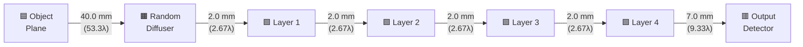

# 3. D2NN 시스템 설계 해부

> [!abstract] 일관된 설계점 (Consistent Design Point)
> Luo et al. (2022)의 baseline 파라미터 $\{\lambda = 0.75\,\text{mm},\; \Delta x = 0.3\,\text{mm},\; N = 240,\; d = 2\,\text{mm},\; z_{\text{obj}} = 40\,\text{mm},\; z_{\text{out}} = 7\,\text{mm},\; \text{pad} = 2\}$는 개별 최적값의 모음이 아니라, ==상호 의존적 제약을 동시에 만족하는 하나의 일관된 설계점==이다. 본 절에서는 논문이 명시적으로 설명하지 않는 **암묵적 설계 제약(tacit design constraints)** — 각 파라미터가 왜 그 값이어야 하는지 — 을 BL-ASM 전파 물리에 근거하여 해부한다.

![[fig_system_geometry.png|700]]
*그림 3.1: D2NN 광학 시스템의 측면 기하 배치. Object plane에서 random diffuser를 거쳐 4개의 학습 가능한 phase layer를 통과한 뒤 output (detector) plane에 도달한다.*

---

## 3.1 BL-ASM 전파와 설계 제약

### 3.1.1 BL-ASM 전달 함수의 구조

Band-Limited Angular Spectrum Method (BL-ASM)은 자유 공간 스칼라 회절 전파의 표준 수치 기법이다[^1]. 전달 함수(transfer function)는 다음과 같이 정의된다:

$$H(f_x, f_y; z) = \begin{cases} \exp\!\left(j\,2\pi z \sqrt{\dfrac{1}{\lambda^2} - f_x^2 - f_y^2}\right), & f_x^2 + f_y^2 < \dfrac{1}{\lambda^2} \\[6pt] 0, & \text{otherwise (evanescent)} \end{cases}$$

여기서 $f_x, f_y$는 공간 주파수 (cycles/mm), $\lambda = 0.75$ mm는 동작 파장, $z$는 전파 거리 (mm)이다. [[section2_diffuser_physics|Section 2]]에서 다룬 diffuser의 위상 변조가 이 전달 함수와 결합하여 시스템의 전파 특성을 결정한다.

코드에서 `propagating = f_sq < cutoff_sq` 조건이 evanescent wave를 완전히 차단(mask)하며, 이는 전파 가능한 공간 주파수의 상한을 $f_{\max} = 1/\lambda$로 엄격히 제한한다. 이 masking이 수치적 안정성과 물리적 정확성을 동시에 보장한다.

### 3.1.2 그리드 파라미터와 Nyquist 제약

> [!example]- 상세 계산: Nyquist 한계로부터 pitch 결정
> Shannon-Nyquist 정리에 의해 공간 주파수를 올바르게 샘플링하려면:
>
> $$\Delta x \leq \frac{\lambda}{2} \cdot \frac{1}{\sin\theta_{\max}}$$
>
> BL-ASM에서 전파 가능한 최대 공간 주파수는:
>
> $$f_{\max} = \frac{1}{\lambda} = \frac{1}{0.75\,\text{mm}} = 1.333\,\text{cycles/mm}$$
>
> Nyquist 조건에 의해 이를 표현하기 위한 최소 샘플링 밀도는:
>
> $$\Delta x \leq \frac{1}{2 f_{\max}} = \frac{\lambda}{2} = 0.375\,\text{mm}$$
>
> 실제 pitch $\Delta x = 0.3$ mm는 이 한계의 80%에 해당한다. $\Delta x > 0.375$ mm로 설정하면 evanescent 경계 부근의 고주파 성분이 aliasing되어 비물리적 허상(artifact)이 생기고, 불필요하게 작게 하면 계산량이 $O(N^2 \log N)$으로 급증한다.

> [!important] 암묵지 1
> pitch = 0.3 mm는 "적당히 고른 값"이 아니라, ==$\lambda/2 = 0.375$ mm 한계의 80% 지점==에서 계산 효율과 물리적 정확성을 절충한 **최적점**이다.

**그리드 크기 240 x 240의 근거.** 전체 물리적 FOV는 $L = 240 \times 0.3 = 72$ mm이다. MNIST 이미지는 $28 \to 160$ px로 확대된 뒤 240 x 240 중앙에 배치되어, 양쪽에 40 px = 12 mm의 zero-padding 버퍼가 존재한다. 이 영역이 전파 시 빔 확산(beam spreading)을 수용한다. 원본 MNIST 1 px은 $5.71 \times 0.3 = 1.71$ mm에 대응하여, 가장 미세한 구조(1 px 너비 획)를 5개 이상의 시뮬레이션 픽셀로 표현함으로써 sub-Nyquist sampling을 방지한다.

### 3.1.3 Padding Factor와 주파수 도메인 Aliasing 방지

BL-ASM 전파는 주파수 도메인 곱셈 = 순환 합성곱(circular convolution)이다. 패딩 없이 FFT를 수행하면 필드의 좌우 경계가 wrap-around되어 서로 간섭한다.

> [!example]- 상세 계산: pad_factor=2의 정당성
> `pad_factor=2`는 그리드를 480 x 480으로 확장하여:
> - 주파수 해상도를 $\Delta f = 1/(480 \times 0.3) = 6.94 \times 10^{-3}$ cycles/mm로 미세화
> - 순환 합성곱을 선형 합성곱으로 근사: 240 px + 240 px zero-padding으로 최대 240 px spatial spread를 aliasing 없이 표현
>
> 전파 후 중앙 240 x 240을 crop하는 과정이 `bl_asm_propagate()`에 구현되어 있다.

> [!important] 암묵지 2
> `pad_factor=2`는 ==정확히 최소 요구치==이다. 선형 합성곱과 순환 합성곱의 등가성은 $N_{\text{pad}} \geq 2N - 1$을 요구하며, $2 \times 240 = 480 \geq 2 \times 240 - 1 = 479$로 1만큼의 여유를 두고 충족된다. `pad_factor=1`이면 경계 aliasing이 발생하고, 3 이상이면 불필요한 메모리를 소모한다.

### 3.1.4 Band-Limiting Circle과 수치 개구수

패딩된 그리드의 최대 공간 주파수는 $f_{\max,\text{grid}} = 1/(2\Delta x) = 1.667$ cycles/mm이다. 이 값은 전파 cutoff $1/\lambda = 1.333$ cycles/mm보다 크므로, ==그리드 해상도가 물리적 전파 대역폭을 완전히 포함한다== — 그리드가 아니라 물리가 bottleneck인 상태이다.

> [!tip] 물리적 직관: 해상도 한계의 결정 요인
> 유효 수치 개구수 $\text{NA}_{\text{eff}} = \lambda \cdot f_{\max} = 1.0$이므로, 시스템은 모든 전파 가능한 파동을 포착한다. 이론적 최대 해상도는:
>
> $$\delta_{\min} = \frac{\lambda}{2\,\text{NA}_{\text{eff}}} = \frac{0.75}{2} = 0.375\,\text{mm}$$
>
> $\delta_{\min} > \Delta x = 0.3$ mm이므로, 해상도 한계는 그리드 샘플링이 아니라 **파동 물리**에 의해 결정된다.

---

## 3.2 기하학적 배치의 물리적 의미

### 전체 광학 경로



| 구간 | 거리 (mm) | 파장 단위 ($\lambda$) | Fresnel 확산 $\sqrt{\lambda z}$ | 비고 |
|---|---|---|---|---|
| Object $\to$ Diffuser | 40.0 | 53.3 | 5.48 mm (18.3 px) | 빔 확산 구간 |
| Diffuser $\to$ Layer 1 | 2.0 | 2.67 | 1.22 mm (4.1 px) | 근접장 결합 |
| Layer 1 $\to$ Layer 2 | 2.0 | 2.67 | 1.22 mm (4.1 px) | 근접장 결합 |
| Layer 2 $\to$ Layer 3 | 2.0 | 2.67 | 1.22 mm (4.1 px) | 근접장 결합 |
| Layer 3 $\to$ Layer 4 | 2.0 | 2.67 | 1.22 mm (4.1 px) | 근접장 결합 |
| Layer 4 $\to$ Output | 7.0 | 9.33 | 2.29 mm (7.6 px) | 위상→강도 변환 |
| **합계** | **55.0** | **73.3** | — | — |

### 3.2.1 Object-to-Diffuser 거리: 40 mm

이 거리는 시스템에서 가장 긴 전파 구간이며, 두 가지 물리적 역할을 수행한다.

> [!example]- 상세 계산: Fresnel number와 파동면 확산
> 물체에서 출발한 파동이 diffuser에 도달할 때까지 충분히 확산되어야 diffuser의 모든 픽셀이 물체 전체의 정보를 "감지"할 수 있다. Fresnel number로 정량화하면:
>
> $$F = \frac{a^2}{\lambda z} = \frac{24^2}{0.75 \times 40} = \frac{576}{30} = 19.2$$
>
> ($a = L_{\text{object}}/2 = 48/2 = 24$ mm)
>
> $F \gg 1$이므로 Fresnel 회절 영역에 해당한다. $z = 10$ mm로 줄이면 $F = 76.8$ (기하광학적 상에 근접, speckle decorrelation 약화). $z = 100$ mm 이상이면 $F < 8$ (Fraunhofer 영역 접근, 에너지 밀도 감소, SNR 악화).
>
> 또한 패딩 영역의 물리적 크기 $(480 - 240)/2 \times 0.3 = 36$ mm이 $z = 40$ mm에서의 실효적 빔 확산을 수용해야 한다.

> [!important] 암묵지 3
> 40 mm는 =="물체 정보가 diffuser 전면에 충분히 퍼지되, 패딩 영역을 넘어가지 않는" 절충점==이다. 이 값을 크게 바꾸면 `pad_factor` 또는 그리드 크기도 함께 조정해야 한다.

### 3.2.2 Layer 간격: 2 mm

> [!tip] 물리적 직관: 광학적 receptive field
> 단일 픽셀($\Delta x = 0.3$ mm)에서 $z = 2$ mm 전파 시 Fresnel 확산 폭:
>
> $$w_{\text{Fresnel}} = \sqrt{\lambda z} = \sqrt{0.75 \times 2} = 1.225\,\text{mm} \approx 4.1\,\text{pixels}$$
>
> 이것이 D2NN의 **receptive field**를 결정한다. CNN의 $3 \times 3$ 또는 $5 \times 5$ 커널에 대응하는 ==광학적 receptive field==로, 4개 layer를 거치면 누적 약 $4 \times 4.1 \approx 16$ px — MNIST 숫자의 획 너비(5-15 px) 규모의 특징을 처리할 수 있다.

> [!example]- 상세 계산: layer 간격 변경의 효과
> | $d$ (mm) | $w_{\text{Fresnel}}$ (mm) | 픽셀 수 | 효과 |
> |---|---|---|---|
> | 0.5 | 0.612 | ~2 px | 결합이 너무 국소적, 표현력 저하 |
> | **2.0** | **1.225** | **~4.1 px** | **최적: CNN 3x3/5x5 대응** |
> | 10.0 | 2.739 | ~9 px | 결합이 너무 광범위, 세밀한 제어 희석 |
>
> Layer Fresnel number $F_{\text{layer}} = 36^2/(0.75 \times 2) = 864 \gg 1$: 강한 근접장 영역으로, 각 픽셀이 다음 layer에서 매우 국소적 영역에만 영향을 미쳐 공간적으로 세밀한 위상 제어가 가능하다.

> [!important] 암묵지 4
> $d = 2$ mm는 ==단일 픽셀의 Fresnel 확산이 약 4 픽셀==이 되도록 설계된 값으로, CNN의 $3 \times 3$ / $5 \times 5$ 커널에 대응하는 **광학적 receptive field**를 형성한다. 이 값은 $\lambda$와 $\Delta x$에 의존하며, 독립적으로 변경할 수 없다.

### 3.2.3 Last Layer to Output: 7 mm

마지막 phase layer에서 detector plane까지의 7 mm는 다른 layer 간격보다 3.5배 길다. 이 비대칭은 의도적이다.

> [!tip] 물리적 직관: 위상-강도 변환
> Detector는 **강도(intensity)**만 측정하므로, 마지막 layer의 위상 정보가 간섭을 통해 강도 변조로 전환되어야 한다. $z = 7$ mm에서의 Fresnel 확산:
>
> $$w_{\text{output}} = \sqrt{0.75 \times 7} = 2.29\,\text{mm} \approx 7.6\,\text{pixels}$$
>
> 마지막 layer의 위상 정보가 약 7-8 px 범위로 "혼합(mixing)"되어 강도 패턴을 형성한다. 이 mixing 거리가 너무 짧으면 위상→강도 변환이 불충분하고, 너무 길면 패턴이 과도하게 퍼진다.

> [!important] 암묵지 5
> $z_{\text{out}} = 7$ mm는 =="위상-강도 변환에 충분한 전파 거리를 확보하되, 패턴이 과도하게 퍼져서 detector FOV를 벗어나지 않도록"== 하는 절충이다.

### 3.2.4 해상도 한계와 Grating Period Sweep

`resolution_targets.py`의 테스트 격자 주기(grating period):

```python
SUPPORTED_PERIODS_MM = [7.2, 8.4, 9.6, 10.8, 12.0]
```

> [!example]- 상세 계산: 왜 이 범위인가?
> **이론적 최소 분해 주기**: Rayleigh 기준에 의해 $3 \times \delta_{\min} = 3 \times 0.375 = 1.125$ mm이다. 그러나 실제 시스템에서는:
>
> 1. **Speckle**: Random diffuser가 유효 해상도를 저하시킴
> 2. **유한 학습 용량**: 4-layer D2NN이 모든 공간 주파수를 완벽히 복원 불가
> 3. **활성 영역 제약**: $2.5 \times \text{period} < 48$ mm $\Rightarrow$ period $< 19.2$ mm
> 4. **하한**: 각 bar가 최소 2-3 px (0.6-0.9 mm) 이상 $\Rightarrow$ period $\geq 1.8$ mm
>
> 테스트 범위 7.2-12.0 mm는 이 제약의 중간 영역이다. ==7.2 mm 주기에서 추정 오차가 가장 큰 것==은 시스템의 실효 해상도 한계에 근접하기 때문이다 ([[section4_5_training_results|Section 4-5]] 참조).

### 3.2.5 파라미터 상호의존성

> [!warning] 하나를 바꾸면 전체가 바뀐다
> 아래 표의 어느 한 파라미터를 변경하면 나머지가 ==연쇄적으로== 재설계되어야 물리적 정합성이 유지된다.

| 변경 파라미터 | 직접 영향 | 연쇄 영향 |
|---|---|---|
| $\Delta x$ 증가 | Nyquist 주파수 감소 | 해상도 저하, band-limiting 원 축소, 최소 분해 주기 증가 |
| $\Delta x$ 감소 | 그리드 크기($N$) 증가 필요 | FFT 계산량 $\propto N^2\log N$ 증가, 메모리 증가 |
| $N$ 증가 | FOV 증대 | 더 많은 spatial spread 허용, MNIST 상대 크기 변화 |
| $z_{\text{layer}}$ 증가 | Fresnel 확산 증대 | Receptive field 증가, 패딩 영역 부족 가능 |
| $z_{\text{layer}}$ 감소 | Fresnel 확산 축소 | Layer 간 결합 약화, 네트워크 표현력 저하 |
| `pad_factor` 감소 (1) | 패딩 영역 소멸 | Circular convolution aliasing 발생 |
| `pad_factor` 증가 (3+) | 메모리 $\times 2.25$ 증가 | 정확도 향상 미미, 비용 대비 효과 없음 |
| $\lambda$ 변경 | 전체 스케일링 변화 | $\Delta x$, 모든 $z$ 값, diffuser 특성 모두 재설계 필요 |

---

### 참조 코드 파일

| 파일 | 역할 |
|---|---|
| `configs/baseline.yaml` | 전체 시스템 파라미터 정의 |
| `optics/bl_asm.py` | BL-ASM 전달 함수 계산 및 전파 |
| `optics/grids.py` | 공간/주파수 도메인 격자 생성 |
| `optics/aperture.py` | 원형 개구(circular aperture) 및 NA 마스크 |
| `models/d2nn.py` | 4-layer D2NN 모델, 전달 함수 사전 계산 |
| `data/resolution_targets.py` | 3-bar grating 테스트 타겟 생성 |
| `figures/fig3_period_sweep.py` | Grating period 복원 실험 및 시각화 |

[^1]: BL-ASM의 상세한 물리적 배경은 [[section2_diffuser_physics]]에서 다룬다.
