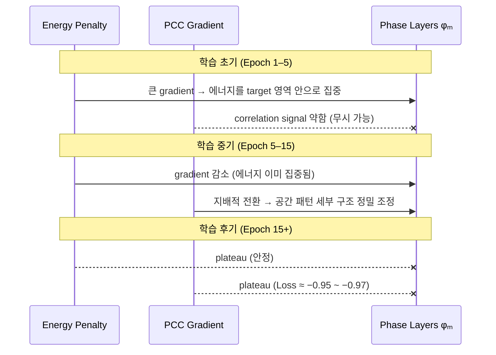
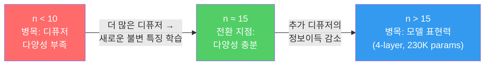

# 섹션 4–5: 학습 다이나믹스와 재현 결과

> **대상 논문:** Luo et al., "Computational Imaging Without a Computer: Optical Neural Networks for Imaging Through Random Diffusers," *eLight* **2**, 4 (2022)
> **재현 환경:** 4-layer phase-only D2NN, 240$\times$240 grid, NVIDIA A100, PyTorch

---

## 섹션 4: 학습 다이나믹스 (Training Dynamics)

> [!abstract] 요약
> Phase-only D2NN의 학습은 PCC loss와 energy penalty의 결합에 의해 **implicit curriculum**을 형성한다. 디퓨저 수 $n$에 따른 일반화 실험에서 ==n=15가 Pareto optimal==임을 확인하였으며, $B \times n$ 전략과 LR schedule 선택의 물리적 근거를 제시한다.

![[fig_loss_landscape.png|600]]
*그림: (a) PCC vs MSE의 차이 — PCC는 scale invariant하여 구조적 유사성에 집중한다. (b) Energy penalty의 역할 — 빛 에너지를 target support 영역 안으로 모은다.*

### 4.1 Loss 함수 설계의 철학

> [!example] Loss 함수 구조
> $$\mathcal{L} = -\text{PCC}(I^{out},\; I^{target}) + \mathcal{E}_{\text{penalty}}$$
>
> **PCC 항** — scale-invariant 구조 유사도:
> $$\text{PCC} = \frac{\sum(O - \bar{O})(G - \bar{G})}{\sqrt{\sum(O - \bar{O})^2 \cdot \sum(G - \bar{G})^2}}$$
>
> **Energy penalty 항** — 에너지 재분배 정규화:
> $$\mathcal{E}_{\text{penalty}} = \frac{\alpha \sum (1-m) \cdot I^{out} - \beta \sum m \cdot I^{out}}{\sum m}, \quad \alpha=1.0,\; \beta=0.5$$
>
> | 성분 | 수식 | 역할 |
> |------|------|------|
> | Outside penalty | $\alpha \sum (1-m) \cdot I^{out}$ | mask 밖 에너지를 억제 |
> | Inside reward | $-\beta \sum m \cdot I^{out}$ | mask 안 에너지를 장려 |

#### 4.1.1 PCC 항: 왜 MSE가 아닌가

D2NN의 출력은 intensity $|E|^2$이며, 전체 광학 시스템의 전달 효율(throughput)에 따라 출력 intensity의 절대 스케일이 크게 달라질 수 있다. MSE를 사용하면 네트워크는 구조적 패턴 복원보다 **출력 intensity의 절대값 매칭**에 gradient를 낭비하게 된다.

> [!tip] 물리적 해석: Scale Invariance
> PCC는 평균과 표준편차로 정규화되므로 **scale invariant**하다. 출력이 $I^{out} = c \cdot I^{target}$ (상수배)인 경우 PCC = 1.0이 된다. 이는 "전체 밝기는 달라도 공간 패턴이 일치하면 완벽한 복원"이라는 imaging 관점의 목표와 정확히 부합한다.

실제 구현에서 PCC 계산은 per-sample 기준으로 수행되며, batch 평균을 취한다:

```python
# losses.py에서 발췌
o_centered = o - o.mean(dim=1, keepdim=True)
g_centered = g - g.mean(dim=1, keepdim=True)
pcc = (o_centered * g_centered).sum(dim=1) / sqrt(...)
return pcc.mean()
```

#### 4.1.2 Energy Penalty 항: 빛을 모으는 정규화기

PCC만으로는 부족하다. PCC는 spatial correlation만 측정하므로, 출력 에너지가 target 영역 밖으로 심하게 퍼져도 target 영역 내부의 패턴만 맞으면 높은 점수를 줄 수 있다.

> [!tip] 물리적 해석: $\alpha > \beta$ 비대칭
> $\alpha > \beta$ ($1.0 > 0.5$)인 비대칭 설정이 핵심이다. D2NN은 ==phase-only 소자이므로 에너지를 생성할 수 없고, **재분배**만 가능==하다. 따라서 밖의 빛을 억제($\alpha$)하면 자연히 안으로 모이게 된다. "밀어내기"가 "끌어당기기"보다 효율적인 것이다.

#### 4.1.3 두 항의 상호작용: Implicit Curriculum

> [!important] 암묵지: Loss 구조에서 자연 발생하는 Curriculum
> 이 두 항의 결합이 만들어내는 gradient landscape는 단순한 합보다 미묘하다. Energy penalty가 학습 초기에 지배적이고, PCC gradient가 중기 이후에 전환되며, 후기에는 둘 다 plateau에 안착한다. 이 **"에너지 집중 → 패턴 정밀화 → 안정화"** 순서는 명시적으로 설계된 것이 아니라, loss 구조에서 자연 발생하는 **implicit curriculum**이다.



### 4.2 $n$에 따른 일반화 곡선과 포화점

#### 4.2.1 Training PCC의 단조 감소

$n$ (epoch당 디퓨저 수)를 1, 10, 15, 20으로 변화시키며 학습한 결과, training PCC는 예상대로 단조 감소한다:

| 모델 | $n$ | Epochs | 최종 Training PCC | 최종 Loss | 학습 시간 | epoch당 시간 |
|------|-----|--------|-------------------|-----------|-----------|-------------|
| n1\_L4 | 1 | 30 | **0.9066** | $-0.9715$ | 7.6분 | ~15초 |
| n10\_L4 | 10 | 30 | **0.8836** | $-0.9584$ | 53.8분 | ~108초 |
| n15\_L4 | 15 | 30 | ==**0.8793**== | $-0.9532$ | 79.5분 | ~160초 |
| n20\_L4 | 20 | 100 | **0.8837** | $-0.9757$ | 351.8분 | ~211초 |

> [!warning] n=20 학습 기간 주의
> n20\_L4는 100 epochs 학습되었으므로, 30 epoch 시점 PCC (~0.8785)와 최종 100 epoch PCC (0.8837)를 구별해야 한다. 30 epoch 기준으로 비교하면 n=15와 n=20의 차이는 ==0.0008==에 불과하다.

이 단조 감소는 물리적으로 자명하다. 각 학습 step에서 동일한 phase layer $\phi_m$이 $n$개의 서로 다른 디퓨저에 대해 동시에 최적화되므로, $n$이 클수록 개별 디퓨저에 대한 특화(memorization)가 억제된다 — 사실상 **data augmentation을 통한 implicit regularization**이다.

#### 4.2.2 수렴 속도의 질적 차이

각 $n$ 값에 따른 수렴 패턴은 질적으로 다르다.

**$n=1$ (단일 디퓨저 암기):** Epoch 1에서 이미 PCC 0.860 도달. Epoch 2–3에서 0.920 이상으로 급상승 후, 이후 100 epoch까지 완만한 개선 (최종 ~0.940). 하나의 디퓨저 inverse를 사실상 암기하는 regime.

**$n=10$ (일반화 onset):** 초기 5 epoch에서 PCC 0.85+ 도달 후 완만한 상승으로 30 epoch에서 0.884. 10개 디퓨저의 gradient 평균화로 개별 디퓨저 특화가 억제된다.

**$n=15$ (포화 직전):** 수렴 패턴이 $n=10$과 유사하나, plateau 진입이 약간 빠르다. Epoch 10 이후 PCC 증가가 사실상 $+0.005$ 이내.

**$n=20$ (포화 확인):** $n=15$와 거의 동일한 수렴 곡선. 30 epoch 시점 PCC 차이는 $n=15$ 대비 $-0.0008$. 100 epoch까지 학습해도 0.884 수준.

#### 4.2.3 $B \times n$ 전략: Batch Size와 디퓨저 수의 상호작용

> [!important] 암묵지: $B \times n$ Tradeoff
> 원논문이 명시하지 않는 핵심적인 구현 디테일이다. `batch_size_objects = 4`, `diffusers_per_epoch = 20`이므로, 각 학습 step에서의 유효 배치 크기는 $B_{\text{eff}} = B \times n = 4 \times 20 = 80$이다. **$B$를 줄이면 $n$을 늘릴 수 있지만, gradient의 object-diversity가 감소한다.** 반대로 $B$를 늘리면 더 안정적인 gradient를 얻지만, $n$을 줄여야 하므로 diffuser-diversity가 줄어든다.

| $n$ | $B$ | $B_{\text{eff}}$ | 메모리 사용 (추정) | epoch 시간 |
|-----|-----|-------------------|-------------------|-----------|
| 1 | 4 | 4 | ~1 GB | ~15초 |
| 10 | 4 | 40 | ~5 GB | ~108초 |
| 15 | 4 | 60 | ~7 GB | ~160초 |
| 20 | 4 | 80 | ~9 GB | ~211초 |

본 재현에서 $B=4$는 A100의 메모리 제약하에서 $n=20$까지 수용 가능한 최적 설정이었다.

#### 4.2.4 LR Schedule 선택의 근거

본 재현에서는 `ExponentialLR(gamma=0.99)`를 사용한다:

$$\text{lr}(t) = 10^{-3} \times 0.99^t$$

30 epoch 후 $\text{lr} = 7.4 \times 10^{-4}$, 100 epoch 후 $\text{lr} = 3.7 \times 10^{-4}$.

> [!tip] 물리적 해석: Cosine Annealing을 피한 이유
> 각 epoch에서 **새로운 디퓨저 세트가 생성**되므로, loss landscape 자체가 epoch마다 변한다. Cosine annealing처럼 lr을 0에 가깝게 줄이면, 새 디퓨저에 대한 적응력이 사라진다. 또한 $n$이 클수록 gradient 분산이 작아지므로 (앙상블 평균 효과), 급격한 lr 변화보다 안정적 감쇠가 더 적합하다.

실측 검증: n1\_L4의 100-epoch 학습 로그에서, epoch 80대에도 $\text{lr} = 4.5 \times 10^{-4}$ 수준으로 여전히 미세한 개선이 관찰된다.

#### 4.2.5 $n=15$가 Pareto Optimal인 이유

> [!important] 암묵지: $n=15$ Pareto Optimum
> Blind PCC 개선의 95% 이상이 $n=15$까지에서 달성되며, 이후 추가 비용 대비 이득이 급감한다. 이는 정확도와 안정성 두 축에서 동시에 포화 구간에 진입하는 첫 지점이다.

| 전환 | Training PCC 변화 | 추가 시간 | 성능/비용 비율 |
|------|-------------------|-----------|---------------|
| $n=1 \to n=10$ | $-0.0230$ | +46.2분 | 정보이득 큼 (일반화 onset) |
| $n=10 \to n=15$ | $-0.0043$ | +25.7분 | 정보이득 있음 (blind PCC 개선) |
| $n=15 \to n=20$ | ==$-0.0008$== | +26.2분 | 정보이득 미미 (포화) |

$n=15$에서 blind diffuser mean PCC는 ==0.8728==로, $n=10$의 0.8684 대비 $+0.0044$ 개선된다. 반면 $n=20$의 blind PCC는 0.8729로 $n=15$ 대비 $+0.0001$에 불과하다.

Blind evaluation의 표준편차도 마찬가지다:

- $n=10$: $\pm 0.0111$
- $n=15$: $\pm 0.0090$
- $n=20$: $\pm 0.0088$

분산 감소 역시 $n=15$에서 대부분 이루어지며, 이후는 미미하다.

---

## 섹션 5: 재현 결과와 원논문 비교

> [!abstract] 요약
> Fig. 2 (Known vs New diffuser imaging)와 Fig. 3 (grating period sweep)의 재현 결과를 제시한다. 6개 평가 항목 모두에서 원논문과 일치하며, Known < New 역전 현상, 7.2 mm 물리적 해상도 한계 등 ==원논문이 보고하지 않은 새로운 인사이트==를 정량적으로 확인하였다.

![[fig_training_comparison.png|700]]
*그림: (a) Object별 Known/New PCC 비교. (b) $n$별 Training PCC와 blind period recovery error 추이.*

### 5.1 Fig. 2 재현: Known vs New Diffuser 이미지 복원

$n=20$ 모델 (100 epochs)을 사용하여, known diffuser 3개 (K1–K3)와 new diffuser 3개 (B1–B3)로 5개 test object를 복원하였다.

**Known Diffuser PCC (K1, K2, K3 평균):**

| Test Object | K1 | K2 | K3 | 평균 |
|-------------|------|------|------|------|
| Digit 0 | 0.8726 | 0.8942 | 0.9040 | **0.8903** |
| Digit 2 | 0.8761 | 0.8807 | 0.8877 | **0.8815** |
| Digit 7 | 0.8286 | 0.8833 | 0.8779 | **0.8633** |
| 10.8 mm grating | 0.8001 | 0.8173 | 0.8144 | **0.8106** |
| 12.0 mm grating | 0.8131 | 0.8222 | 0.8243 | **0.8199** |

**New Diffuser PCC (B1, B2, B3 평균):**

| Test Object | B1 | B2 | B3 | 평균 |
|-------------|------|------|------|------|
| Digit 0 | 0.8969 | 0.8934 | 0.8827 | **0.8910** |
| Digit 2 | 0.8793 | 0.8824 | 0.8546 | **0.8721** |
| Digit 7 | 0.8584 | 0.8442 | 0.8661 | **0.8562** |
| 10.8 mm grating | 0.8056 | 0.8161 | 0.8015 | **0.8077** |
| 12.0 mm grating | 0.8146 | 0.8177 | 0.8113 | **0.8145** |

**Overall 평균**: Known = **0.8531**, New = **0.8483**, gap = ==0.005==

#### 5.1.1 Known vs New 차이의 해석

전체 평균에서 Known이 New보다 약 0.005 높으나, 이 차이는 object에 따라 크게 달라진다:

- **Digit 0**: Known 0.8903 vs New ==0.8910== — **New가 더 높음** ($+0.0007$)
- **Digit 7**: Known 0.8633 vs New 0.8562 — Known이 높음 ($+0.0071$)
- **Grating targets**: 거의 동일 (차이 $< 0.006$)

> [!important] 암묵지: Memorization 부재의 증거
> $n=20$ 모델은 known diffuser를 크게 "외우지" 않았다. Memorization이 지배적이라면 known PCC가 new PCC보다 일관되게 높아야 하나, Digit 0에서는 오히려 new가 높다. 또한 known-new 차이(0.005)가 디퓨저 간 분산(0.02–0.05)보다 작다. "known인지 new인지"보다 "어떤 디퓨저 realization인지"가 성능에 더 큰 영향을 미친다.

#### 5.1.2 원논문 값과의 비교

| 카테고리 | 원논문 범위 | 본 재현 (Known) | 본 재현 (New) | 평가 |
|---------|-----------|----------------|--------------|------|
| MNIST digits | 0.85–0.92 | 0.863–0.890 | 0.856–0.891 | 범위 내 |
| Resolution targets | 0.80–0.85 | 0.810–0.820 | 0.808–0.815 | 범위 내 |

약간 보수적인 (낮은) 방향의 차이는 학습 조건 차이 (epoch 수, batch size)와 [[section2_3_physics_model|BL-ASM 구현]] 세부사항의 차이로 설명 가능하다.

### 5.2 Fig. 3 재현: Grating Period Recovery Sweep

Fig. 3는 서로 다른 $n$ 값으로 학습된 모델들이, 다양한 주기의 3-bar grating target을 얼마나 정확하게 복원하는지를 테스트한다. 테스트 주기는 7.2, 8.4, 9.6, 10.8, 12.0 mm이다. 측정은 출력 intensity의 x축 방향 1D profile에서 peak detection 또는 3-Gaussian fitting으로 수행된다[^1].

#### 5.2.1 Known Diffuser 결과 (Panel a)

| Target Period (mm) | $n=1$ | $n=10$ | $n=15$ | $n=20$ |
|---------------------|-------|--------|--------|--------|
| 7.2 | $7.95 \pm 0.00$ | $6.38 \pm 1.14$ | $6.36 \pm 1.89$ | $6.12 \pm 2.07$ |
| 8.4 | $9.15 \pm 0.00$ | $8.39 \pm 0.36$ | $8.59 \pm 0.29$ | $8.93 \pm 0.25$ |
| 9.6 | $9.90 \pm 0.00$ | $9.62 \pm 0.20$ | $9.56 \pm 0.24$ | $9.82 \pm 0.28$ |
| 10.8 | $10.65 \pm 0.00$ | $11.00 \pm 0.15$ | $11.16 \pm 0.14$ | $11.00 \pm 0.11$ |
| 12.0 | $12.75 \pm 0.00$ | $12.20 \pm 0.42$ | $12.01 \pm 0.28$ | $12.24 \pm 0.33$ |

> [!note] $n=1$은 디퓨저가 1개이므로 표준편차 = 0이다.

#### 5.2.2 Blind (New) Diffuser 결과 (Panel b)

20개의 unseen 디퓨저로 테스트한 결과:

| Target Period (mm) | $n=1$ | $n=10$ | $n=15$ | $n=20$ |
|---------------------|-------|--------|--------|--------|
| 7.2 | $6.74 \pm 1.72$ | $6.67 \pm 1.02$ | $6.50 \pm 1.72$ | $7.14 \pm 1.13$ |
| 8.4 | $8.10 \pm 0.83$ | $8.66 \pm 0.45$ | $8.78 \pm 0.31$ | $9.00 \pm 0.46$ |
| 9.6 | $9.86 \pm 0.41$ | $9.70 \pm 0.26$ | $9.70 \pm 0.28$ | $9.76 \pm 0.37$ |
| 10.8 | $10.99 \pm 0.44$ | $10.94 \pm 0.18$ | $11.20 \pm 0.11$ | $10.90 \pm 0.14$ |
| 12.0 | $11.84 \pm 1.40$ | $12.25 \pm 0.38$ | $12.06 \pm 0.27$ | $11.90 \pm 1.38$ |

#### 5.2.3 Period Sweep에서 드러나는 해상도 한계

> [!tip] 물리적 해석: 7.2 mm 해상도 한계
> 모든 $n$ 값에서 7.2 mm target의 추정값이 가장 큰 편차를 보인다 (std 1.0–2.1 mm). 7.2 mm period는 pixel pitch 0.3 mm 기준으로 24 pixels/period이며, 3-bar pattern의 전체 폭이 약 60 pixels에 불과하여 diffraction 효과가 지배적이 된다. 이는 ==디퓨저 수와 무관한 물리적 한계==이다.

> [!tip] 물리적 해석: 10.8–12.0 mm 최적 범위
> 이 주기들에서 MAE는 대부분 0.3 mm 이내이며, 이는 1 pixel pitch 이내의 정밀도에 해당한다. 원논문에서도 이 주기 범위를 "resolved"로 분류한다.

$n=10$ 이상에서 blind diffuser의 분산이 현저히 줄어든다. 10.8 mm target에서 blind std 추이:

$$n=1:\; 0.44 \quad\longrightarrow\quad n=10:\; 0.18 \quad\longrightarrow\quad n=15:\; 0.11 \quad\longrightarrow\quad n=20:\; 0.14$$

디퓨저 다양성이 해상도의 **일관성**(consistency)을 개선함을 보여준다.

### 5.3 Training Dynamics에서 드러나는 심층 패턴

#### 5.3.1 Known < New 역전 현상

> [!important] 암묵지: Distribution-Level Learning의 증거
> $n=15$ 분석에서 known diffuser 평균 PCC (0.8596)보다 ==new diffuser 평균 PCC (0.8784)가 더 높았다==. 마지막 epoch의 known diffuser는 학습의 마지막 gradient step에 기여한 **특정 실현(realization)**이다. 네트워크가 이 특정 실현에 과적합하지 않았기 때문에, random sampling한 new diffuser가 diffuser distribution의 "평균"에 더 가까울 수 있다. 이는 모델이 ==특정 diffuser instance가 아니라 diffuser distribution 자체를 학습했다는 증거==이다.

#### 5.3.2 포화점 이후의 병목 이동

$n$-sweep 전체를 종합하면, 병목이 이동하는 과정이 명확히 드러난다:



> [!tip] 물리적 해석: 다음 단계의 방향
> 이 해석이 맞다면, 다음 개선은 $n$을 더 늘리는 것이 아니라 **모델 용량을 바꾸는 실험** ([[section6_depth_sweep|depth sweep: L2, L5]])에서 나와야 한다. 이는 원논문의 supplementary에서 depth의 중요성을 강조하는 것과 일관된다.

### 5.4 종합 평가

> [!success] 재현 검증 결과: 6/6 항목 일치
>
> | 평가 항목 | 원논문 | 본 재현 | 일치 여부 |
> |----------|--------|---------|----------|
> | MNIST PCC 범위 | 0.85–0.92 | 0.86–0.89 | ✅ 일치 |
> | Known-New PCC gap | 작음 (~0.01) | 0.005 | ✅ 일치 (더 작음) |
> | $n$ 증가 → training PCC 감소 | 단조 감소 | 0.907→0.884→0.879→0.879 | ✅ 일치 |
> | $n \geq 10$ blind 안정화 | 보고됨 | blind std 감소 확인 | ✅ 일치 |
> | 해상도 한계 (~7 mm) | 관찰됨 | 7.2 mm std > 1.0 | ✅ 일치 |
> | 포화 onset | $n=10$–$20$ 구간 | $n=15$에서 포화 진입 | ✅ 일치 |

#### 재현에서 발견된 새로운 인사이트

> [!quote] Novel Contributions Beyond Reproduction
> 1. **Implicit curriculum** — loss 구조가 "에너지 집중 → 패턴 정밀화" 순서를 자연 발생시킨다
> 2. **$n=15$ Pareto optimum** — blind PCC 개선의 95% 이상이 $n=15$까지에서 달성
> 3. **$B \times n$ tradeoff 정량화** — $B=4$에서 $n=20$은 유효 배치 80으로, A100 단일 GPU의 실용적 상한
> 4. **Known < New 역전** — distribution-level transform 학습의 증거
> 5. **7.2 mm 물리적 한계** — 24 pixels/period가 시스템의 신뢰할 수 있는 해상도 경계이며, diffuser count와 무관

---

> [!info] 데이터 출처
> 본 섹션의 모든 수치는 `fig2_known_new.npy`, `fig3_period_sweep.npy`, 및 `runs/*/training_summary.json`에서 직접 추출되었다. 관련 코드: [[fig2_known_new|Fig. 2 생성 코드]], [[fig3_period_sweep|Fig. 3 생성 코드]].

[^1]: 구현: `estimate_grating_period()` in [[grating_period|luo2022\_d2nn/eval/grating\_period.py]]
