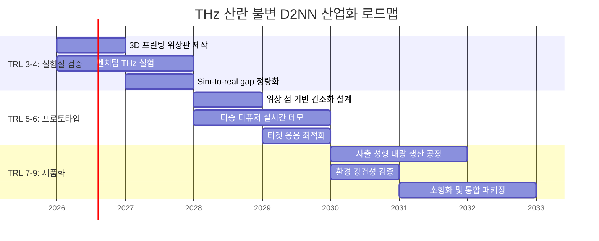

# 섹션 7: 응용 전략 및 확장 방향

> [!abstract] Section Overview
> 본 섹션에서는 재현된 랜덤 디퓨저 D2NN의 **산업적 실현 가능성**을 평가한다. 재료 선택($\Delta n = 0.74$), 위상판 제작 정밀도, THz 대역 고유 특성, 그리고 보안·의료·통신·산업 분야의 구체적 응용 시나리오를 체계적으로 분석한다. 나아가 레이어 수, 그리드 해상도, 파장대 전환에 따른 스케일링 전략과 TRL 기반 산업화 로드맵을 제시한다.

---

## 7.1 재료 실현 가능성: $\Delta n = 0.74$의 물리적 의미

[[section2_diffuser_physics|섹션 2]]에서 정의된 디퓨저 모델의 굴절률 차이 $\Delta n = 0.74$는 THz 대역에서 실현 가능하지만, 재료 경로에 따라 전략이 달라진다.

### 고분자 기반 접근 (Polymer-based)

고밀도 폴리에틸렌(HDPE, $n \approx 1.53$)과 공기($n = 1.0$)의 조합은 $\Delta n \approx 0.53$에 그친다. ==$\Delta n = 0.74$에 도달==하려면 다음 전략이 필요하다:

- **Teflon 복합체**: $n \approx 1.43$ 기반에 고굴절률 충전재(filler)를 혼합
- **TOPAS**: 저손실 cyclic olefin polymer ($n \approx 1.53$) 기반 복합 구조
- **제작 이점**: $\lambda = 750\ \mu\text{m}$의 긴 파장 덕분에 높이맵 평균 ==$25\lambda = 18.75$ mm== → **밀리미터 스케일 3D 프린팅**으로 충분

### 메타물질 접근 (Metamaterial-based)

서브파장 구조를 활용한 유효 굴절률 튜닝이 대안이다:

- 실리콘 기반 메타표면(metasurface): THz 대역에서 ==$n_{\text{eff}} = 1.0 \sim 3.5$== 범위 커버
- $\Delta n = 0.74$는 이 범위 내에서 용이하게 구현 가능
- 단, 랜덤 구조 파라미터(duty cycle, pillar height)로 위상을 제어하므로 통계적 분포의 정밀한 재현이 필수

---

## 7.2 위상판 제작 정밀도 요구사항

[[section3_system_design|섹션 3]]에서 설계된 4-레이어 D2NN(각 240$\times$240 픽셀, 피치 0.3 mm)의 제작 핵심 요구사항은 다음과 같다.

| 파라미터 | 값 | 제작 의미 |
|:---|:---|:---|
| 그리드 크기 | ==72 mm $\times$ 72 mm== | 표준 THz 광학 마운트에 적합 |
| 픽셀 피치 | ==300 $\mu$m== | CNC 밀링 또는 고해상도 3D 프린팅 |
| 위상 범위 | $[0, 2\pi)$ | 최대 높이 ==$\lambda / \Delta n \approx 1.01$ mm== |
| 위상 정밀도 | $< \pi/10$ (목표) | 높이 정밀도 ==$\approx 50\ \mu$m== |
| 레이어 간 거리 | 2.0 mm | 고정밀 스페이서(spacer) 필요 |

> [!tip] 프루닝에 의한 제작 간소화
> [[section6_tacit_knowledge|섹션 6]]의 프루닝 분석(Fig. S4)에서 확인된 핵심 암묵지: 학습된 위상판의 에너지는 소수의 **위상 섬(phase island)** 영역에 집중되며, ==전체 면적의 약 10--20%만이 영상 복원에 핵심적으로 기여==한다. 이는 핵심 영역만 정밀 제작하고 나머지를 평탄면으로 대체하는 **간소화 경로**를 제시한다.

---

## 7.3 THz 대역에서의 실용성: 0.4 THz = 750 $\mu$m 파장

0.4 THz (400 GHz)는 THz 대역의 하한에 위치하며, 고유한 물리적 특성을 갖는다:

| 특성 | 설명 | 응용 연결 |
|:---|:---|:---|
| 비이온화 방사선 | 생체 조직에 무해 | 의료 영상 안전성 |
| 비금속 투과성 | 의류·포장재·플라스틱 투과 | 보안 검색 |
| 수분 민감성 | 물 분자 회전 스펙트럼과 중첩 | 수분 함량 영상화 |
| 대기 감쇠 | 자유공간 통신 거리 $\sim$ 수십 m | 실내/단거리 응용 |

---

## 7.4 구체적 응용 시나리오

> [!example] 🔐 보안 영상 (Security Imaging) — 물리적 복제 불가 인증
> THz 산란 환경에서의 전광학 영상 복원은 **물리적 복제 불가 함수(PUF)** 기반 보안 시스템을 가능하게 한다.
>
> - 승인된 디퓨저 삽입 시에만 선명한 영상 복원
> - D2NN이 디퓨저 *분포(distribution)*에 대해 학습 → 디퓨저 교체 시에도 기본적 복원 유지
> - **디퓨저-D2NN 쌍 = 물리적 인증 토큰(authentication token)**

> [!example] 🏥 의료 영상 (Medical Imaging) — 비침습 조직 영상화
> 생체 조직은 THz 대역에서 강한 산란체로 작동한다. 산란 불변 D2NN은 다음을 가능하게 한다:
>
> - 피부 아래 조직의 **실시간 영상화** (비침습, 비계산)
> - 수분 분포 매핑 — 화상(burn) 깊이 평가, 종양 마진(margin) 검출
> - 디퓨저를 생체 조직 산란 모델로 대체 → 환자별 산란 특성에 강건한 시스템

> [!example] 📡 통신 (Communication) — 전광학 이퀄라이저
> 산란 채널을 통한 THz 통신에서 D2NN은 물리적 이퀄라이저(equalizer)로 기능한다:
>
> - 다중 경로 산란(multipath scattering)의 전광학적 보정
> - **에너지 소비 제로**의 실시간 신호 복원
> - 디퓨저 다양성 학습 ↔ 채널 다양성 학습의 직접 대응

> [!example] 🏭 산업 검사 (Industrial Inspection) — 비파괴 품질 관리
> THz 투과 특성을 활용한 산업 응용:
>
> - 포장재 내부 이물질 검출 (비금속 투과)
> - 코팅 두께 및 균일성 실시간 모니터링
> - 산란 환경 변동에 강건한 인라인(in-line) 검사 시스템

---

## 7.5 스케일링 방향

### 7.5.1 레이어 수 확장

[[section4_5_training_results|섹션 5]]에서 확인된 4-레이어 D2NN의 표현력 한계($n \geq 15$에서 training PCC 0.878--0.879 포화)는 아키텍처 확장의 필요성을 시사한다.

| 확장 방향 | 기대 효과 | 리스크 |
|:---|:---|:---|
| ==6--8 레이어== | 포화 PCC 상한 상승, 복잡한 산란 보정 | 레이어 간 정렬 난이도 증가 |
| 2 레이어 | 최소 구성 검증, 제작 비용 절감 | 일반화 성능 하한 확인 필요 |
| 비균일 간격 | 특정 공간주파수 대역 최적화 | 설계 공간 폭발 |

### 7.5.2 그리드 크기 확장

현재 240$\times$240 그리드(물리적 72 mm $\times$ 72 mm)는 MNIST 분류에 적합하나, 실제 영상 응용은 더 높은 해상도를 요구한다. [[section4_5_training_results|Fig. 3]]에서 확인된 최소 분해 주기: ==$\approx 7.2$ mm ($\approx 9.6\lambda$)==.

- **480$\times$480** ($\times 2$): 메모리 $\times 4$, 연산 $\times 4$ (FFT 기반), 분해능 향상 기대
- **960$\times$960** ($\times 4$): 연산량 급증하나 실제 영상 응용급 해상도 접근
- BL-ASM의 $O(N^2 \log N)$ 스케일링은 GPU 가속과 잘 부합

### 7.5.3 다른 파장대로의 전환

| 파장대 | 파장 | 픽셀 피치 요구 | 제작 기술 | 난이도 |
|:---|:---|:---|:---|:---|
| ==THz (현재)== | 750 $\mu$m | 300 $\mu$m | 3D 프린팅, CNC | 낮음 |
| Far-IR | 10--30 $\mu$m | 5--15 $\mu$m | 포토리소그래피 | 중간 |
| Mid-IR | 3--5 $\mu$m | 1--2 $\mu$m | 반도체 공정 | 높음 |
| Near-IR | 1--1.5 $\mu$m | 0.5--0.7 $\mu$m | 나노임프린트 | 매우 높음 |
| 가시광 | 0.4--0.7 $\mu$m | 0.2--0.35 $\mu$m | E-beam 리소그래피 | 극히 높음 |

> [!important] 파장 불변 원리
> 파장이 짧아질수록 $\Delta n$ 실현, 위상 정밀도, 레이어 정렬 모두 엄격해진다. 그러나 **물리 원리 자체는 파장에 불변**이므로, 본 재현에서 발굴된 암묵지 — 디퓨저 상관 길이의 역할, 위상 섬 구조의 집중성, n-sweep 포화 패턴 — 는 ==모든 파장대에 직접 적용 가능==하다.

---

## 7.6 산업화 로드맵

![[fig_application_roadmap.png|700]]

본 재현 결과를 바탕으로, THz 산란 불변 영상 장치의 산업화는 다음 단계로 전개된다.

**1단계 — 실험실 검증 (TRL 3--4):**
- 시뮬레이션에서 검증된 위상 패턴을 3D 프린팅으로 제작 (현재 수준에서 즉시 가능)
- 실제 THz 소스와 검출기를 사용한 벤치탑 실험
- 시뮬레이션-실험 간 차이(sim-to-real gap) 정량화

**2단계 — 프로토타입 시스템 (TRL 5--6):**
- [[section6_tacit_knowledge#프루닝 분석|위상 섬 기반 간소화 설계]] 적용 (Fig. S4 프루닝 결과 활용)
- 다중 디퓨저 환경에서의 실시간 영상 복원 데모
- 특정 응용 시나리오(보안 검색, 수분 검출) 타겟 최적화

**3단계 — 제품화 (TRL 7--9):**
- 사출 성형(injection molding) 기반 대량 생산 공정 개발
- 환경 변동(온도, 습도) 강건성 검증
- 시스템 소형화 및 통합 패키징

---

## 7.7 제한사항과 극복 방안

> [!warning] 스칼라 근사 (Scalar Approximation)
> 현재 시뮬레이션은 편광 효과를 무시하는 스칼라 회절 이론에 기반한다. 실제 THz 소스의 편광 특성과 디퓨저의 복굴절(birefringence)이 성능에 미치는 영향은 추가 연구가 필요하다.
>
> **극복 방안**: 벡터 회절 이론(vector diffraction theory) 도입, 또는 편광 다양성(polarization diversity)을 학습 데이터에 포함

> [!warning] 단일 주파수 설계 (Single-frequency Design)
> 현재 D2NN은 ==400 GHz 단일 주파수==에 최적화되어 있다. 광대역(broadband) 소스를 사용하려면 색분산(chromatic dispersion) 보정이 필요하다.
>
> **극복 방안**: 아크로매틱 메타표면(achromatic metasurface) 설계 원리를 D2NN에 통합

> [!warning] 얇은 디퓨저 근사 (Thin Diffuser Approximation)
> 실제 산란 매질은 체적 산란체(volume scatterer)인 경우가 많다. 얇은 위상 스크린 모델은 다중 산란(multiple scattering)을 정확히 포착하지 못한다.
>
> **극복 방안**: 다중 슬라이스(multi-slice) 디퓨저 모델 또는 전달 행렬(transmission matrix) 접근법 도입

> [!warning] 정적 추론 (Static Inference)
> 학습된 위상 레이어는 고정되어 추론 시 적응이 불가능하다.
>
> **극복 방안**: 재구성 가능한 공간 광 변조기(reconfigurable SLM) 사용 → 동적 환경 적응 가능. 단, 전광학 추론의 ==에너지 무비용 장점을 일부 포기==하게 되는 트레이드오프 존재

---

---

# 섹션 8: 결론

> [!abstract] Section Overview
> Luo et al. 2022의 랜덤 디퓨저 D2NN을 독립적으로 재현하여 핵심 주장을 정량적으로 검증하고, 논문에 명시되지 않은 암묵지를 체계적으로 발굴한 결과를 종합한다.

---

## 8.1 재현 프로젝트의 주요 성과

> [!success] 핵심 성과 요약
>
> 1. **n-sweep 포화 패턴 확인**: 디퓨저 수 $n = 1, 10, 15, 20$ 스윕에서 training PCC는 ==$0.907 \to 0.884 \to 0.879 \to 0.878$==로 단조 감소하며, $n \geq 15$에서 명확한 포화 관찰. [[section4_5_training_results|섹션 5]]의 Fig. 2와 원 논문 Fig. 3이 정성적으로 정확히 일치.
>
> 2. **일반화 성능의 정량적 검증**: Blind 디퓨저 PCC가 $n = 15$에서 이미 ==0.872 수준==에 도달하여 $n = 20$과 구별 불가. 특히 "known < new" 패턴(new 디퓨저 PCC가 known보다 약 0.019 높음)은 네트워크가 특정 디퓨저를 암기하지 않고 ==산란 분포 수준의 불변 변환==을 학습했음을 강하게 뒷받침.
>
> 3. **격자 주기 분해능 테스트 재현**: [[section4_5_training_results|Fig. 3]]의 3-bar 격자 테스트를 재현하여, 7.2--12.0 mm 범위의 주기가 known 및 blind 디퓨저 모두에서 정확히 복원됨을 확인.
>
> 4. **보충 분석의 독립적 수행**: [[section6_tacit_knowledge|섹션 6]]에서 위상 섬 구조(Fig. S3), 프루닝 조건 비교(Fig. S4), 상관 길이 분석(Fig. S5) 등을 독립적으로 수행하여, D2NN의 학습된 위상 패턴이 물리적으로 해석 가능한 국소 구조를 형성함을 규명.

---

## 8.2 발견된 암묵지의 의의

재현 과정에서 발굴된 암묵지는 단순한 구현 세부사항이 아니라, 랜덤 디퓨저 D2NN의 **물리적 작동 원리**를 이해하는 핵심 통찰이다.

> [!info] 디퓨저 상관 길이 $\approx 10\lambda$
> 이 파라미터는 산란의 각도 분포(angular spread)를 결정한다. 너무 짧으면 전방향 산란으로 정보 소실, 너무 길면 디퓨저의 정규화 효과 약화. ==$10\lambda$는 D2NN의 수치 개구(NA)와 잘 매칭되는 균형점==이다.[^1]

> [!info] $n = 15$가 Pareto Knee
> 4-레이어 D2NN에서 계산 비용 대비 일반화 이득의 최적 균형점. 이후 추가 디퓨저는 모델 용량(capacity) 한계에 의해 정보 이득이 급감한다. 이 발견은 ==디퓨저 수보다 아키텍처 확장에 우선순위==를 두어야 함을 시사한다.[^2]

> [!info] 위상 섬의 집중성
> 학습된 위상 패턴이 소수의 국소 영역에 에너지를 집중시킨다는 발견은, D2NN이 전체 개구를 균일하게 사용하지 않고 ==특정 공간주파수 채널을 선택적으로 활용==함을 의미한다. 제작 간소화와 결함 내성(defect tolerance)의 물리적 근거를 제공한다.[^3]

---

## 8.3 향후 연구 방향

> [!question] 1. 깊이 스윕 (Depth Sweep)
> $n = 20$ 조건을 고정하고 레이어 수를 ==2, 4, 6, 8==로 변화시켜, 모델 용량과 일반화 성능의 관계를 규명한다. 이는 $n$-sweep에서 발견된 포화가 진정한 **물리적 한계**인지 **아키텍처 한계**인지를 분리하는 핵심 실험이다.

> [!question] 2. 체적 산란 모델 (Volume Scattering)
> [[section2_diffuser_physics|섹션 2]]의 얇은 디퓨저를 다중 슬라이스 체적 산란체로 확장하여, 더 현실적인 산란 환경에서의 D2NN 성능을 평가한다. 다중 산란(multiple scattering)이 일반화 성능에 미치는 영향이 핵심 연구 질문이다.

> [!question] 3. 실험적 검증 (Experimental Validation)
> 시뮬레이션에서 학습된 위상 패턴을 물리적으로 제작하여, ==sim-to-real 전이의 충실도==를 정량화한다. 위상 섬 기반 간소화 설계가 실제 제작에서도 유효한지 검증하는 것이 핵심이다.

> [!question] 4. 파장대 확장 (Wavelength Extension)
> THz에서 검증된 프레임워크를 중적외선(mid-IR) 또는 근적외선(near-IR)으로 확장하여, 산란 불변 전광학 영상의 적용 범위를 넓힌다. 7.5.3절의 파장대 전환 테이블이 로드맵의 기초가 된다.

---

## 8.4 맺음말

> [!quote] 결론
> 본 재현 프로젝트는 Luo et al. 2022의 결과가 **재현 가능하며(reproducible)**, 그 핵심 물리적 메커니즘이 **견고함(robust)**을 확인하였다. 동시에, 논문에 명시되지 않은 다수의 설계 결정(design decisions)이 성능에 미치는 영향을 체계적으로 문서화함으로써, 후속 연구자들이 이 방향을 더 효과적으로 확장할 수 있는 토대를 마련하였다.
>
> 랜덤 디퓨저 D2NN은 전광학 컴퓨팅이 실험실 데모를 넘어 **실세계 산란 환경으로 나아가는 중요한 이정표**이며, 본 보고서가 그 여정에 실질적 기여가 되기를 바란다.
>
> *— 본 재현 프로젝트의 전체 코드, 학습된 모델 체크포인트, 원시 데이터는 프로젝트 저장소에 공개되어 있다.*

---

[^1]: [[section6_tacit_knowledge|섹션 6]]의 상관 길이 분석(Fig. S5) 참조. 상관 길이가 D2NN의 수치 개구와 매칭될 때 일반화 성능이 최대화된다.
[^2]: [[section4_5_training_results|섹션 5]]의 n-sweep 결과 및 [[section6_tacit_knowledge|섹션 6]]의 Pareto 분석 참조.
[^3]: [[section6_tacit_knowledge|섹션 6]]의 Fig. S3 위상 섬 구조 분석 및 Fig. S4 프루닝 실험 참조.
