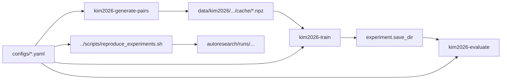

# kim2026

근적외선 자유공간광통신(FSO) 환경에서 대기 난류를 거친 빔을 D2NN / F-D2NN으로 복원하는 재현형 시뮬레이션 프로젝트입니다. deterministic pair cache 구축, 학습/평가, `autoresearch` 스윕 재현까지 한 디렉터리 안에서 연결됩니다.

## 이 디렉터리로 할 수 있는 일

- 난류/진공 complex field pair를 NPZ cache로 생성
- beam-cleanup D2NN 또는 F-D2NN 학습
- checkpoint 기반 평가와 요약 artifact 생성
- `autoresearch/` 기반 스윕과 보고용 figure 재현

## 작업 흐름 한눈에 보기



## 빠른 시작

```bash
cd kim2026
python -m pip install -e .[dev]
kim2026-generate-pairs --config configs/pilot_pair_generation_a100.yaml
kim2026-train --config configs/pilot_train_a100.yaml
kim2026-evaluate --config configs/pilot_eval_a100.yaml
```

커밋된 `autoresearch` 실험을 다시 생성하려면 리포 루트에서 실행합니다.

```bash
./scripts/reproduce_experiments.sh list
./scripts/reproduce_experiments.sh focal_pib --gpu 0
```

## 입출력 계약

| 종류 | 위치 | 설명 |
| --- | --- | --- |
| 입력 설정 | `configs/*.yaml` | runtime, optics, grid, model, training, evaluation 계약 |
| 입력 데이터 | `data/kim2026/...` | pair cache와 split manifest가 위치하는 데이터 저장소 |
| 핵심 실행 | `kim2026-generate-pairs`, `kim2026-train`, `kim2026-evaluate` | 캐시 생성, 학습, 평가 CLI |
| 장기 실험 | `autoresearch/*.py`, `../scripts/reproduce_experiments.sh` | 스윕, ablation, paper figure 재현 |
| 산출물 | `experiment.save_dir`, `autoresearch/runs/` | checkpoint, JSON summary, sample field, 보고용 figure |

## 디렉터리 구조

```text
kim2026/
|-- autoresearch/         # sweep, ablation, paper-figure generation
|-- configs/              # beam-cleanup / FD2NN / pilot / smoke configs
|-- data/                 # generated pair caches and manifests
|-- docs/                 # 계획, 설계, 보고서, troubleshooting notes
|-- scripts/              # dashboard, sweep runner, visualization helpers
|-- src/kim2026/          # optics, turbulence, models, training, viz core
|-- tests/                # config, optics, training, sweep, viz regression tests
|-- troubleshooting/      # physics debugging notes
`-- spec.md               # physics/implementation PRD
```

## 주요 구성요소

| 구성요소 | 역할 | 언제 보나 |
| --- | --- | --- |
| `src/kim2026/` | 난류 채널, D2NN/FD2NN 모델, 학습/평가, 시각화 구현 | 핵심 알고리즘을 이해하거나 수정할 때 |
| `configs/` | 실험 레시피와 runtime 계약 | 새 실험을 돌리거나 비교할 때 |
| `autoresearch/` | 대규모 스윕, 논문 figure 재현, 실험 프로그램 | 보고용 결과를 다시 만들 때 |
| `scripts/` | dashboard, 결과 집계, 시각화, 병렬 sweep 래퍼 | 결과 분석과 운영 자동화 시 |
| `tests/` | optics, seed, config schema, evaluation, sweep 검증 | 변경 후 회귀 확인 시 |
| `docs/`, `troubleshooting/` | 설계 기록과 물리 디버깅 맥락 | 구조를 빠르게 파악할 때 |

## 관련 문서 / 다음에 읽을 것

- `spec.md`: 물리 모델과 sampling 제약의 source-of-truth
- `docs/experiment-catalog.md`: 실험 카탈로그
- `autoresearch/program.md`: 현재 autoresearch 프로그램 메모
- `troubleshooting/TROUBLESHOOTING_PHYSICS.md`: 물리적 이상 징후 진단
- 리포 루트 `scripts/reproduce_experiments.sh`: gitignored 산출물 재생성 진입점
