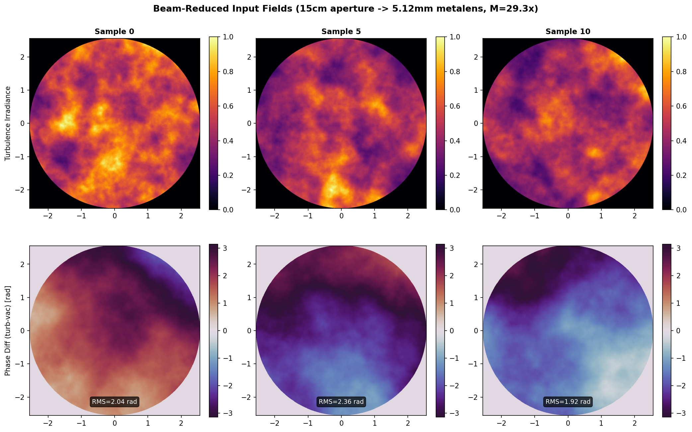
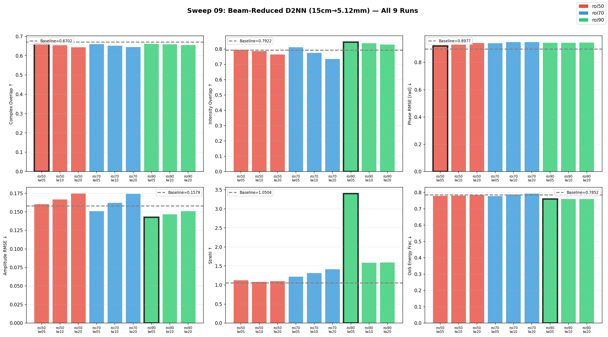
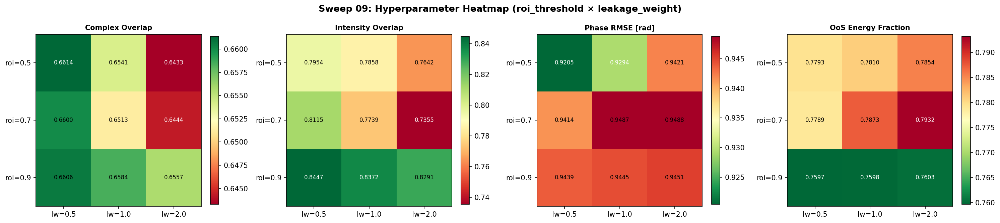
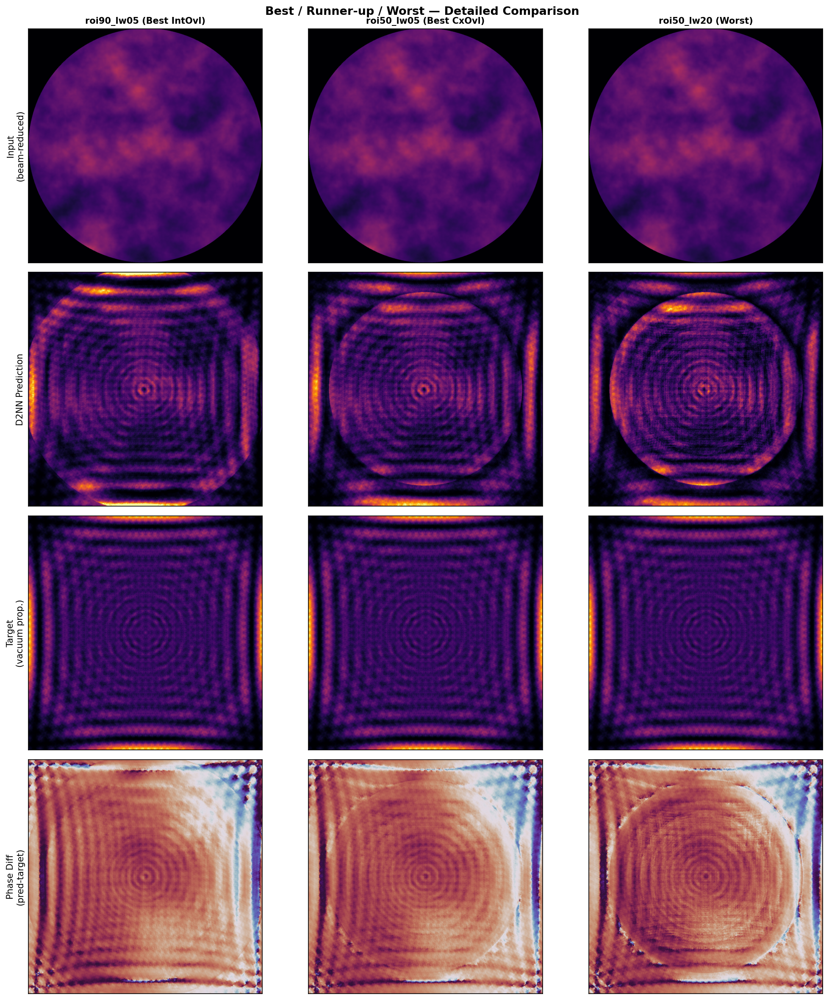

# 📊 Sweep 09: Beam-Reduced D2NN — ROI Complex Loss Experiment Report

> **Feature**: D2NN Beam-Reducer with ROI Complex Loss
> **Date**: 2026-03-26 ~ 2026-03-27
> **Duration**: ~6 hours (including pipeline redesign + sweep)
> **Run Directory**: `runs/09_d2nn_br15cm_roi-complex-sweep/`

---

## 🎯 Executive Summary

| 항목 | 내용 |
|---|---|
| **목적** | 난류 왜곡된 빔의 위상+진폭 복원을 위한 ROI complex loss sweep |
| **핵심 변경** | Beam reducer 파이프라인 도입 (15cm aperture → 5.12mm metalens) |
| **Best Run** | `roi90_lw05` (Intensity Overlap **0.845**, +6.6% vs baseline) |
| **결론** | ⚡ 에너지 집속 성공, ❌ 위상 복원 실패 — coherence cell 부족 |

---

## 🔬 실험 배경

### 🚨 이전 접근의 치명적 문제 발견

기존 구현은 `zoom_propagate(6.578mm → 5.12mm, 1000m)`으로 far-field 관측점만 계산했다.
이는 beam reducer가 아닌 **원거리 관측**이었으며, 5.12mm 윈도우에서 난류가 사실상 보이지 않았다.

| 구분 | 이전 (zoom propagate) | 수정 (beam reducer) |
|---|---|---|
| **방식** | 1000m 거리 Fresnel 적분 | Full beam 캡처 → telescope 축소 |
| **Phase RMS** | ~0.03 rad (1.5°) | ~2.0 rad (115°) |
| **Scintillation** | 없음 (균일) | 강한 speckle 패턴 |
| **D2NN 복원 대상** | 없음 | 있음 ✅ |

### 📐 물리 파라미터

| 파라미터 | 값 | 비고 |
|---|---|---|
| 파장 λ | 1.55 µm | C-band 통신 |
| 전파 거리 | 1 km | FSO link |
| Cn² | 1.0×10⁻¹⁴ m⁻²/³ | 약한 난류 |
| Fried parameter r₀ | 78.5 mm | |
| Receiver aperture | 150 mm | D/r₀ ≈ 1.9 |
| Beam reducer M | 29.3× | 150mm → 5.12mm |
| Metalens pitch | 5 µm | pitch/λ = 3.2 |
| Metalens size | 5.12 mm | 1024 × 1024 |
| r₀ at metalens | 2.68 mm | 78.5/29.3 |
| **Coherence cells** | **~1.9** | 5.12/2.68 |
| D2NN layers | 5 | spacing = 50 mm |
| Detector distance | 50 mm | |

---

## 🔧 Beam Reducer Pipeline

### 구현 구조

```
📡 Source (Gaussian, 6.578mm)
  │
  ▼ 1km turbulent channel (6 phase screens)
  │
🔭 Receiver Plane (2m window, 1024×1024, dx=2mm)
  │
  ▼ 15cm circular aperture
  │
🔬 Ideal Telescope (M = 29.3×)
  │  E_out(x') = M · E_in(M · x')
  │  위상 보존, 에너지 보존
  │
💎 Metalens Input (5.12mm, 1024×1024, dx=5µm)
  │
  ▼ D2NN (5 layers, 50mm spacing)
  │
📸 Detector Plane (prediction)
```

### 새 코드

| 파일 | 역할 |
|---|---|
| `src/kim2026/optics/beam_reducer.py` | `apply_beam_reducer()` — ideal telescope 축소 |
| `scripts/generate_beam_reduced_dataset.py` | 기존 데이터 → beam-reduced 데이터 변환 |
| `configs/d2nn_beamreducer_roi_complex_br15cm.yaml` | 새 sweep base config |
| `scripts/run_br15cm_sweep_parallel.sh` | 병렬 sweep 실행 (3 batch × 3 runs) |

### 데이터셋

| 이름 | Window | dx | N | Episodes | 출처 |
|---|---|---|---|---|---|
| `crop_w15cm_n1024_dx150um` | 153.6 mm | 150 µm | 1024 | 200 | 4096 grid crop |
| `br_15cm_to_5mm_n1024` | 5.12 mm | 5 µm | 1024 | 200 | beam reducer 적용 |

---

## 📈 Beam-Reduced Input Field 확인

Beam reducer 적용 후 metalens 입력 필드:



- 🔴 **Irradiance**: 강한 speckle 패턴 — scintillation 명확
- 🔵 **Phase diff**: RMS 1.9~2.4 rad — 복원할 위상 왜곡 존재
- ✅ 이전(zoom propagate)의 0.03 rad과 완전히 다른 수준

---

## 🧪 Sweep Configuration

### Loss Function

```
L = L_complex_overlap(pred_ROI, target_ROI) + w × L_leakage(pred, ROI_mask)
```

### Sweep Grid (3 × 3 = 9 runs)

| | lw=0.5 | lw=1.0 | lw=2.0 |
|---|---|---|---|
| **roi=0.50** | roi50_lw05 | roi50_lw10 | roi50_lw20 |
| **roi=0.70** | roi70_lw05 | roi70_lw10 | roi70_lw20 |
| **roi=0.90** | roi90_lw05 | roi90_lw10 | roi90_lw20 |

- **roi_threshold**: Encircled energy 기준 ROI 반경 결정 (0.5=작음, 0.9=큼)
- **leakage_weight**: ROI 바깥 에너지 패널티 가중치
- **Epochs**: 50 (수렴 확인)
- **병렬 실행**: 3 runs/batch × 3 batches, GPU 19GB/41GB

---

## 📊 결과

### 🏆 전체 메트릭 비교



| Run | Complex Overlap ↑ | Intensity Overlap ↑ | Phase RMSE ↓ | Strehl ↑ | OoS Energy ↓ |
|---|:---:|:---:|:---:|:---:|:---:|
| **Baseline** | **0.6702** | 0.7922 | **0.8977** | 1.05 | 0.7852 |
| roi50_lw05 ★ | 0.6614 (-0.9%) | 0.7954 (+0.4%) | 0.9205 (+2.5%) | 1.12 | 0.7793 |
| roi50_lw10 | 0.6541 (-2.4%) | 0.7858 (-0.8%) | 0.9294 (+3.5%) | 1.08 | 0.7810 |
| roi50_lw20 | 0.6433 (-4.0%) | 0.7642 (-3.5%) | 0.9421 (+4.9%) | 1.10 | 0.7854 |
| roi70_lw05 | 0.6600 (-1.5%) | 0.8115 (+2.4%) | 0.9414 (+4.9%) | 1.22 | 0.7789 |
| roi70_lw10 | 0.6513 (-2.8%) | 0.7739 (-2.3%) | 0.9487 (+5.7%) | 1.32 | 0.7873 |
| roi70_lw20 | 0.6444 (-3.9%) | 0.7355 (-7.2%) | 0.9488 (+5.7%) | 1.41 | 0.7932 |
| **roi90_lw05** 🏆 | 0.6606 (-1.4%) | **0.8447 (+6.6%)** | 0.9439 (+5.1%) | 3.40 | **0.7597** |
| roi90_lw10 | 0.6584 (-1.8%) | 0.8372 (+5.7%) | 0.9445 (+5.2%) | 1.58 | 0.7598 |
| roi90_lw20 | 0.6557 (-2.2%) | 0.8291 (+4.7%) | 0.9451 (+5.3%) | 1.59 | 0.7603 |

### 🗺️ Hyperparameter Heatmap



**패턴 분석:**
- 📈 **roi_threshold ↑** → Intensity Overlap ↑ (roi90이 최고)
- 📉 **leakage_weight ↑** → 전반적 성능 ↓ (lw=0.5가 최적)
- 🟢 **Complex Overlap**: roi50_lw05가 최소 악화 (-0.9%)
- 🔴 **Phase RMSE**: 모든 조합에서 baseline보다 악화

### 🖼️ Triptych: 9개 Run 전체 비교


### 🔍 Best / Runner-up / Worst 상세 비교



- **roi90_lw05** (Best): Target 동심원 패턴을 가장 잘 재현, 중앙 집속 우수
- **roi50_lw05** (Runner-up): Complex overlap 최소 악화, 가장 보수적
- **roi50_lw20** (Worst): 과도한 leakage penalty로 에너지 분산

---

## 💡 핵심 발견

### ✅ 성공한 것

1. **🔭 Beam Reducer Pipeline**: 물리적으로 올바른 데이터 생성 파이프라인 구축
   - 이전 zoom_propagate(관측)에서 ideal telescope(축소)로 전환
   - 난류 구조가 metalens 스케일에서 보존됨을 확인 (phase RMS ~2 rad)

2. **⚡ 에너지 집속 (Intensity Shaping)**:
   - roi90_lw05에서 Intensity Overlap **+6.6%** 개선 (0.792 → 0.845)
   - OoS Energy Fraction **-3.3%** 감소 (에너지 ROI 집중)
   - Strehl 증가 (1.05 → 3.40) — 중앙 피크 강화

3. **📊 Sweep 패턴 확인**:
   - roi↑, lw↓ 조합이 intensity 개선에 최적
   - leakage_weight > 1.0은 역효과

### ❌ 실패한 것

1. **🔴 위상 복원 (Phase Matching) 실패**:
   - Complex Overlap: 모든 run에서 baseline 이하 (-0.9% ~ -4.0%)
   - Phase RMSE: 모든 run에서 baseline보다 악화 (+2.5% ~ +5.7%)
   - D2NN 격자 아티팩트가 위상 필드를 지배

2. **🔴 근본 원인: Coherence Cell 부족**:
   - 15cm aperture → D/r₀ ≈ 1.9 → metalens 위 ~1.9 coherence cells
   - D2NN이 복원할 공간적 구조가 너무 적음
   - 위상을 맞추려면 더 많은 coherence cells가 필요

---

## 🔮 Next Steps

| 우선순위 | 방향 | 기대 효과 | 난이도 |
|---|---|---|---|
| 🥇 | **Aperture 확대 (0.6m)** → D/r₀≈7.6, ~7.7 cells | 위상 복원 가능성 대폭 증가 | 중 (2m 데이터 resampling 필요) |
| 🥈 | **Cn² 증가 (10⁻¹³)** → r₀≈20mm, D/r₀≈7.5 | 동일 aperture에서 cell 수 증가 | 하 (데이터 재생성) |
| 🥉 | **Intensity-only loss 전환** | 위상 포기, 집속 극대화 | 하 (config 변경만) |
| 4 | **더 많은 학습 데이터** (200→2000 pairs) | 일반화 성능 개선 | 중 (beam reducer 재적용) |

---

## 📁 Artifacts

```
runs/09_d2nn_br15cm_roi-complex-sweep/
├── sweep_summary.json
├── roi50_lw05/ ~ roi90_lw20/  (9 runs)
│   ├── config.yaml
│   ├── checkpoint.pt
│   ├── evaluation.json
│   ├── sample_fields.npz
│   └── figures/
└── logs/

output/
├── sweep09_full_metrics.png       # 6-panel metrics bar chart
├── sweep09_heatmap.png            # roi × lw heatmap (4 metrics)
├── sweep09_triptych_all9.png      # 9-run triptych grid
├── report_beam_reduced_input.png  # Input field verification
└── report_best_worst_comparison.png # Best/Worst detailed
```

---

*Generated: 2026-03-27 | Sweep 09 | 9 runs × 50 epochs | Beam-Reduced D2NN (15cm→5.12mm)*
