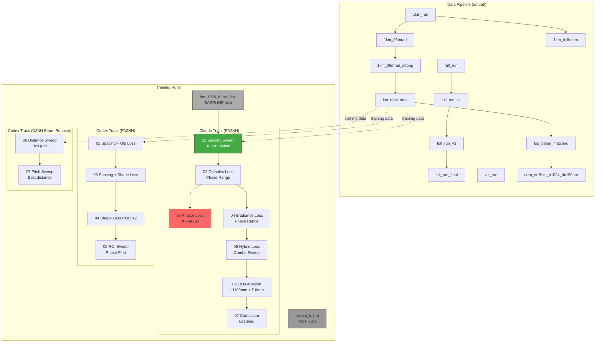

# D2NN / FD2NN Experiment Catalog

> Kim 2026 -- FSO Beam Cleanup through Atmospheric Turbulence

| Field | Value |
|-------|-------|
| Last updated | 2026-03-25 |
| Total directories | 30 (18 runs + 12 output) |
| Scope | `kim2026/runs/` + `kim2026/output/` |
| Wavelength | 1550 nm (all experiments) |
| Problem | Atmospheric turbulence degrades FSO laser beam quality |

---

## How to Read This Document

### Outcome Badges

| Badge | Meaning |
|-------|---------|
| SUCCESS | Experiment produced meaningful results as intended |
| PARTIAL | Some variants worked, others didn't; or incomplete execution |
| FAILED | Experiment did not achieve its hypothesis |
| NOT RUN | Config prepared but training never executed |
| BASELINE | Reference/pilot run, not a sweep |

### Naming Convention

```
{SEQ}_{MODEL}_{SWEEP-TYPE}_{DETAILS}_{TOOL}
```

- **SEQ**: 01-07, campaign sequence number
- **MODEL**: `fd2nn` (Fourier domain) or `d2nn` (spatial domain)
- **TOOL**: `_claude` or `_codex` -- parallel exploration using different AI assistants (same time period, independent angles)

### Metric Abbreviations

| Abbr | Full Name | Direction |
|------|-----------|-----------|
| CO | Complex Overlap | Higher = better |
| IO | Intensity Overlap | Higher = better |
| Strehl | Strehl Ratio | ~1 = ideal |
| EE | Encircled Energy | Higher = better |
| BR | Beam Radius | Depends on target |
| Phase RMSE | Phase error (rad) | Lower = better |
| Amp RMSE | Amplitude error | Lower = better |

---

## Experiment Lineage



### Lineage Narrative

1. **Data generation**: `full_run` 시리즈로 전파 시뮬레이션 코드를 검증 → `1km` 시리즈로 1km 경로 파라미터 탐색 → `fso_train_data`로 200개 학습 데이터 생성 → `fso_beam_matched`/`crop_w15cm_n1024_dx150um`로 순차 개선
2. **Pilot**: `fso_1024_d2nn_2cm`으로 기본 D2NN 파이프라인 확인 (모델 효과 거의 없음)
3. **Foundation (01)**: 7개 spacing으로 FD2NN의 최적 layer간격 탐색 → spacing=1~6mm가 유효
4. **Claude track**: Loss function 집중 탐색 (complex → phasor(실패) → irradiance → hybrid → ablation → curriculum)
5. **Codex track**: Spacing + ROI 조합 탐색, 이후 D2NN beam reducer로 spatial domain 접근 시도

---

## Master Summary Table

### Atmospheric Simulations (`output/`)

| # | Directory | Path | Cn2 | N | Realizations | Purpose | Outcome |
|---|-----------|------|-----|---|-------------|---------|---------|
| O1 | `full_run` | 5km | 1e-15 | 2048 | 20 | 전파 코드 초기 검증 | PARTIAL |
| O2 | `full_run_v2` | 5km | 1e-15 | 2048 | 20 | 검증 코드 수정 후 재시도 | PARTIAL |
| O3 | `full_run_v3` | 5km | 1e-15 | 2048 | 20 | 알고리즘 수정 후 재검증 | SUCCESS |
| O4 | `full_run_final` | 5km | 1e-15 | 2048 | 20 | 최종 확인 | SUCCESS |
| O5 | `1km_run` | 1km | 1e-15 | 512 | 30 | 1km 기본 시뮬레이션 | SUCCESS |
| O6 | `1km_06mrad` | 1km | 1e-15 | 1024 | 30 | 작은 빔 발산각 테스트 | SUCCESS |
| O7 | `1km_06mrad_strong` | 1km | 1e-14 | 1024 | 30 | 강한 난류 조건 | SUCCESS |
| O8 | `1km_fullbeam` | 1km | 1e-15 | 1024 | 30 | 전체 빔 캡처 | SUCCESS |
| O9 | `fso_train_data` | 1km | 1e-14 | 1024 | 200 | 학습 데이터 생성 | SUCCESS |
| O10 | `fso_beam_matched` | 1km | -- | -- | -- | 빔 파라미터 매칭 | PARTIAL |
| O11 | `crop_w15cm_n1024_dx150um` | 1km | 1e-14 | 4096 | 200 | 고해상도 학습 데이터 | SUCCESS |
| O12 | `viz_run` | 5km | 1e-15 | 2048 | 30 | 시각화 전용 | SUCCESS |

### Training Runs (`runs/`)

| # | Directory | Model | Swept Variable | Variants | Outcome | Led To |
|---|-----------|-------|----------------|----------|---------|--------|
| R1 | `중요_01_spacing_sweep_f10mm_claude` | FD2NN | layer spacing | 7 (0~50mm) | SUCCESS | 02C, 02X |
| R2 | `02_complexloss_phase_range_claude` | FD2NN | phase constraint | 6 | SUCCESS | 03C, 04C |
| R3 | `03_phasorloss_phase_range_claude` | FD2NN | phase constraint | 6 | FAILED | (dead end) |
| R4 | `04_irradianceloss_phase_range_claude` | FD2NN | phase constraint | 6 | SUCCESS | 05C |
| R5 | `05_hybridloss_loss_combo_claude` | FD2NN | loss combination | 4 | PARTIAL | 06C |
| R6 | `06_loss_ablation_claude` | FD2NN | loss components | 4 | SUCCESS | 07C |
| R7 | `06_loss_sweep_f10mm_sp50mm_claude` | FD2NN | loss function | 4 | SUCCESS | -- |
| R8 | `06_loss_sweep_f100mm_claude` | FD2NN | loss function | 1 | NOT RUN | -- |
| R9 | `07_curriculum_claude` | FD2NN | curriculum strategy | 4 | PARTIAL | -- |
| R10 | `02_spacing-sweep_loss-old_codex` | FD2NN | layer spacing | 4 (0~2mm) | PARTIAL | 03X |
| R11 | `03_spacing-sweep_loss-shape_codex` | FD2NN | layer spacing | 4 (0~2mm) | SUCCESS | 04X |
| R12 | `04_spacing-sweep_loss-shape_roi-512_codex` | FD2NN | ROI size | 2 | SUCCESS | 05X |
| R13 | `05_roi-sweep_phase-first_codex` | FD2NN | ROI size | 2 | PARTIAL | -- |
| R14 | `06_beamreducer_distance-sweep_codex` | D2NN | ls x dd (3x3) | 9 | SUCCESS | 07X |
| R15 | `07_beamreducer_pitch-sweep_codex` | D2NN | pixel pitch | 3 | SUCCESS | -- |
| R16 | `fso_1024_d2nn_2cm` | D2NN | (none) | 1 | BASELINE | 01 |
| R17 | `sweep_fd2nn` | FD2NN | Cn2 x pitch | 12 configs | NOT RUN | -- |
| R18 | `fd2nn_metasurface_sweep_dual2f` | -- | -- | -- | BROKEN | -- |

---

## Section A: Atmospheric Simulations (`output/`)

### A1. full_run Series -- Propagation Code Verification

**목적**: 5km 경로의 대기 난류 전파 시뮬레이션 코드가 물리적으로 올바른지 검증

| Parameter | full_run | full_run_v2 | full_run_v3 | full_run_final |
|-----------|----------|-------------|-------------|----------------|
| Path (km) | 5 | 5 | 5 | 5 |
| Cn2 | 1e-15 | 1e-15 | 1e-15 | 1e-15 |
| N | 2048 | 2048 | 2048 | 2048 |
| delta_n (m) | 0.005 | 0.005 | 0.005 | 0.005 |
| D_roi (m) | 0.5 | 0.5 | 0.5 | 0.5 |
| n_reals | 20 | 20 | 20 | 20 |
| w0 (m) | 9.87e-4 | 9.87e-4 | 9.87e-4 | 9.87e-4 |

**독립변수**: 시뮬레이션 코드/알고리즘 구현 (config는 동일, 코드가 변경)

**종속변수**: Structure function 검증 통과 여부, coherence factor 이론값 일치

**도전**: Structure function 검증이 반복적으로 실패 → 전파 알고리즘과 phase screen 생성 코드를 수정하며 v2, v3, final로 반복

**실패 분석**: full_run/v2에서 structure function 검증 실패. v3에서 알고리즘 수정 후 8개 중 6개 통과, coherence factor가 이론값(rho_0)에 수렴

---

### A2. 1km Series -- 단거리 Parameter Exploration

**목적**: 1km 경로에서 빔 발산각, 난류 강도, ROI 크기의 영향 탐색

| Parameter | 1km_run | 1km_06mrad | 1km_06mrad_strong | 1km_fullbeam |
|-----------|---------|------------|-------------------|--------------|
| Path (km) | 1 | 1 | 1 | 1 |
| Cn2 | 1e-15 | 1e-15 | **1e-14** | 1e-15 |
| theta_div (rad) | 1e-3 | **6e-4** | **6e-4** | 1e-3 |
| D_roi (m) | 0.3 | **0.9** | **0.9** | **1.2** |
| N | 512 | **1024** | **1024** | **1024** |
| delta_n (m) | 0.003 | **0.002** | **0.002** | 0.003 |
| n_reals | 30 | 30 | 30 | 30 |

**독립변수**:
- Cn2 (난류 강도): 1e-15 (약) vs 1e-14 (강)
- theta_div (빔 발산각): 1.0 vs 0.6 mrad
- D_roi (관측 창): 0.3 ~ 1.2 m
- Grid N: 512 ~ 1024

**종속변수**: 난류 통계, 필드 품질, Fried parameter

**도전**: D2NN 학습에 적합한 데이터 조건 찾기 → `1km_06mrad_strong` (Cn2=1e-14, 0.6mrad)이 최종 학습 데이터 조건으로 선택됨

---

### A3. FSO Training Data Series -- Sequential Improvement

**목적**: D2NN/FD2NN 학습에 사용할 FSO 필드 데이터 생성 및 품질 개선

| Parameter | fso_train_data | fso_beam_matched | crop_w15cm_n1024_dx150um |
|-----------|---------------|------------------|---------------|
| Path (km) | 1 | (unknown) | 1 |
| Cn2 | 1e-14 | (unknown) | 1e-14 |
| theta_div (rad) | 6e-4 | (unknown) | 6e-4 |
| D_roi (m) | 0.9 | (unknown) | **0.15** |
| N | 1024 | (unknown) | **4096** |
| delta_n (m) | 0.002 | (unknown) | **1.5e-4** |
| n_reals | 200 | (unknown) | 200 |

> Note: `fso_beam_matched`의 config.json이 존재하지 않음

**독립변수**: Grid 해상도 (N: 1024→4096), 관측 aperture (D_roi: 0.9→0.15m)

**종속변수**: Sampling 적절성, 필드 해상도

**도전**: 초기 데이터(fso_train_data)의 해상도가 metalens 시뮬레이션에 충분한지 → beam 파라미터 매칭 → 최종적으로 4096 grid 고해상도 데이터 생성

**계보**: fso_train_data (첫 시도) → fso_beam_matched (조건 맞춤) → crop_w15cm_n1024_dx150um (고해상도화)

---

### A4. viz_run -- Visualization

| Field | Value |
|-------|-------|
| **Directory** | `output/viz_run/` |
| **Purpose** | 5km 경로 시각화용 데이터 생성 |
| **Parameters** | 5km, Cn2=1e-15, N=2048, 30 realizations |
| **Outcome** | SUCCESS (독립 실행, 다른 실험과 무관) |

---

## Section B: FD2NN Training Experiments (Claude Track)

FD2NN은 dual-2f 렌즈 구조로 Fourier 공간에서 동작하는 회절 신경망.
모든 Claude track 실험의 공통 설정: wavelength=1.55um, num_layers=5, batch_size=2, lr=5e-4

---

### R1. 01 Spacing Sweep (Foundation) ★

| Field | Value |
|-------|-------|
| **Directory** | `runs/중요_01_fd2nn_spacing_sweep_f10mm_claude/` |
| **Model** | FD2NN, f1=f2=10mm, NA=0.16, N=1024 |
| **Purpose** | FD2NN layer 간 최적 거리 탐색 |
| **Hypothesis** | Layer spacing이 phase correction 능력에 큰 영향을 미칠 것 |

**독립변수**

| Variable | Values |
|----------|--------|
| Layer spacing | 0, 1, 3, 6, 12, 25, 50 mm |

**종속변수**: CO, IO, Phase RMSE, Amp RMSE, Strehl, EE, BR

**Outcome**: SUCCESS -- spacing=1~6mm 범위가 유효, 이후 모든 실험에서 spacing=1mm 사용

**Led to**: 02 claude (loss function 탐색), 02 codex (다른 loss로 spacing 재탐색)

---

### R2. 02 Complex Loss + Phase Range Sweep

| Field | Value |
|-------|-------|
| **Directory** | `runs/02_fd2nn_complexloss_roi1024_phase_range_sweep_claude/` |
| **Model** | FD2NN, f1=f2=1mm, spacing=1mm, ROI=1024 |
| **Purpose** | Complex loss 하에서 최적 phase constraint 및 범위 탐색 |
| **Hypothesis** | Phase constraint(sigmoid vs tanh)와 range(pi/2~4pi)에 따라 성능 차이 클 것 |

**독립변수**

| Variable | Values |
|----------|--------|
| Phase constraint | sigmoid, tanh |
| Phase range | pi/2, pi, 2pi (tanh) / pi, 2pi, 4pi (sigmoid) |

**종속변수**: CO, IO, Phase RMSE, Amp RMSE, Strehl, EE, BR

**Outcome**: SUCCESS -- tanh_2pi가 전반적으로 우수

**Led to**: 03 claude (phase-only loss 시도), 04 claude (intensity-only loss 시도)

---

### R3. 03 Phasor Loss + Phase Range Sweep

| Field | Value |
|-------|-------|
| **Directory** | `runs/03_fd2nn_phasorloss_roi1024_phase_range_sweep_claude/` |
| **Model** | FD2NN, f1=f2=1mm, spacing=1mm, ROI=1024 |
| **Purpose** | Phase 정보만으로 학습 가능한지 테스트 (phasor loss) |
| **Hypothesis** | Phase-only loss가 complex loss보다 phase 교정에 특화될 것 |

**독립변수**

| Variable | Values |
|----------|--------|
| Phase constraint | sigmoid, tanh |
| Phase range | pi/2, pi, 2pi / pi, 2pi, 4pi |

**종속변수**: CO, IO, Phase RMSE, Amp RMSE, Strehl, EE, BR

**Outcome**: FAILED

**실패 분석**:
- **원인**: Amplitude 정보 부재. Phasor loss는 phase만 보고 amplitude를 무시하므로, gradient 신호가 불충분
- **교훈**: Phase correction에도 amplitude 정보가 함께 필요함. Phase-only 학습은 물리적으로 의미 있는 결과를 내지 못함
- **CO가 02(complex)의 절반 수준**: 학습이 진행되긴 하지만 수렴 품질이 매우 낮음

**Led to**: Dead end (이 방향 폐기)

---

### R4. 04 Irradiance Loss + Phase Range Sweep

| Field | Value |
|-------|-------|
| **Directory** | `runs/04_fd2nn_irradianceloss_roi1024_phase_range_sweep_claude/` |
| **Model** | FD2NN, f1=f2=1mm, spacing=1mm, ROI=1024 |
| **Purpose** | Intensity-only loss로 beam shape 교정 가능한지 테스트 |
| **Hypothesis** | Irradiance(intensity) loss가 beam quality 지표(IO, Strehl)에서 우수할 것 |

**독립변수**

| Variable | Values |
|----------|--------|
| Phase constraint | sigmoid, tanh |
| Phase range | pi/2, pi, 2pi / pi, 2pi, 4pi |

**종속변수**: CO, IO, Phase RMSE, Amp RMSE, Strehl, EE, BR

**Outcome**: SUCCESS (IO 측면) -- IO가 매우 높지만 CO가 극히 낮음

**Key Finding**: Irradiance loss는 beam shape을 잘 교정하지만, phase 정보를 완전히 무시 → CO와 IO 사이의 trade-off 발견

**Led to**: 05 claude (hybrid loss로 CO+IO 균형 시도)

---

### R5. 05 Hybrid Loss Combo Sweep

| Field | Value |
|-------|-------|
| **Directory** | `runs/05_fd2nn_hybridloss_roi1024_loss_combo_sweep_claude/` |
| **Model** | FD2NN, f1=f2=1mm, spacing=1mm, ROI=1024 |
| **Purpose** | 여러 loss component 조합으로 CO-IO 균형점 탐색 |
| **Hypothesis** | 적절한 loss 조합이 CO와 IO를 동시에 높일 것 |

**독립변수**

| Variable | Values |
|----------|--------|
| Loss combination | combo1: IO+CO |
|  | combo2: IO+BR+EE |
|  | combo3: CO+IO+BR |
|  | combo4: SP+Leak+IO |

**종속변수**: CO, IO, Strehl, EE, BR

**Outcome**: PARTIAL -- combo4가 CO 최고이나 IO 붕괴, combo1/2가 IO 최고이나 CO 낮음. 완벽한 균형점 미발견

**Led to**: 06 claude (더 체계적인 ablation study)

---

### R6. 06 Loss Ablation

| Field | Value |
|-------|-------|
| **Directory** | `runs/06_fd2nn_loss_ablation_roi1024_claude/` |
| **Model** | FD2NN, f1=f2=1mm, spacing=1mm, ROI=1024 |
| **Purpose** | Loss component를 하나씩 추가하며 기여도 분석 |
| **Hypothesis** | 각 component의 개별 기여를 분리하면 최적 조합을 찾을 수 있음 |

**독립변수**

| Variable | Values |
|----------|--------|
| Loss components | co_only (CO만) |
|  | co_amp01 (CO + Amp MSE 0.1) |
|  | co_io (CO + IO) |
|  | co_io_br (CO + IO + BR) |

**종속변수**: CO, IO, Strehl, EE, BR

**Outcome**: SUCCESS

**Key Finding**:
- co_only와 co_amp01이 동일 성능 → Amp MSE 0.1 가중치는 효과 없음
- IO 추가 시 CO 하락 확인 → CO와 IO는 근본적으로 경쟁 관계
- co_io_br가 가장 균형 잡힌 결과

**Led to**: 07 claude (curriculum으로 학습 순서 변경 시도)

---

### R7. 06 Loss Sweep (f=10mm, spacing=50mm)

| Field | Value |
|-------|-------|
| **Directory** | `runs/06_fd2nn_loss_sweep_f10mm_sp50mm_claude/` |
| **Model** | FD2NN, f1=f2=10mm, spacing=**50mm**, ROI=1024 |
| **Purpose** | 01에서 찾은 다른 spacing(50mm)에서 loss function 비교 |
| **Hypothesis** | 긴 spacing에서 loss function 효과가 달라질 수 있음 |

**독립변수**

| Variable | Values |
|----------|--------|
| Loss function | complex, phasor, irradiance, hybrid |

**종속변수**: CO, IO, Strehl, EE, BR

**Outcome**: SUCCESS -- hybrid가 CO 최고, complex와 irradiance가 동일 성능

---

### R8. 06 Loss Sweep (f=100mm)

| Field | Value |
|-------|-------|
| **Directory** | `runs/06_fd2nn_loss_sweep_f100mm_claude/` |
| **Model** | FD2NN, f=**100mm** |
| **Purpose** | 더 긴 초점거리에서의 FD2NN 가능성 탐색 |
| **Outcome** | NOT RUN (complex/ 디렉토리만 존재, checkpoint 없음) |

**실패 분석**: 실험 설계만 되고 실행되지 않음. f=100mm은 물리적으로 시스템이 너무 커질 수 있어 우선순위가 낮았을 가능성

---

### R9. 07 Curriculum Learning

| Field | Value |
|-------|-------|
| **Directory** | `runs/07_fd2nn_curriculum_roi1024_claude/` |
| **Model** | FD2NN, f1=f2=1mm, spacing=1mm, ROI=1024 |
| **Purpose** | Phase-first 학습 후 amplitude 학습으로 curriculum 적용 |
| **Hypothesis** | Phase를 먼저 학습하고 나중에 amplitude를 추가하면 CO-IO trade-off 완화 |

**독립변수**

| Variable | Values |
|----------|--------|
| Curriculum strategy | cur_10_20 (phase 10ep + full 20ep) |
|  | cur_15_15 (phase 15ep + full 15ep) |
|  | cur_20_10 (phase 20ep + full 10ep) |
|  | cur_blend (blending) |

**종속변수**: CO, IO, Strehl, EE, BR

**Outcome**: PARTIAL -- cur_10_20이 소폭 우수하나, ablation(R6) co_only 대비 큰 개선 없음. Curriculum의 효과는 미미

---

## Section C: FD2NN Training Experiments (Codex Track)

Codex track은 Claude track과 **병렬로** 다른 각도에서 탐색.
주로 spacing과 ROI 조합을 다루며, loss function도 다른 변형 사용.

---

### R10. 02 Spacing Sweep + Old Loss

| Field | Value |
|-------|-------|
| **Directory** | `runs/02_fd2nn_spacing-sweep_loss-old_roi-1024_codex/` |
| **Model** | FD2NN, ROI=1024 |
| **Purpose** | 초기 loss formulation으로 spacing 효과 탐색 |

**독립변수**

| Variable | Values |
|----------|--------|
| Layer spacing | 0, 0.1, 1, 2 mm |

**종속변수**: CO, IO, Strehl, EE, BR

**Outcome**: PARTIAL (summary 파일 미존재, 개별 결과만 존재)

**Led to**: 03 codex (shape loss로 개선)

---

### R11. 03 Spacing Sweep + Shape Loss (ROI 1024)

| Field | Value |
|-------|-------|
| **Directory** | `runs/03_fd2nn_spacing-sweep_loss-shape_roi-1024_codex/` |
| **Model** | FD2NN, ROI=1024 |
| **Purpose** | 개선된 shape loss로 spacing 재탐색 |

**독립변수**

| Variable | Values |
|----------|--------|
| Layer spacing | 0, 0.1, 1, 2 mm |

**종속변수**: CO, IO, Strehl, EE, BR

**Outcome**: SUCCESS -- spacing_1mm이 CO 최고 (Claude track 01과 일치하는 결론)

**Led to**: 04 codex (ROI 축소 시 변화 확인)

---

### R12. 04 Spacing Sweep + Shape Loss (ROI 512)

| Field | Value |
|-------|-------|
| **Directory** | `runs/04_fd2nn_spacing-sweep_loss-shape_roi-512_codex/` |
| **Model** | FD2NN, ROI=**512** |
| **Purpose** | ROI를 512로 줄였을 때 성능 변화 측정 |

**독립변수**

| Variable | Values |
|----------|--------|
| ROI size | 512, 1024 (at spacing=0.1mm) |

**종속변수**: CO, IO, Strehl

**Outcome**: SUCCESS -- ROI 512는 IO를 높이지만 CO를 낮춤. ROI-성능 trade-off 확인

**Led to**: 05 codex (ROI sweep 확장)

---

### R13. 05 ROI Sweep + Phase-First Loss

| Field | Value |
|-------|-------|
| **Directory** | `runs/05_fd2nn_roi-sweep_loss-phase-first_spacing-0p1mm_codex/` |
| **Model** | FD2NN, spacing=0.1mm |
| **Purpose** | Phase-first loss 전략으로 ROI 크기 효과 재확인 |

**독립변수**

| Variable | Values |
|----------|--------|
| ROI size | 512, 1024 |

**종속변수**: CO, IO, Strehl

**Outcome**: PARTIAL (summary 파일 미존재)

---

## Section D: D2NN Beam Reducer (Codex Track)

D2NN은 FD2NN과 **같은 문제**(FSO beam cleanup)를 **spatial domain**에서 접근.
Fresnel propagation으로 직접 빔을 전파하며, Fourier 렌즈 없이 phase mask만 사용.

---

### R14. 06 Beam Reducer Distance Sweep (Stage 1)

| Field | Value |
|-------|-------|
| **Directory** | `runs/06_d2nn_beamreducer_distance-sweep_pitch-3um_codex/` |
| **Model** | D2NN, num_layers=5, pitch=3um, N=1024 |
| **Purpose** | Layer spacing과 detector distance의 최적 조합 탐색 |
| **Hypothesis** | Spatial domain D2NN에서 물리적 거리가 beam reduction 성능을 결정 |

**독립변수**

| Variable | Values |
|----------|--------|
| Layer spacing | 10, 50, 100 mm |
| Detector distance | 10, 50, 100 mm |

→ 3x3 = 9개 조합 (ls10_dd10, ls10_dd50, ..., ls100_dd100)

**종속변수**: Overlap (intensity), BR, EE, Strehl

**Outcome**: SUCCESS -- ls50mm_dd50mm이 최적. 전체적으로 50mm 부근이 sweet spot

**Led to**: 07 codex (best distance에서 pitch 최적화)

---

### R15. 07 Beam Reducer Pitch Sweep (Stage 2)

| Field | Value |
|-------|-------|
| **Directory** | `runs/07_d2nn_beamreducer_pitch-sweep_codex/` |
| **Model** | D2NN, num_layers=5, ls=50mm, dd=50mm |
| **Purpose** | 최적 거리(50mm/50mm)에서 pixel pitch 최적화 |
| **Hypothesis** | Pitch가 receiver window size를 결정하므로 성능에 영향 |

**독립변수**

| Variable | Values |
|----------|--------|
| Pixel pitch | 2, 3, 5 um |

**종속변수**: Overlap (intensity), BR, EE, Strehl

**Outcome**: SUCCESS -- pitch 5um이 최적 (overlap 최고)

**Key Finding**: 큰 pitch(5um)가 작은 pitch(2um)보다 우수 → receiver window가 넓을수록 더 많은 beam energy를 캡처

---

## Section E: Miscellaneous

### R16. fso_1024_d2nn_2cm (Baseline Pilot)

| Field | Value |
|-------|-------|
| **Directory** | `runs/fso_1024_d2nn_2cm/` |
| **Model** | D2NN |
| **Purpose** | D2NN 학습 파이프라인 검증용 pilot run |
| **Outcome** | BASELINE -- model overlap = baseline overlap (모델 효과 거의 없음) |
| **의미** | 파이프라인이 정상 동작함을 확인. 이후 본격 sweep으로 진행 |

---

### R17. sweep_fd2nn (Config Templates)

| Field | Value |
|-------|-------|
| **Directory** | `runs/sweep_fd2nn/configs/` |
| **Model** | FD2NN |
| **Purpose** | Cn2 x pixel spacing grid sweep 계획 |
| **Outcome** | NOT RUN -- 12개 YAML config만 존재, checkpoint 없음 |

**계획된 독립변수**

| Variable | Values |
|----------|--------|
| Cn2 (turbulence) | 1e-14, 1e-15, 5e-15 |
| Pixel spacing | 1, 3, 5, 10 um |

→ 3x4 = 12개 config. 실행되지 않고 보류 상태.

---

### R18. fd2nn_metasurface_sweep_dual2f (Broken Symlink)

| Field | Value |
|-------|-------|
| **Directory** | `runs/fd2nn_metasurface_sweep_dual2f` |
| **Target** | `04_fd2nn_dual2f_loss-shape_roi-512_status-final_codex` (존재하지 않음) |
| **Outcome** | BROKEN -- symlink target이 생성되지 않음 |
| **의미** | 계획되었으나 실행되지 않은 실험. Codex track에서 dual-2f 구조를 별도로 탐색하려 했으나 중단 |

---

### Non-experiment Artifacts in `runs/`

| Item | Type | Description |
|------|------|-------------|
| `fig_scale_comparison.png` | Image | 실험 결과 비교 figure |
| `fig_spacing_sweep.png` | Image | Spacing sweep 결과 figure |
| `figures_sweep_report/` | Directory | Sweep 리포트용 figure 모음 |
| `spacing_sweep_results.json` | JSON | Spacing sweep 통합 결과 |

---

## Appendix: Metrics Glossary

| Metric | Symbol | Description | Range | Better |
|--------|--------|-------------|-------|--------|
| Complex Overlap | CO | Vacuum/model 복소 필드 간 정규화된 내적 | 0--1 | Higher |
| Intensity Overlap | IO | Intensity 패턴 간 공간 상관계수 | 0--1 | Higher |
| Phase RMSE | -- | Phase 오차 (라디안), amplitude-weighted | 0--pi | Lower |
| Amplitude RMSE | -- | Amplitude 차이의 RMS | 0+ | Lower |
| Strehl Ratio | Strehl | Peak intensity / diffraction limit | 0+ | ~1 |
| Encircled Energy | EE | Target area 내 power 비율 | 0--1 | Higher |
| Beam Radius | BR | 1/e^2 반경 (m) | 0+ | Context |

---

## Key Insights Across All Experiments

1. **CO vs IO trade-off**: Complex overlap과 intensity overlap은 근본적으로 경쟁 관계. Loss function 조합으로 완화 가능하나 완전 해소 불가
2. **Phase-only 학습 한계**: Phasor loss (03 claude)의 실패가 보여주듯, amplitude 정보 없이는 의미 있는 학습 불가능
3. **Spacing sweet spot**: FD2NN에서 1~6mm, D2NN beam reducer에서 50mm가 최적
4. **Spatial vs Fourier**: 두 접근법 모두 FSO beam cleanup에 유효하나, 서로 다른 파라미터 공간에서 동작
5. **Data quality 중요**: output/ 시뮬레이션의 반복 개선(full_run 4회, fso data 3회)이 보여주듯, 학습 데이터 품질이 모든 실험의 기반
