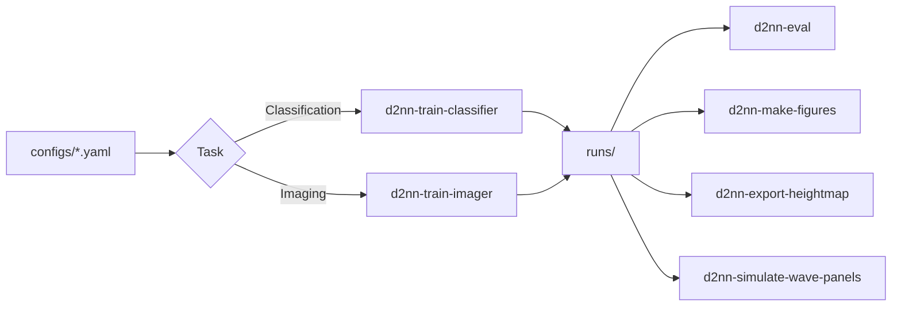

# lin2018_all_optical_d2nn

2018 Science D2NN 논문 재현을 위한 시뮬레이션/학습 스택입니다. 이 디렉터리에서는 분류형 D2NN, 이미징 렌즈형 D2NN, heightmap export, 재현용 figure 생성까지 한 흐름으로 다룹니다.

## 이 디렉터리로 할 수 있는 일

- MNIST / FashionMNIST 분류형 D2NN 학습
- 이미징 렌즈형 D2NN 학습과 평가
- 학습된 위상 마스크를 fabrication-friendly heightmap으로 변환
- 논문/보고서용 figure 및 wave-panel 시뮬레이션 생성

## 작업 흐름 한눈에 보기



## 빠른 시작

```bash
cd lin2018_all_optical_d2nn
python -m pip install -e .[dev]
d2nn-train-classifier --config configs/mnist_phase_only_5l.yaml
d2nn-train-imager --config configs/imaging_lens_5l.yaml
d2nn-eval --config configs/mnist_phase_only_5l.yaml --checkpoint runs/.../checkpoint.pt
d2nn-make-figures --run-dir runs/...
```

추가 진입점:

```bash
d2nn-export-heightmap --config configs/mnist_phase_only_5l.yaml --checkpoint runs/.../checkpoint.pt
d2nn-simulate-wave-panels --output-dir runs/wave_panels --num-layers 10 --num-segments 10 --mask-mode optimized --opt-steps 300
```

## 입출력 계약

| 종류 | 위치 | 설명 |
| --- | --- | --- |
| 입력 설정 | `configs/*.yaml` | 분류, 이미징, Imagenette, A100 전용 설정 파일 |
| 입력 데이터 | `data/` | MNIST, FashionMNIST, Imagenette 계열 데이터 |
| 핵심 실행 | `d2nn-*` CLI | 학습, 평가, export, figure generation |
| 산출물 | `runs/` | 체크포인트, 로그, 중간 결과, figure 입력 |
| 참고 분석 | `notebooks/`, `report/` | 디버깅, 재현 실험, 보고서 산출 |

## 디렉터리 구조

```text
lin2018_all_optical_d2nn/
|-- configs/               # task별 학습/평가 설정
|   |-- layouts/          # optical layout variants
|   `-- sweeps/           # parameter sweep configs
|-- data/                 # MNIST / FashionMNIST / Imagenette data
|-- docs/                 # API, 재현 프로토콜, 시각화, Lumerical 연동 문서
|-- notebooks/            # 실험/디버깅 노트북
|-- report/               # 보고서 소스와 build 스크립트
|-- runs/                 # 학습 결과와 figure 입력
|-- src/d2nn/             # 광학/학습 핵심 코드
`-- tests/                # 재현성, 물리, export 테스트
```

## 주요 구성요소

| 구성요소 | 역할 | 언제 보나 |
| --- | --- | --- |
| `src/d2nn/` | ASM propagation, 모델, 손실, export 구현 | 물리/학습 로직을 수정할 때 |
| `configs/` | 실험별 optical layout과 training recipe | 새 실험을 시작할 때 |
| `runs/` | 학습된 모델과 시각화 입력 | 평가, figure 재생성, export 시 |
| `docs/` | 코드트리, 재현 프로토콜, 시각화/연동 설명 | 구조를 먼저 이해할 때 |
| `notebooks/` | sanity check와 인터랙티브 분석 | 디버깅이나 빠른 실험 시 |
| `tests/` | 에너지 보존, 위상 제약, export 검증 | 변경 후 회귀 확인 시 |

## 관련 문서 / 다음에 읽을 것

- `spec.md`: 구현 범위와 기본 재현 목표
- `docs/REPRODUCTION_PROTOCOL.md`: 논문 재현 절차
- `docs/CORE_API.md`: 내부 핵심 API 개요
- `docs/VISUALIZATION.md`: figure 및 wave visualization 규칙
- `docs/LUMERICAL_INTEGRATION.md`: fabrication/export 연계 정보
