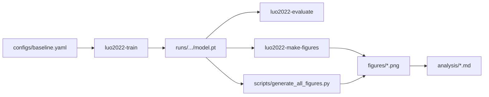

# luo2022_random_diffusers_d2nn

Luo et al. 2022 random diffuser imaging 논문을 재현하고 확장하기 위한 D2NN 프로젝트입니다. baseline 학습, 평가, figure 재생성, checkpoint 묶음 비교, 해석 문서까지 한 디렉터리에서 관리합니다.

## 이 디렉터리로 할 수 있는 일

- baseline random diffuser D2NN 학습
- checkpoint 기반 평가와 figure 재생성
- depth / diffuser condition별 비교 실험 정리
- 논문 해석 문서와 보조 실험 분석 관리

## 작업 흐름 한눈에 보기



## 빠른 시작

```bash
cd luo2022_random_diffusers_d2nn
python -m pip install -e .[dev]
luo2022-train --config configs/baseline.yaml --device cuda
luo2022-evaluate --config configs/baseline.yaml --checkpoint runs/.../model.pt
luo2022-make-figures --figure fig3 --n1 runs/.../model.pt --n10 runs/.../model.pt
python scripts/generate_all_figures.py --runs-root runs --output-dir figures
```

## 입출력 계약

| 종류 | 위치 | 설명 |
| --- | --- | --- |
| 입력 설정 | `configs/` | baseline과 세부 optics/diffuser/training 설정 |
| 입력 참조 | `reference/` | 원 논문, supplement, 보조 이미지 |
| 핵심 실행 | `luo2022-train`, `luo2022-evaluate`, `luo2022-make-figures` | 학습, 평가, 논문 figure 생성 |
| 보조 재현 | `scripts/reproduce_fig*.py`, `scripts/train_all.py` | figure별 재현과 일괄 실행 |
| 산출물 | `runs/`, `runs_b4/`, `figures/`, `analysis/` | checkpoint, 이미지, 해석 문서 |

## 디렉터리 구조

```text
luo2022_random_diffusers_d2nn/
|-- analysis/            # 결과 해석 문서 (영문/국문)
|-- configs/             # baseline + dataset/diffuser/model/optics/training 설정
|-- data/                # MNIST cache 및 입력 데이터
|-- docs/                # 계획과 작업 메모
|-- figures/             # 재생성된 논문 figure
|-- reference/           # 원논문 PDF와 보조 자료
|-- runs/                # 주요 checkpoint와 결과
|-- runs_b4/             # depth/baseline 변형 실험 결과
|-- scripts/             # figure 재현과 일괄 학습 스크립트
|-- specs/               # 단계별 구현 스펙
|-- src/luo2022_d2nn/    # optics, model, trainer, figures core
|-- sweeps/              # 확장 실험용 sweep assets
`-- tests/               # optics, diffuser, figure, config regression tests
```

## 주요 구성요소

| 구성요소 | 역할 | 언제 보나 |
| --- | --- | --- |
| `src/luo2022_d2nn/` | 모델, trainer, diffuser, figure generator 구현 | 핵심 재현 로직을 이해할 때 |
| `configs/` | baseline 및 하위 설정 계층 | 재현 조건을 조정할 때 |
| `scripts/` | figure별 재현과 일괄 실행 래퍼 | 논문 panel을 다시 만들 때 |
| `runs/`, `runs_b4/` | checkpoint 세트와 실험 결과 | 비교 figure나 후속 분석 시 |
| `figures/` | 생성된 최종 이미지 | 문서/발표에 넣을 산출물을 확인할 때 |
| `analysis/`, `reference/` | 해석 문서와 원문 자료 | 결과 의미를 빠르게 파악할 때 |

## 관련 문서 / 다음에 읽을 것

- `spec.md`: 물리/재현 목표가 정리된 메인 PRD
- `specs/phase01_spec.md`, `specs/phase23_spec.md`, `specs/phase46_spec.md`: 구현 단계별 설계
- `analysis/*.md`: 각 run 묶음에 대한 해석 문서
- `reference/*.pdf`: 논문과 supplement 원문
