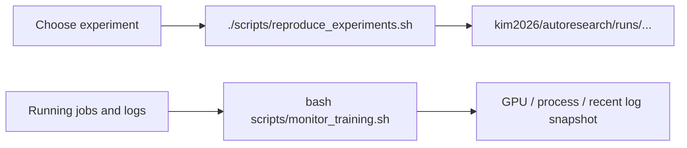

# scripts

리포 루트 `scripts/`는 하위 프로젝트를 감싸는 운영용 진입점 디렉터리입니다. 현재는 `kim2026` 실험 재현과 모니터링을 빠르게 수행하는 두 개의 래퍼 스크립트를 제공합니다.

## 이 디렉터리로 할 수 있는 일

- gitignored 실험 산출물을 커밋된 코드/설정에서 다시 생성
- 현재 돌아가는 학습/스윕과 최근 로그를 헤드리스 환경에서 점검

## 작업 흐름 한눈에 보기



## 빠른 시작

```bash
./scripts/reproduce_experiments.sh list
./scripts/reproduce_experiments.sh focal_pib --gpu 0
./scripts/reproduce_experiments.sh --dry-run
bash scripts/monitor_training.sh
```

## 입출력 계약

| 스크립트 | 입력 | 출력 | 비고 |
| --- | --- | --- | --- |
| `reproduce_experiments.sh` | 실험 이름, GPU ID, dry-run 옵션 | `kim2026/autoresearch/runs/...` 산출물과 `reproduce.log` | `kim2026/data/.../cache`가 준비되어 있어야 함 |
| `monitor_training.sh` | 현재 시스템 상태와 최근 로그 | GPU 사용량, 활성 프로세스, 최근 로그 tail, 최근 완료 run 목록 | cron/원격 셸 모니터링에 적합 |

## 디렉터리 구조

```text
scripts/
|-- monitor_training.sh       # GPU / process / log snapshot monitor
`-- reproduce_experiments.sh  # committed kim2026 experiments regeneration wrapper
```

## 주요 구성요소

| 파일 | 역할 | 언제 보나 |
| --- | --- | --- |
| `reproduce_experiments.sh` | `kim2026/autoresearch` 실험 레지스트리를 순서대로 실행 | 논문/보고서 산출물을 다시 만들 때 |
| `monitor_training.sh` | 최근 2시간 기준 GPU/로그/에러를 요약 | 학습이 오래 도는 동안 상태를 점검할 때 |

## 전제조건

- Conda 환경 `d2nn`이 준비되어 있어야 합니다.
- 프로젝트 규칙상 Python 실행 시 `PYTHONPATH=src`가 필요합니다.
- `reproduce_experiments.sh`는 `kim2026/data/.../cache`가 이미 생성되어 있어야 합니다.
- GPU가 필요할 수 있으므로 `nvidia-smi`로 자원 상태를 먼저 확인하는 편이 안전합니다.

## 관련 문서 / 다음에 읽을 것

- 리포 루트 `AGENTS.md`: 환경, 재현, 물리 관련 공통 규칙
- `kim2026/README.md`: 이 스크립트들이 실제로 건드리는 하위 프로젝트 개요
- `kim2026/autoresearch/program.md`: 장기 실험 맥락
