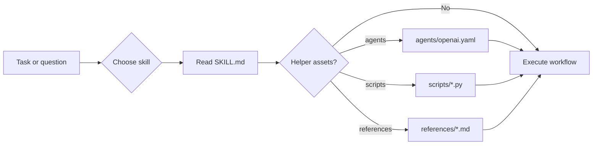

# skills

이 디렉터리는 D2NN 리포 전용 Codex skill 모음입니다. 각 skill은 `SKILL.md`를 중심으로 동작하며, 필요하면 `agents/`, `scripts/`, `references/`를 함께 사용해 실험 실행, 해석, 리포팅, 모니터링을 표준화합니다.

## 이 디렉터리로 할 수 있는 일

- 반복되는 실험 운영 절차를 skill 형태로 표준화
- 해석/리포팅용 지식을 재사용 가능한 워크플로우로 캡슐화
- 에이전트, 스크립트, 참고 스키마를 묶어 task-specific automation 제공

## 작업 흐름 한눈에 보기



## 빠른 시작

```bash
find skills -maxdepth 2 -name SKILL.md | sort
sed -n '1,120p' skills/monitor/SKILL.md
sed -n '1,120p' skills/d2nn-lab-interpreter/SKILL.md
find skills/d2nn-lab-interpreter -maxdepth 2 -type f | sort
```

## 입출력 계약

| 종류 | 형태 | 설명 |
| --- | --- | --- |
| 입력 | task description | 사용자가 해결하려는 문제나 요청 |
| 핵심 문서 | `*/SKILL.md` | skill의 절차와 의사결정 규칙 |
| 부속 자산 | `agents/`, `scripts/`, `references/` | 자동화/해석/스키마 보강 |
| 출력 | 실행 절차, 해석 결과, 보고서, 실험 운영 행동 | skill마다 달라지는 표준화된 결과 |

## 디렉터리 구조

```text
skills/
|-- autonomous-sweep/
|-- d2nn-lab-interpreter/
|   |-- SKILL.md
|   |-- agents/
|   |-- references/
|   `-- scripts/
|-- fd2nn-codex-run-interpreter/
|-- fd2nn-figure-curator/
|-- monitor/
|-- parallel-report/
|-- physics-tests/
|-- report/
|-- reproduce-pib-experiments/
`-- sweep/
```

## 주요 skill 카탈로그

| Skill | 역할 | 보조 자산 |
| --- | --- | --- |
| `autonomous-sweep` | sweep를 self-validation / self-healing 방식으로 실행 | `SKILL.md` |
| `d2nn-lab-interpreter` | 흩어진 run 폴더를 canonical registry와 비교 리포트로 변환 | `agents/`, `references/`, `scripts/` |
| `fd2nn-codex-run-interpreter` | `kim2026` codex run 02~05를 해석해 보고용 narrative로 정리 | `agents/`, `references/`, `scripts/` |
| `fd2nn-figure-curator` | run-local figure를 공식 figure store로 승격 | `agents/`, `references/`, `scripts/` |
| `monitor` | 실행 중인 학습/스윕 상태와 로그를 점검 | `SKILL.md` |
| `parallel-report` | 병렬 에이전트 기반 보고서 생성 파이프라인 | `SKILL.md` |
| `physics-tests` | optics pipeline 물리 검증 테스트 생성/실행 | `SKILL.md` |
| `report` | 실험 결과에서 PDF/PPTX 보고서 생성 | `SKILL.md` |
| `reproduce-pib-experiments` | `kim2026/autoresearch` PIB 실험 end-to-end 재현 | `agents/` |
| `sweep` | 파라미터 sweep와 기본 물리 검증 실행 | `SKILL.md` |

## 어떤 구조가 필요한가

| 구조 | 왜 필요한가 |
| --- | --- |
| `SKILL.md` | 사람과 에이전트가 공통으로 따를 표준 절차를 담음 |
| `agents/` | 반복적으로 호출되는 에이전트 설정을 고정 |
| `scripts/` | 긴 절차 중 계산/집계를 코드로 재사용 |
| `references/` | schema, taxonomy, policy 같은 source-of-truth 보강 |

## 관련 문서 / 다음에 읽을 것

- 각 skill의 `SKILL.md`: 실제 사용 규칙
- `kim2026/tests/test_fd2nn_*_skill.py`: 일부 skill의 회귀 테스트
- 리포 루트 `AGENTS.md`: 프로젝트 공통 실행 규칙
