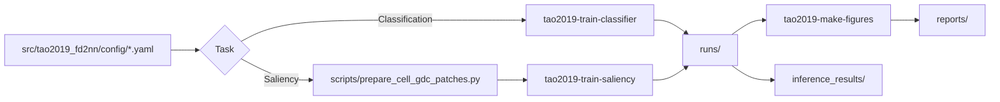

# tao2019_fourier_space_d2nn

Fourier-space Diffractive Deep Neural Network(F-D2NN) 재현 프로젝트입니다. 이 디렉터리는 MNIST 분류 재현과 saliency / co-saliency 실험을 함께 다루며, 데이터 준비, 학습, figure 재생성, 보고서 산출을 한 흐름으로 연결합니다.

## 이 디렉터리로 할 수 있는 일

- Fourier-space / real-space / hybrid D2NN 분류 실험 재현
- saliency 및 co-saliency 학습과 추론
- Cell-GDC, ECSSD, CIFAR10 기반 보조 실험과 figure 생성
- run 결과를 보고서와 도식으로 재정리

## 작업 흐름 한눈에 보기



## 빠른 시작

```bash
cd tao2019_fourier_space_d2nn
python -m pip install -e .[dev]
tao2019-train-classifier --config src/tao2019_fd2nn/config/cls_mnist_linear_fourier_5l_f1mm.yaml
tao2019-train-saliency --config src/tao2019_fd2nn/config/saliency_cell.yaml
tao2019-make-figures --run-dir runs/... --task classification
pytest
```

Cell-GDC patch 데이터를 직접 만들 때는:

```bash
python scripts/prepare_cell_gdc_patches.py \
  --type1-image /path/to/cell_type1_slide.png \
  --type2-image /path/to/cell_type2_slide.png \
  --type3-image /path/to/cell_type3_slide.png \
  --out-root data/cell_gdc
```

## 입출력 계약

| 종류 | 위치 | 설명 |
| --- | --- | --- |
| 입력 설정 | `src/tao2019_fd2nn/config/*.yaml` | classification / saliency 실험 설정 |
| 입력 데이터 | `data/`, 외부 Cell-GDC / ECSSD / CIFAR 계열 | task별 이미지/마스크/분류 데이터 |
| 핵심 실행 | `tao2019-train-classifier`, `tao2019-train-saliency`, `tao2019-make-figures` | 학습과 figure regeneration |
| 보조 스크립트 | `scripts/*.py` | 데이터 준비, 보조 재현, 감도 분석, 추론 |
| 산출물 | `runs/`, `inference_results/`, `reports/` | checkpoint, 예측 결과, 최종 보고용 도표 |

## 디렉터리 구조

```text
tao2019_fourier_space_d2nn/
|-- data/                 # MNIST, CIFAR10, ECSSD, Cell-GDC 등 입력 데이터
|-- docs/                 # config template, figure layout spec, 계획 문서
|-- inference_results/    # 추론 결과와 분석 리포트
|-- reports/              # 최종 보고서, diagram, figure summary
|-- runs/                 # classification / saliency 실험 결과
|-- scripts/              # 데이터 준비, 재현, 진단, 추론 스크립트
|-- src/tao2019_fd2nn/    # F-D2NN 모델, CLI, viz, task core
|-- tests/                # optics, figure, saliency, reproducibility tests
|-- tmp/                  # 임시 config 및 pilot assets
`-- spec.md               # 재현 요구사항과 설계 메모
```

## 주요 구성요소

| 구성요소 | 역할 | 언제 보나 |
| --- | --- | --- |
| `src/tao2019_fd2nn/` | classification / saliency 공통 코어와 CLI 구현 | 핵심 로직을 파악하거나 수정할 때 |
| `scripts/` | Cell-GDC patch 준비, CIFAR/ECSSD 처리, supplementary figure 재현 | 논문 panel이나 데이터 준비를 다시 할 때 |
| `runs/` | 학습 실험의 기준 산출물 저장소 | checkpoint와 figure 입력을 찾을 때 |
| `inference_results/` | 추론 결과와 후처리 산출물 | saliency output을 비교할 때 |
| `reports/` | 분석 메모, 도식, 최종 보고서 | 전체 구조를 한 번 더 요약해서 볼 때 |
| `tests/` | ASM, phase constraints, saliency metrics, figure factory 회귀 검증 | 변경 후 회귀 확인 시 |

## 관련 문서 / 다음에 읽을 것

- `spec.md`: 프로젝트 설계/재현 기준
- `docs/CONFIG_TEMPLATES.md`: 실험 설정 템플릿
- `docs/FIGURE_LAYOUT_SPECS.md`: figure layout 계약
- `reports/final_report_fd2nn.md`: 주요 결과 요약
- `reports/diagram_*.png`: optical flow와 task 구조 그림
