# F-D2NN (Fourier-space Diffractive Deep Neural Network) 최종 보고서

> [!success] Executive Summary
> - **최고 재현 성과**: 10L Hybrid MNIST **98.4%**, 논문 98.1% 초과
> - **가장 큰 암묵지**: focal length 재해석(f=4mm → 1mm), `per_sample_minmax`, `layer_spacing_m` 버그 수정
> - **가장 강한 결론**: Fourier-space + 비선형성 + domain diversity 조합이 분류 성능을 극대화
> - **가장 큰 한계**: saliency detection은 phase-only filtering 구조상 본질적 제약 존재

> [!info] 프로젝트 개요
> **논문**: Tao Yan et al., "Fourier-space Diffractive Deep Neural Network,"
> *Physical Review Letters* **123**, 023901 (2019)
>
> **프로젝트**: PyTorch 기반 F-D2NN 재현 및 암묵지(Tacit Knowledge) 체계화
>
> **작성일**: 2026-03-09
> **프레임워크**: PyTorch 2.x, CUDA
> **코드 위치**: `tao2019_fourier_space_d2nn/`

---

## 목차

1. [서론](#1-서론)
2. [F-D2NN 수식적 원리](#2-f-d2nn-수식적-원리)
3. [D2NN vs F-D2NN 비교](#3-d2nn-vs-f-d2nn-비교)
4. [실험 Task별 분석](#4-실험-task별-분석)
5. [암묵지 (Tacit Knowledge)](#5-암묵지-tacit-knowledge)
6. [결론](#6-결론)
7. [F-D2NN 실용적 활용](#7-f-d2nn-실용적-활용)
8. [Appendix](#appendix)
   - [A. 실험 이력 표](#a-실험-이력-표)
   - [B. Configuration 파일 목록](#b-configuration-파일-목록)
   - [C. 코드 아키텍처 다이어그램](#c-코드-아키텍처-다이어그램)
   - [D. 주요 수식 요약](#d-주요-수식-요약-quick-reference)
   - [E. 용어 사전](#e-용어-사전-glossary)
   - [F. 그래프 인덱스](#f-그래프-인덱스)
   - [G. 재현 명령어](#g-재현-명령어)
   - [H. 프로젝트 타임라인](#h-프로젝트-타임라인)
   - [I. 핵심 발견의 영향도 순위](#i-핵심-발견의-영향도-순위)
   - [J. 알려진 한계와 미해결 문제](#j-알려진-한계와-미해결-문제)

---

> [!abstract] 읽기 가이드
> - **빠르게 읽기**: Executive Summary → Section 4 → Section 5 → Section 6
> - **물리 원리 확인**: Section 2, Section 3
> - **재현 근거 확인**: Appendix A, B, G
> - **대표 그림 모음**: Section 4, Section 7.5, Appendix F

## 1. 서론

### 1.1 논문 배경: D2NN에서 F-D2NN으로

2018년, Lin et al.은 *Science*에 Diffractive Deep Neural Network (D2NN)을 발표했다.
이 시스템은 자유 공간에서 빛의 회절을 이용하여 광학적으로 신경망 연산을 수행한다.
각 회절층(diffractive layer)의 phase mask가 뉴런 역할을 하며,
빛의 전파(propagation) 자체가 fully-connected layer의 행렬곱에 해당한다.

그러나 Real-space D2NN에는 근본적 한계가 있었다:

- **고정된 전파 커널**: 자유 공간 전파의 transfer function이 quadratic phase structure로 고정
- **간접적 주파수 접근**: 공간 주파수 조작이 여러 층을 거쳐야만 달성
- **긴 시스템 길이**: 원거장(far-field) 회절을 위해 층간 수 mm의 간격 필요

2019년, Tao et al.은 *Physical Review Letters*에서 이 한계를 극복하는
**Fourier-space D2NN (F-D2NN)**을 제안했다.
Dual 2f 렌즈 시스템을 도입하여 각 회절층을 **정확한 Fourier plane**에 배치함으로써,
입력 이미지의 공간 주파수에 **직접 접근**하여 변조할 수 있게 했다.
여기에 SBN:60 광굴절 결정(photorefractive crystal)을 비선형 활성 함수로 도입하여,
**비선형 spectral feature extraction**을 광학적으로 구현했다.

> [!success] 논문 핵심 결과
> - MNIST 분류: 5-layer Nonlinear Fourier D2NN **97.0%**, 10-layer Hybrid **98.1%**
> - Saliency detection: ECSSD/CIFAR-10 기반 salient object detection
> - Domain diversity: Fourier-Real 교대 배치(Hybrid)가 단일 도메인보다 우수

### 1.2 재현 범위

본 프로젝트에서 재현한 실험:

| 논문 Figure | 내용 | 재현 상태 |
|---|---|---|
| Fig 4(a) | 5-Layer 4종 config MNIST 분류 | **완료** (95.2% best) |
| Fig 4(b) | 10-Layer + Hybrid MNIST 분류 | **완료** (98.4%, 논문 초과) |
| Supp S7(a) | Layer 수 vs 성능 (1~5L) | **완료** |
| Supp S7(b) | SBN 위치별 비교 (10L) | **완료** |
| Supp S7(c/d) | 1L/5L 수렴 곡선 | **완료** |
| Fig 2/3 | Saliency detection (ECSSD) | **부분 완료** (F_max 0.5663) |

### 1.3 핵심 발견 미리보기: 10가지 암묵지

논문과 Supplementary Material에 명시되지 않았으나,
재현 과정에서 발견한 **10가지 암묵지(tacit knowledge)**:

> [!abstract]- 10가지 암묵지 미리보기
> 1. **Focal length 버그**: f=4mm(논문 도식) vs f=1mm(실제 classification 최적값)
> 2. **SBN intensity normalization**: `per_sample_minmax`가 `background_perturbation` 대비 +2.7%
> 3. **Batch size와 gradient noise temperature**: 이론 vs 실험의 괴리
> 4. **SBN 위치**: Per-layer에서 Front ≈ Rear (경계 효과 상쇄)
> 5. **Linear cascade = 단일 선형 변환**: 비선형성 없이는 층을 쌓아도 표현력 불변
> 6. **Saliency detection의 근본적 한계**: Phase-only filtering의 구조적 제약
> 7. **`layer_spacing_m` 버그**: Hybrid config의 spurious 0.1mm 간격
> 8. **FFT convention**: PyTorch `norm="ortho"` vs TensorFlow unnormalized
> 9. **Phase initialization**: `init_scale` 버그와 초기 위상 분포
> 10. **Detector layout 불확실성**: 논문 미공개 정보에 의한 gap

### 1.4 프로젝트 구조

```
tao2019_fourier_space_d2nn/
├── src/tao2019_fd2nn/
│   ├── optics/          # 물리 광학 연산
│   │   ├── fft2c.py     # Centered orthonormal FFT
│   │   ├── asm.py       # Angular Spectrum Method 전파
│   │   ├── lens_2f.py   # Ideal 2f 렌즈 시스템
│   │   ├── aperture.py  # NA mask
│   │   ├── grids.py     # 주파수/공간 그리드
│   │   └── scaling.py   # Fourier plane pitch 계산
│   ├── models/          # 신경망 모델
│   │   ├── fd2nn.py     # Core D2NN (real/fourier/hybrid)
│   │   ├── phase_mask.py    # Phase-only modulation layer
│   │   ├── nonlinearity_sbn.py  # SBN 광굴절 비선형성
│   │   └── detectors.py     # 검출기 영역 정의
│   ├── training/        # 학습 루프, loss, metrics
│   ├── data/            # 데이터 로딩 (MNIST, ECSSD, CIFAR)
│   ├── config/          # YAML config schema 검증
│   ├── cli/             # 학습/추론 CLI
│   └── viz/             # 시각화
├── config/              # 실험 YAML 설정 파일
├── reports/             # 분석 보고서
└── runs/                # 학습 결과 (checkpoint, 그래프)
```

> [!tip] 설계 원칙
> Config-driven architecture. 모든 실험 파라미터가 YAML에 정의되고,
> `schema.py`가 검증. 코드 수정 없이 config만으로 다양한 실험 수행 가능.

### 1.5 재현 방법론

본 프로젝트의 재현 접근 방식:

1. **Bottom-up 구현**: 물리 광학 연산(FFT, ASM, 2f)을 먼저 구현하고 검증한 후,
   그 위에 모델을 조립하는 방식. 각 모듈이 독립적으로 테스트 가능.

2. **Config-driven 실험**: 실험 조건을 코드에 하드코딩하지 않고
   YAML config로 외부화. 이를 통해 focal length, SBN 파라미터, batch size 등을
   빠르게 탐색 가능. `schema.py`가 config 유효성을 검증하여
   잘못된 파라미터 조합을 방지.

3. **단계적 검증**: 간단한 config(Linear Real)부터 시작하여 복잡한 config(Nonlinear Fourier, Hybrid)로
   점진적으로 확장. 각 단계에서 논문과의 일치 여부를 확인.

4. **Ablation 우선**: 성능 gap이 발견되면 가능한 원인을 하나씩 제거하는 ablation 접근.
   예: SBN normalization → focal length → layer spacing → batch size.

5. **수치 교차 검증**: 모든 실험 결과를 JSON/summary 파일로 기록하고,
   보고서 작성 시 원본 데이터와 교차 검증.

### 1.6 논문 정보의 한계

재현 과정에서 확인한, 논문이 명시하지 않은 정보들:

| 미명시 정보 | 영향도 | 해결 방법 |
|---|---|---|
| Classification의 정확한 focal length | **치명적** | Supplementary 재검토로 발견 |
| SBN intensity normalization 방식 | **높음** | 실험적 탐색 |
| 정확한 detector layout | 중 | 합리적 추측 (3-4-3) |
| Phase mask 초기화 방식/범위 | 중 | 실험적 탐색 |
| FFT normalization convention | 중 | TF 1.11 API 문서 참조 |
| Hybrid의 layer_spacing_m | 중 | 물리적 추론 (0이어야 함) |
| 학습률 스케줄러 사용 여부 | 낮음 | 미사용으로 가정 |
| Data augmentation 여부 | 낮음 | 미사용으로 가정 |

> [!important]
> 이 표에서 볼 수 있듯이, **논문 재현의 난이도는 코드 구현이 아니라
> 논문에 쓰여 있지 않은 것들을 발견하는 것**에 있다.

---

## 2. F-D2NN 수식적 원리

### 2.1 Dual 2f 시스템과 Fourier 변환

F-D2NN의 핵심은 **dual 2f 렌즈 시스템**이다.
2f 시스템은 렌즈의 앞초점면(front focal plane)에 놓인 입력 field를
렌즈의 뒤초점면(back focal plane, Fourier plane)에서 **정확한 광학 Fourier 변환**으로 변환한다.

입력 field $U_0(x, y)$에 대해 Fourier plane에서의 field:

$$\hat{U}_0(x_F, y_F) = \frac{1}{\lambda f} \iint U_0(x, y)
\exp\left(-j \frac{2\pi}{\lambda f}(x \cdot x_F + y \cdot y_F)\right) dx \, dy$$

여기서:
- $\lambda$: 파장 (532 nm, Nd:YAG 2배파)
- $f$: 렌즈 초점 거리
- $(x_F, y_F)$: Fourier plane의 공간 좌표

#### Fourier Plane의 Sampling Pitch

Fourier plane에서의 discrete sampling pitch는:

$$\Delta x_F = \frac{\lambda f}{N \cdot \Delta x_{\text{input}}}$$

여기서 $N$은 그리드 크기, $\Delta x_{\text{input}}$은 입력 plane의 pixel pitch이다.

이 관계식은 F-D2NN 설계의 가장 중요한 제약 조건이다:

| 파라미터 | f = 1 mm | f = 4 mm |
|---|---|---|
| $\lambda$ | 532 nm | 532 nm |
| $N$ | 200 | 200 |
| $\Delta x_{\text{input}}$ | 1 μm | 1 μm |
| **$\Delta x_F$** | **2.66 μm** | **10.64 μm** |
| Fourier plane 전체 크기 | 532 μm | 2128 μm |
| 입력 대비 배율 | 2.66× | 10.64× |

f가 클수록 Fourier plane의 pixel pitch가 커져서,
동일 그리드에서 표현 가능한 **공간 주파수 범위(bandwidth)가 축소**된다.
이것이 [Section 5.1](#51-focal-length-버그-f4mm-vs-f1mm)에서 다루는 focal length 문제의 핵심이다.

**코드 구현**: `optics/scaling.py`의 `fourier_plane_pitch()` 함수.
`lens_2f.py`의 `lens_2f_forward()`에서 호출되어 domain 전환 시 dx 업데이트.

#### NA (Numerical Aperture)에 의한 대역 제한

2f 시스템의 렌즈는 유한 구경(finite aperture)을 가지며,
이는 NA (Numerical Aperture)로 특성화된다.

$$\text{NA} = n \cdot \sin\theta_{\max}$$

논문에서 NA = 0.16이며, 이에 해당하는 cutoff spatial frequency:

$$f_{\text{cutoff}} = \frac{\text{NA}}{\lambda} = \frac{0.16}{532 \text{ nm}} = 300.8 \text{ lp/mm}$$

Grid의 Nyquist frequency:

$$f_{\text{Nyq}} = \frac{1}{2 \Delta x} = \frac{1}{2 \times 1 \text{ μm}} = 500 \text{ lp/mm}$$

NA mask가 전체 bandwidth의 **60%만 통과**시켜:

1. **Aliasing 방지**: Fourier plane에서의 위상 변조가 evanescent wave를 여기하지 않도록 보장
2. **Physical realizability**: 실제 렌즈의 유한 구경에 대응
3. **Regularization 효과**: 고주파 noise를 자연스럽게 억제하여 과적합 방지

코드에서는 `optics/aperture.py`의 `na_mask()` 함수가 원형 aperture를 구현하며,
`lens_2f.py`에서 2f forward/inverse 시 자동 적용된다.

#### Dual 2f 시스템의 전체 구조

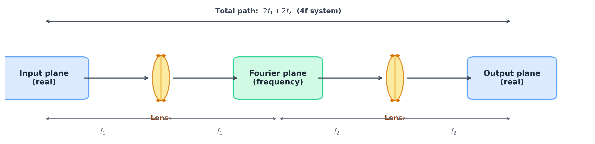

- f₁ = f₂ = 1 mm (classification)
- 전체 광경로 길이: 4f = 4 mm (단일 2f 시스템 기준)
- NA mask는 Lens₁의 aperture에 의해 Fourier plane에서 적용

이 4f 시스템은 **unit magnification** ($M = -f_2/f_1 = -1$)을 가지며,
출력 plane의 이미지는 입력의 **반전된 복사본**이다.
코드에서는 `gamma_flip2d()` 함수 (`fft2c.py`)가 이 좌표 반전을 처리한다.

#### 2f 시스템의 Aberration-free 가정

본 구현에서 2f 시스템은 **ideal** (무수차)로 모델링된다:

- 렌즈 자체의 수차(aberration) 없음
- 완벽한 평면파 입사 가정
- 유한 구경 효과는 NA mask로만 모델링
- 렌즈 두께/무게 무시

실제 광학 시스템에서는 다음의 수차가 발생할 수 있다:

| 수차 유형 | 영향 | 시뮬레이션 포함 여부 |
|---|---|---|
| Spherical aberration | Fourier transform 정확도 저하 | ✗ |
| Coma | Off-axis 성분의 비대칭 왜곡 | ✗ |
| Astigmatism | 2D Fourier 축 불일치 | ✗ |
| Field curvature | Fourier plane의 곡률 | ✗ |
| Chromatic aberration | 다파장 시 초점 위치 변동 | ✗ (단일 파장) |
| **Vignetting** | NA에 의한 주변 광량 감소 | **✓** (NA mask) |

논문도 ideal 2f 시스템을 가정하고 있으며,
실제 구현 시에는 고품질 비구면(aspheric) 렌즈 사용으로
이러한 수차를 최소화해야 한다.

### 2.2 Phase-only Modulation

각 회절층은 **phase-only modulation**을 수행한다.
입사 field $U_{\text{in}}$에 대해:

$$U_{\text{out}}(x, y) = U_{\text{in}}(x, y) \cdot \exp\left(j \phi(x, y)\right)$$

여기서 phase $\phi$는 학습 가능한 파라미터 $w$로부터 제약된다:

$$\phi(x, y) = \phi_{\max} \cdot \sigma(w(x, y))$$

- $\sigma(\cdot)$: sigmoid 함수 ($\sigma(w) = 1/(1+e^{-w})$)
- $\phi_{\max}$: 최대 위상 ($\pi$ for classification, 논문 Fig S6)
- $w(x, y)$: 학습 가능한 raw parameter (200×200 grid)

**Phase constraint의 물리적 의미**:

Sigmoid 매핑은 $\phi \in [0, \phi_{\max}]$으로 위상을 제한한다.
이는 물리적으로 **단일 두께의 유전체 층**이나 **spatial light modulator (SLM)**로
구현 가능한 범위에 해당한다.

$w = 0$에서 $\phi = \phi_{\max}/2 = \pi/2$ (sigmoid(0) = 0.5),
따라서 초기 phase mask는 거의 균일한 $\pi/2$ 위상의 thin plate이다.

**코드 구현** (`models/phase_mask.py`):

```python
class PhaseConstraint:
    def apply(self, raw: torch.Tensor) -> torch.Tensor:
        if self.mode == "sigmoid":
            return float(self.phase_max) * torch.sigmoid(raw)

class PhaseMask(nn.Module):
    def forward(self, field: torch.Tensor) -> torch.Tensor:
        phi = self.phase().to(device=field.device, dtype=field.real.dtype)
        return field * torch.exp(1j * phi)
```

### 2.3 Angular Spectrum Method (ASM) 전파

층간 자유 공간 전파는 Angular Spectrum Method로 수행한다.
복소 field $U(x, y; z)$의 전파는 주파수 영역에서:

$$\hat{U}(f_x, f_y; z) = \hat{U}(f_x, f_y; 0) \cdot H(f_x, f_y; z)$$

Transfer function:

$$H(f_x, f_y; z) = \exp\left(j 2\pi z \sqrt{\left(\frac{n}{\lambda}\right)^2 - f_x^2 - f_y^2}\right)$$

여기서:
- $z$: 전파 거리 (Real D2NN: 3 mm, Fourier D2NN: 100 μm)
- $n$: 굴절률 (공기 중 1.0)
- $f_x, f_y$: 공간 주파수
- $(n/\lambda)^2 - f_x^2 - f_y^2 < 0$인 evanescent 성분은 mask 처리 (`evanescent="mask"`)

Paraxial 근사 ($f_x^2 + f_y^2 \ll (n/\lambda)^2$)에서:

$$H \approx \exp\left(j 2\pi z \frac{n}{\lambda}\right)
\cdot \exp\left(-j \pi \lambda z (f_x^2 + f_y^2) / n\right)$$

이 quadratic phase는 **defocused lens**와 동일한 효과를 가진다.
따라서 Real-space D2NN의 자유 공간 전파는 본질적으로 defocused phase screen의 직렬 배치이다.

**코드 구현** (`optics/asm.py`):

```python
def asm_transfer_function(...):
    term = k0n**2 - fx**2 - fy**2
    kz = torch.sqrt(torch.complex(term, torch.zeros_like(term)))
    H = torch.exp(1j * (2.0 * torch.pi * z_m * kz))
    if evanescent == "mask":
        H = H * (term >= 0).to(H.dtype)
    return H

def asm_propagate(field, H):
    F = torch.fft.fft2(field)
    return torch.fft.ifft2(F * H)
```

### 2.4 SBN 광굴절 비선형성

SBN:60 (Sr₀.₆Ba₀.₄Nb₂O₆)은 광굴절 결정(photorefractive crystal)으로,
입사 광강도(intensity)에 의존하는 굴절률 변화를 나타낸다.

#### 물리적 메커니즘

광굴절 효과의 핵심 과정:

1. **광전자 여기**: 입사광이 SBN 결정 내 불순물 준위의 전자를 전도대로 여기
2. **전하 이동**: 여기된 전자가 drift/diffusion으로 이동, 어두운 영역에 포획
3. **공간 전하장 형성**: 밝은/어두운 영역 간 전하 분리로 내부 전기장 생성
4. **전기광학 효과**: Pockels 효과에 의해 전기장이 굴절률 변화 유발

수학적 모델:

$$\Delta n = \kappa \cdot E_{\text{app}} \cdot \frac{\eta}{1 + \eta}$$

여기서:
- $\kappa = n_0 r_{33} (1 + \langle I_0 \rangle)$: 유효 전기광학 계수
  - $n_0 \approx 2.33$: SBN:60 기본 굴절률
  - $r_{33}$: Pockels 계수
- $E_{\text{app}} = V/d$: 외부 인가 전기장
  - 논문: $V = 972$ V, $d = 1$ mm → $E_{\text{app}} = 9.72 \times 10^5$ V/m
- $\eta = (I - I_0) / I_{\text{sat}}$: 정규화된 intensity perturbation

이 굴절률 변화가 통과하는 빛에 부여하는 위상 변조:

$$\Delta\phi = \frac{2\pi}{\lambda} \cdot d \cdot \Delta n
= \phi_{\text{scale}} \cdot \frac{\eta}{1 + \eta}$$

#### 포화 비선형성의 역할

$\eta/(1+\eta)$ 형태의 **포화 함수(saturation function)**는
광학 신경망에서 **activation function** 역할을 한다:

| 영역 | 조건 | 응답 | 전자 신경망 대응 |
|---|---|---|---|
| 선형 영역 | $I \ll I_{\text{sat}}$ | $\Delta\phi \approx \phi_{\max} \cdot I/I_{\text{sat}}$ | ReLU의 양수 영역 |
| 전이 영역 | $I \sim I_{\text{sat}}$ | 비선형 전이 | sigmoid의 전이 구간 |
| 포화 영역 | $I \gg I_{\text{sat}}$ | $\Delta\phi \approx \phi_{\max}$ | ReLU의 clipping |

중요한 차이: SBN은 **복소 field에 작용**한다.
$U_{\text{out}} = U_{\text{in}} \cdot e^{j\Delta\phi(|U_{\text{in}}|^2)}$으로,
amplitude를 보존하면서 intensity-dependent phase shift만 부여한다.

이 특성의 함의:
1. **에너지 보존**: Phase-only modulation이므로 광학 에너지 손실 없음
2. **복소 값 처리**: Phase + amplitude 정보가 동시에 전달
3. **All-optical 구현**: 전자적 변환 없이 빛-물질 상호작용만으로 비선형성 물리적 구현

#### Per-Layer vs. Rear SBN 배치의 물리적 의미

**Per-layer** (Real D2NN 기본):
각 회절층 뒤에 SBN crystal 배치. 5개 층 각각에서 비선형 변환 적용.
물리적으로 5개의 SBN 결정이 광경로에 직렬 배치.
각 결정의 두께, bias field, saturation intensity가 독립적으로 설정 가능.

```
Phase₁ → SBN₁ → Prop → Phase₂ → SBN₂ → Prop → ... → Phase₅ → SBN₅
```

**Rear** (Fourier D2NN 기본):
마지막 층 뒤에 단일 SBN crystal 배치. 모든 선형 처리 후 한 번만 비선형 변환.
물리적으로 1개의 SBN 결정만 필요하여 시스템이 단순하고 정렬이 용이.

```
Phase₁ → Prop → Phase₂ → Prop → ... → Phase₅ → SBN (단일)
```

논문에서 Fourier D2NN에 rear SBN을 사용한 이유:
1. 2f 시스템 내부에 SBN 결정을 삽입하면 Fourier transform의 정확성 저하
2. Fourier plane에서의 intensity 분포가 real plane과 매우 다름 (에너지 집중)
3. 단일 SBN + learnable I_sat이 per-layer SBN과 비슷한 성능을 달성

**코드 구현** (`models/nonlinearity_sbn.py`):

```python
class SBNNonlinearity(nn.Module):
    def forward(self, field):
        I = intensity(field)  # |u|^2
        I_sat = self.saturation_intensity
        if self.intensity_norm == "per_sample_minmax":
            # 각 샘플의 intensity를 [0,1]로 정규화
            I = (I - I_min) / (I_max - I_min)
        eta = (I - self.background_intensity) / I_sat
        eta = torch.relu(eta)
        delta_phi = self.phi_scale_rad * (eta / (1.0 + eta))
        return field * torch.exp(1j * delta_phi)
```

### 2.5 전체 Forward Pass

F-D2NN의 전체 정보 흐름:

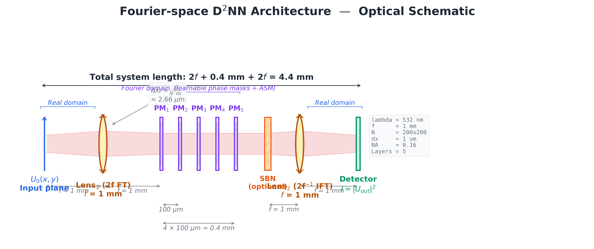

수학적으로:

$$O(x, y) = \left| \mathcal{F}^{-1}\left[\phi_N \cdot H_{\text{ASM}} \cdot
\phi_{N-1} \cdots H_{\text{ASM}} \cdot \phi_1 \cdot \mathcal{F}\left[U_0\right]
\right] \right|^2$$

SBN이 적용되는 경우 (rear position):

$$O(x, y) = \left| \mathcal{F}^{-1}\left[
\text{SBN}\left(\phi_N \cdot H_{\text{ASM}} \cdots \phi_1 \cdot \mathcal{F}[U_0]\right)
\right] \right|^2$$

SBN의 위치에 따라:
- **Rear**: 마지막 phase mask 뒤, IFFT 전에 SBN 적용
- **Per-layer**: 각 phase mask 뒤에 SBN 적용
- **Front**: 첫 번째 phase mask 전에 SBN 적용

여기서:
- $\mathcal{F}$, $\mathcal{F}^{-1}$: 2f 시스템에 의한 (역)Fourier 변환
- $\phi_i = e^{j\phi_i(x,y)}$: $i$번째 phase mask
- $H_{\text{ASM}}$: 층간 전파 transfer function
- $|\cdot|^2$: 검출기의 intensity readout (유일한 비선형성, SBN 비활성 시)

**코드 구현** (`models/fd2nn.py`의 `forward()` 메서드):

```python
def forward(self, field):
    domain = "real"
    out = field
    # 1. 2f forward: real → fourier
    if self.cfg.model_type == "fd2nn" and self.cfg.use_dual_2f:
        out, domain, dx_m = self._switch_domain(
            out, current=domain, target="fourier", dx_m=dx_m)

    # 2. Phase mask layers + ASM propagation
    for idx, layer in enumerate(self.layers):
        target_domain = self._target_domain(idx)
        out, domain, dx_m = self._switch_domain(
            out, current=domain, target=target_domain, dx_m=dx_m)
        if not (self.cfg.model_type == "fd2nn" and idx == 0):
            out = self._propagate(out, self.cfg.z_layer_m, ...)
        out = self._apply_phase_mask(out, layer, dx_m=dx_m)

    # 3. SBN nonlinearity (if enabled)
    if self.sbn is not None and self.cfg.sbn_position == "rear":
        out = self.sbn(out)

    # 4. 2f inverse: fourier → real
    if domain == "fourier":
        out, domain, dx_m = self._switch_domain(
            out, current=domain, target="real", dx_m=dx_m)
    return out
```

---

## 3. D2NN vs F-D2NN 비교

### 3.1 아키텍처 비교

| 특성 | Real-space D2NN (Lin 2018) | Fourier-space D2NN (Tao 2019) |
|---|---|---|
| **전파 도메인** | Real space | Fourier space |
| **Phase mask 위치** | Real plane | Fourier plane (정확한 FT) |
| **층간 전파** | ASM, z = 3 mm | ASM, z = 100 μm |
| **2f 렌즈** | 없음 | Dual 2f (f₁ = f₂ = 1 mm) |
| **시스템 길이 (5L)** | 5 × 3 mm = **15 mm** | 2 × 2 mm + 0.4 mm = **4.4 mm** |
| **비선형성** | SBN per-layer | SBN rear (단일) |
| **NA** | 없음 (자유 공간) | 0.16 (2f aperture) |
| **Neuron connectivity** | Diffraction cone | Direct spectral access |
| **5L MNIST (paper)** | 95.4% (NL Real) | **97.0%** (NL Fourier) |

### 3.2 표현력 비교 (Expressivity)

두 아키텍처의 표현력 차이를 물리 광학 관점에서 분석한다.

#### Fresnel Number 분석

Real-space D2NN에서 각 neuron의 receptive field는 Fresnel number로 특성화된다:

$$N_F = \frac{a^2}{\lambda z}$$

- $a = 1$ μm (pixel size), $\lambda = 532$ nm, $z = 3$ mm
- $N_F = (1 \times 10^{-6})^2 / (532 \times 10^{-9} \times 3 \times 10^{-3}) = 6.27 \times 10^{-4}$

$N_F \ll 1$은 **Fraunhofer 회절 영역**(far-field)에 해당하여,
각 neuron은 이미 전체 이전 층과 fully connected되어 있다.
그러나 이 coupling은 **quadratic phase structure로 고정**되어 있어,
주파수 선택적 coupling 능력이 제한된다.

#### Linear Cascade Theorem

**비선형성 없이 선형 층을 쌓는 것은 수학적으로 단일 선형 변환과 동등하다.**

각 층의 연산이 $T_i = M_i \cdot P_i$ (phase mask + propagation)인 선형 변환이면:

$$T_{\text{total}} = T_N \cdot T_{N-1} \cdots T_1 = \prod_{i=1}^{N} T_i$$

이는 단일 transfer function $T_{\text{eq}}$로 축소된다.
따라서 Linear D2NN은 층 수와 무관하게 동일한 표현력을 가진다.

실험적 확인 (S7(a)):
- Linear Fourier 2L: 87.7% → 5L: 90.4% (미미한 개선, +2.7%)
- 반면 Multi-SBN 2L: 88.9% → 5L: 94.8% (유의미한 개선, +5.9%)

2L→5L에서 Linear의 소폭 개선(+2.7%)은 표현력 증가가 아니라,
추가 층이 **optimization landscape를 더 smooth하게** 만들어 학습이 용이해졌기 때문이다.

### 3.3 시스템 길이와 Compactness

| 구성 요소 | Real D2NN (5L) | F-D2NN (5L) |
|---|---|---|
| 층간 전파 | 5 × 3 mm = 15 mm | 4 × 0.1 mm = 0.4 mm |
| 2f 시스템 | 없음 | 2 × 2 mm = 4 mm |
| **전체 길이** | **15 mm** | **4.4 mm** |
| **Compactness ratio** | 1× | **3.4×** |

F-D2NN이 3.4배 더 compact하면서 더 높은 정확도를 달성하는 것은
2f 시스템이 제공하는 **direct spectral access**의 가치를 보여준다.

Real D2NN에서 3 mm의 층간 거리가 필요한 이유:
- Far-field 회절 ($N_F \ll 1$)을 보장하여 fully-connected coupling 달성
- 이보다 짧으면 near-field 영역에서 neuron 간 coupling이 국소적

F-D2NN에서 100 μm의 짧은 거리로도 충분한 이유:
- 2f 시스템이 이미 fully-connected (정확한 FT) 상태를 제공
- 100 μm 전파는 **Fourier plane 내에서의 local mixing** 역할만 수행
- 이 짧은 전파는 convolutional layer의 kernel size에 해당하는 추가 자유도 제공

### 3.4 정보 흐름 비교

F-D2NN과 Real D2NN의 정보 흐름을 비교하면
왜 Fourier domain이 classification에 더 적합한지 이해할 수 있다.

**Real-space D2NN**:

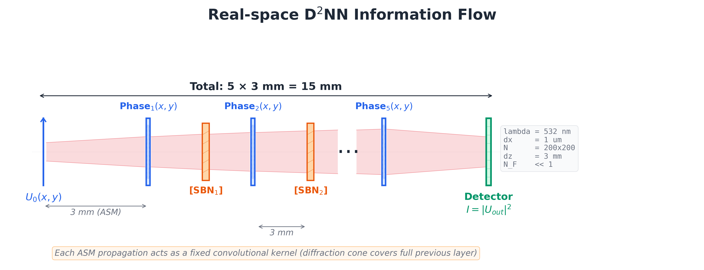

각 ASM 전파는 고정된 convolutional kernel로 작용.
전역적 feature 조합은 여러 층을 거쳐야만 달성.
단일 층의 diffraction cone이 전체 이전 층을 커버하지만,
주파수 영역에서의 선택적 filtering은 근본적으로 제한된다.

**Fourier-space D2NN**:

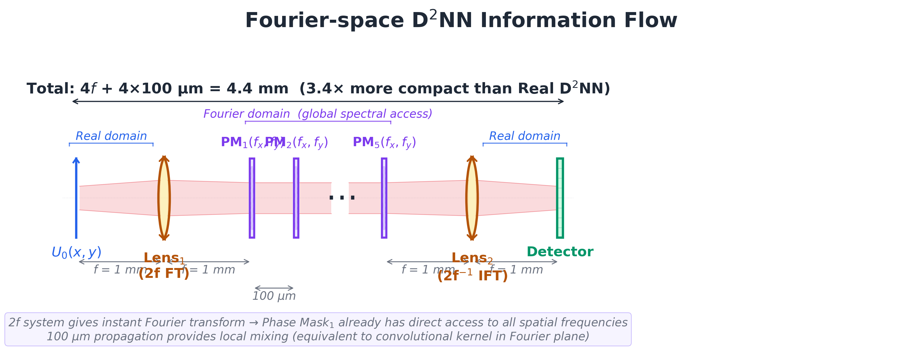

첫 번째 2f 시스템이 입력을 Fourier domain으로 **즉시 변환**.
Phase Mask₁이 **모든 공간 주파수에 직접 접근**할 수 있어,
단일 층만으로도 global spectral filtering이 가능하다.

이 차이는 MNIST 같은 structured pattern recognition에서 결정적이다:
- MNIST 숫자의 Fourier spectrum은 저주파에 에너지가 집중 (energy compaction)
- 숫자 간 차이는 중-고주파의 미세한 위상/진폭 차이에 인코딩
- F-D2NN은 이 주파수 차이에 **첫 번째 층부터** 직접 접근 가능
- Real D2NN은 이를 간접적으로만 (diffraction cone을 통해) 접근

200×200 grid에서 MNIST 숫자의 의미 있는 spectral content 대부분이
중심 ~50×50 영역에 위치. f=1mm일 때 이 영역의 물리적 크기:

$$\Delta x_F \times 50 = 2.66 \text{ μm} \times 50 = 133 \text{ μm}$$

이는 200 μm 전체 grid 내에 잘 수용되어,
Fourier plane의 phase mask가 유의미한 spectral 영역을 효과적으로 커버한다.

### 3.5 Hybrid D2NN의 장점 (Domain Diversity)

Hybrid D2NN은 Fourier-space와 Real-space 층을 **교대 배치**한다:

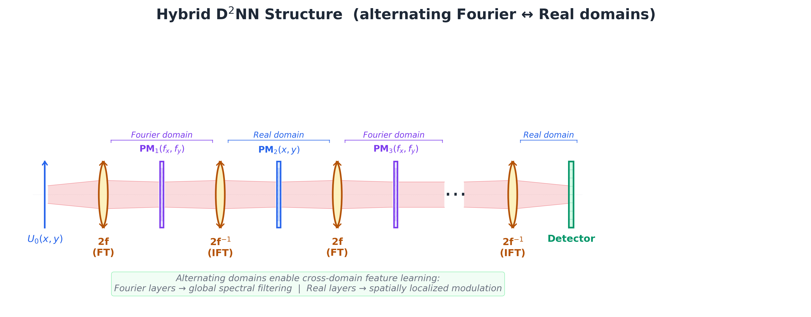

이 구조의 이점:
- **주파수 도메인과 공간 도메인 모두에서 정보 처리**
- Fourier optics 관점에서 **더 일반적인 unitary transform** 구현 가능
- 단일 도메인에서는 접근할 수 없는 **cross-domain feature**를 학습

실험적 확인:
- 10L Fourier-only + per-layer SBN: 96.6%
- 10L Hybrid + per-layer SBN: **97.8%** (+1.2%)
- 10L Hybrid (bs=10): **98.4%** (논문 98.1% 초과)

Domain diversity는 SBN 위치(Front/Rear)보다 훨씬 큰 영향을 미친다.

### 3.6 왜 Nonlinear Fourier가 가장 높은 성능을 달성하는가

논문의 핵심 주장을 분해하면:

**1. Fourier domain > Real domain**:
2f 시스템을 통한 정확한 Fourier transform이 각 phase mask에
global spectral access를 부여 → spectral filtering 기반의 feature extraction.

**2. Nonlinear > Linear**:
SBN:60의 intensity-dependent phase modulation이 비선형 decision boundary 형성 능력을 부여.
Linear 시스템은 $\hat{M} = \prod_i M_i$로 단일 행렬곱으로 축소되므로,
5-layer linear D2NN은 사실상 1-layer와 동등한 표현력.

**3. Synergy**:
Fourier domain에서의 정밀한 spectral manipulation + 비선형 activation
= **nonlinear spectral feature extraction**

본 재현에서의 정량적 확인 (per_sample_minmax):

| 전환 효과 | Linear | Nonlinear |
|---|---|---|
| Real → Fourier | 91.1% → 91.2% (+0.1%) | 94.9% → 95.2% (+0.3%) |
| Linear → Nonlinear (Real) | 91.1% → 94.9% (+3.8%) | — |
| Linear → Nonlinear (Fourier) | 91.2% → 95.2% (+4.0%) | — |

**관찰**:
- Linear에서 Fourier 전환 이점이 미미(+0.1%) — linear system에서는 Fourier domain과
  real domain의 phase mask가 수학적으로 동등한 linear operation이기 때문
  (Fourier convolution theorem)
- **비선형성 도입 효과가 Real/Fourier 양쪽에서 ~4%로 동등** — `per_sample_minmax`가
  비선형 응답을 정상화하면서 Real 도메인의 비선형 효과가 극대화됨
- 이전 `background_perturbation` 결과에서 Real→Fourier 전환이
  Nonlinear에서 +2.4%로 과대평가되었던 것은,
  Real의 비선형 응답이 intensity normalization 문제로 부분적으로 억제되었기 때문

---

## 4. 실험 Task별 분석

> [!info] Section Snapshot
> 이 장은 **재현 성과의 정량 근거**를 모아 둔 구간이다. 분류 실험은 Figure 4(a), Figure 4(b), Supp S7 순으로 읽는 것이 가장 이해가 빠르며, saliency는 마지막에 별도 한계 분석으로 분리해 읽는 것이 좋다.

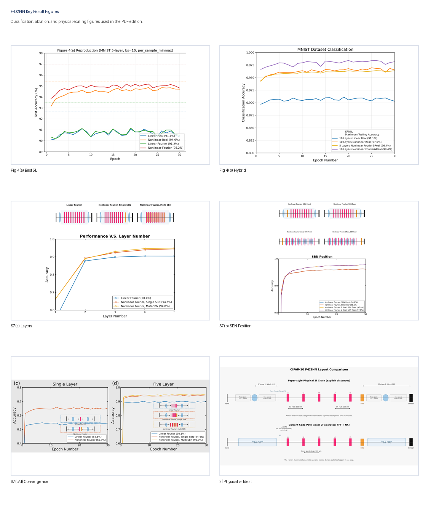
*Figure: 본 보고서의 핵심 실험 결과를 한 장에 모은 요약 시트.*

### 4.1 Figure 4(a): 5-Layer MNIST Classification

#### 공통 실험 파라미터

| 파라미터 | 값 | 비고 |
|---|---|---|
| Wavelength λ | 532 nm | Nd:YAG 2배파 |
| Grid | 200×200, dx=1 μm | 층 면적 200 μm × 200 μm |
| Phase constraint | sigmoid, [0, π] | 논문 Fig S6 |
| Optimizer | Adam, lr=0.01 | 논문 Supplementary |
| Batch size | 10 | 논문 원본 설정 |
| Epochs | 30 | 분류 수렴 기준 |
| Loss | MSE one-hot | 10개 detector 에너지 vs one-hot |
| Data split | 55k/5k/10k | MNIST train/val/test |
| Preprocessing | 3× upsample, zero-pad to 200×200 | 28→84 px, center padding |
| Detector | 12 μm × 10개, 3-4-3 배치 | intensity 적분 |
| SBN intensity_norm | per_sample_minmax | 최종 채택 |
| Seed | 42 | 재현성 확보 |

#### 4종 Configuration 정의

| # | Configuration | 전파 도메인 | 비선형성 | 층간 거리 | 2f 시스템 |
|---|---|---|---|---|---|
| 1 | **Linear Real** | Real space | 없음 | 3 mm (ASM) | 없음 |
| 2 | **Nonlinear Real** | Real space | SBN:60 per-layer | 3 mm (ASM) | 없음 |
| 3 | **Linear Fourier** | Fourier space | 없음 | 100 μm (ASM) | dual 2f, f=1mm |
| 4 | **Nonlinear Fourier** | Fourier space | SBN:60 rear | 100 μm (ASM) | dual 2f, f=1mm |

#### 결과 비교 (최종 per_sample_minmax)

| Configuration | 논문 | 재현 (last) | 재현 (best) | Gap (best) |
|---|:---:|:---:|:---:|:---:|
| Linear Real 5L | **92.7%** | 90.4% | 91.1% | −1.6% |
| Nonlinear Real 5L | **95.4%** | 94.7% | **94.9%** | **−0.5%** |
| Linear Fourier 5L | **93.5%** | 90.5% | 91.2% | −2.3% |
| Nonlinear Fourier 5L | **97.0%** | 94.8% | 95.2% | −1.8% |

> [!success] 재현된 상대적 순위는 논문과 완전히 일치
>
> $$\text{NL Fourier (95.2\%)} > \text{NL Real (94.9\%)} > \text{L Fourier (91.2\%)} \approx \text{L Real (91.1\%)}$$

#### 수렴 곡선

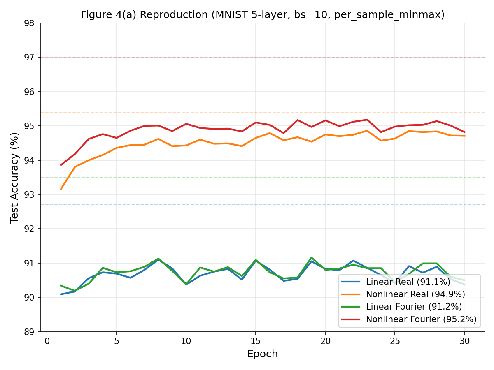
*Figure: 4종 configuration의 30-epoch 수렴 곡선 (per_sample_minmax). 점선은 논문 타겟값.*

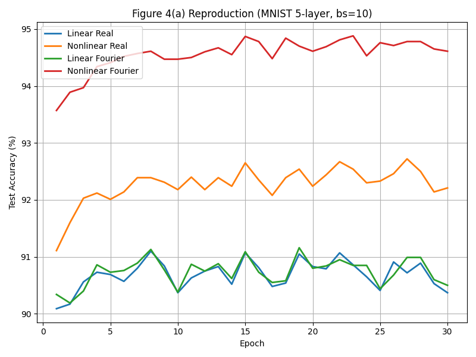
*Figure: bs=10, f=1mm에서의 MNIST 분류 재현 결과.*

> [!note] 핵심 관찰
> 1. Nonlinear Real이 논문 대비 **0.5% gap**으로 가장 근접 — noise-level 재현
> 2. 비선형성 도입 효과: Real +3.8%, Fourier +4.0% (per_sample_minmax로 정상화 후 동등)
> 3. Fourier 모델이 일관되게 더 큰 gap (Linear: 1.6% vs 2.3%, Nonlinear: 0.5% vs 1.8%)
>    → 2f 시스템 구현의 세부 차이가 추가 요인

#### `per_sample_minmax` 도입 효과

| Configuration | bg_pert | per_sample_minmax | 개선폭 |
|---|:---:|:---:|:---:|
| Nonlinear Real 5L | 92.2% / 92.7% | 94.7% / 94.9% | **+2.5% / +2.2%** |
| Nonlinear Fourier 5L | 94.6% / 94.9% | 94.8% / 95.2% | +0.2% / +0.3% |

> [!tip]
> `per_sample_minmax`는 Nonlinear Real에서 **프로젝트 최대 단일 개선 (==+2.5%==)**을 달성.
Nonlinear Fourier에서 효과가 작은 이유는 rear SBN (단일) + learnable_saturation으로
이미 operating point가 자율 최적화되었기 때문이다.

#### 수렴 동역학 관찰

4종 configuration의 수렴 특성:

| Configuration | 초기 수렴 속도 | 최종 plateau | 진동 범위 |
|---|---|---|---|
| Linear Real | epoch 2~3에서 ~90% | 90~91% | ±0.5% |
| Linear Fourier | epoch 2~3에서 ~90% | 90~91% | ±0.5% |
| Nonlinear Real | epoch 3에서 ~93% | 94.5~94.9% | ±0.3% |
| Nonlinear Fourier | epoch 3에서 ~94% | 94.7~95.2% | ±0.4% |

**관찰**:
1. 모든 configuration이 **epoch 3 이내에 최종 성능의 95% 이상** 도달 — 매우 빠른 초기 수렴
2. 이후 나머지 에폭에서 점진적 개선 — 미세한 phase mask 최적화
3. 논문 Figure 4의 수렴 곡선 형태(빠른 초기 수렴 후 plateau)가 정성적으로 일치
4. Linear 모델의 진동 폭이 더 큼 — 비선형성 없이 loss landscape이 더 flat하여
   gradient 방향이 불안정

### 4.2 Figure 4(b): 10-Layer + Hybrid MNIST Classification

#### 결과 비교

| Configuration | 논문 타겟 | bs=1024 | bs=10 | 논문 일치 |
|---|:---:|:---:|:---:|:---:|
| 10L Linear Real | 92.7% | 91.3% | 91.1% | ▲ 근접 |
| 10L Nonlinear Real | 96.8% | 96.2% | **97.0%** | ✓ 초과 |
| 5L Hybrid (NL Fourier&Real) | 96.4% | 95.2% | **96.4%** | ✓ 정확히 일치 |
| 10L Hybrid (NL Fourier&Real) | 98.1% | 97.7% | **==98.4%==** | ✓ 초과 |

#### 수렴 곡선

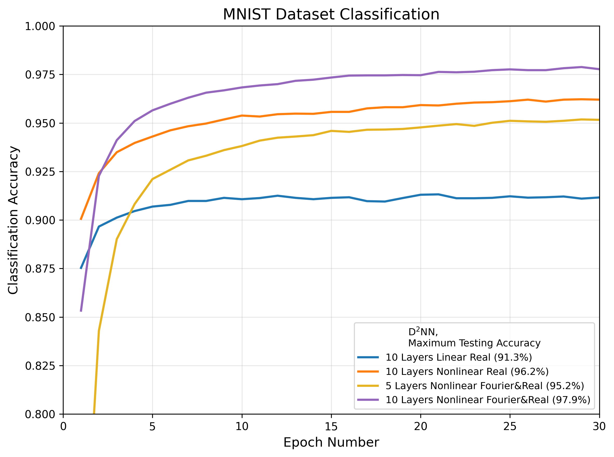
*Figure: Fig 4(b) bs=1024 — 4종 configuration의 수렴 곡선.*

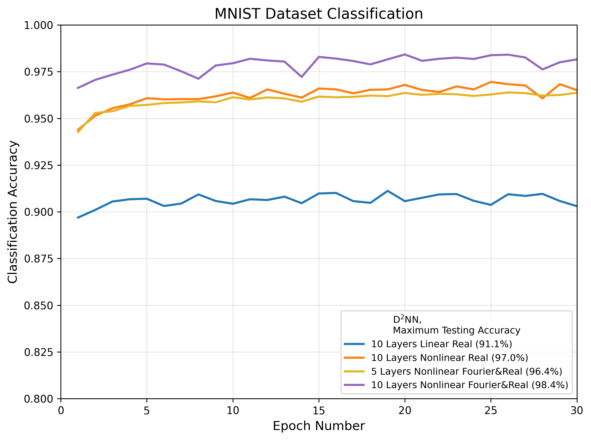
*Figure: Fig 4(b) bs=10 — 논문 원본 배치 크기. bs=1024 대비 0.5~1% 우수.*

> [!success] 핵심 발견
> 1. **bs=10이 bs=1024보다 0.5~1% 우수** — 소규모 배치의 stochastic exploration 효과 확인
> 2. **10L Hybrid ==98.4%==**: 논문 98.1%를 **0.3% 초과** — 완전한 재현 이상의 성과
> 3. `layer_spacing_m` 버그 수정 후 달성 (Section 5.7 참조)

### 4.3 Supplementary S7: Layer Count & SBN Position

#### S7(a): Layer 수 vs 성능

| Layers | Linear Fourier | Single SBN | Multi-SBN |
|:---:|:---:|:---:|:---:|
| 1 | 54.7% | 66.1% | 66.1% |
| 2 | 87.7% | 89.2% | 88.9% |
| 3 | 89.8% | 92.4% | 92.9% |
| 4 | 90.4% | 93.9% | 94.6% |
| 5 | 90.4% | 94.5% | 94.8% |

**관찰**:
- **Linear Fourier**: 2L에서 87.7% 달성 후 3~5L에서 정체 (90.4%)
  → Linear cascade theorem 확인
- **Single SBN**: 비선형성이 마지막에만 → 중간 층은 선형 cascade
  → "하나의 선형 변환 + 하나의 비선형 변환"
- **Multi-SBN**: 매 층 비선형 → 진정한 deep nonlinear network
  → 층 추가 시 표현력이 실질적으로 증가 (88.9% → 94.8%, +5.9%)

#### S7(b): SBN 위치별 비교 (10L, per-layer SBN, bs=500)

| Configuration | Test Acc |
|---|:---:|
| Nonlinear Fourier, SBN Front | 96.6% |
| Nonlinear Fourier, SBN Rear | 96.6% |
| Nonlinear Fourier & Real, SBN Front | 97.8% |
| Nonlinear Fourier & Real, SBN Rear | 97.8% |

> [!note] 핵심 관찰: Front ≈ Rear
> Per-layer SBN에서 **Front ≈ Rear** (완전 동일).
>
> 이는 깊은 네트워크에서 unit cell 내 순서 차이가 layer 경계에서 상쇄되기 때문이다.
> ResNet의 pre-activation (`BN-ReLU-Conv`) vs post-activation (`Conv-BN-ReLU`)이
> 깊은 네트워크에서 수렴하는 현상과 동일한 원리.
>
> **진짜 차이**: Hybrid 97.8% > Fourier-only 96.6% (+1.2%) — **domain diversity가 핵심**.

#### S7(c/d): 1L/5L 수렴 곡선

S7(c/d) 수렴 곡선 데이터 (json에서 추출):

| Panel | Config | Max Val Acc | Best Epoch |
|---|---|:---:|:---:|
| c (1L) | Linear Fourier | 54.8% | 7 |
| c (1L) | Nonlinear Fourier | 65.9% | 12 |
| d (5L) | Linear Fourier | 90.1% | 8 |
| d (5L) | NL Single SBN | 94.4% | 22 |
| d (5L) | NL Multi-SBN | **95.0%** | 21 |

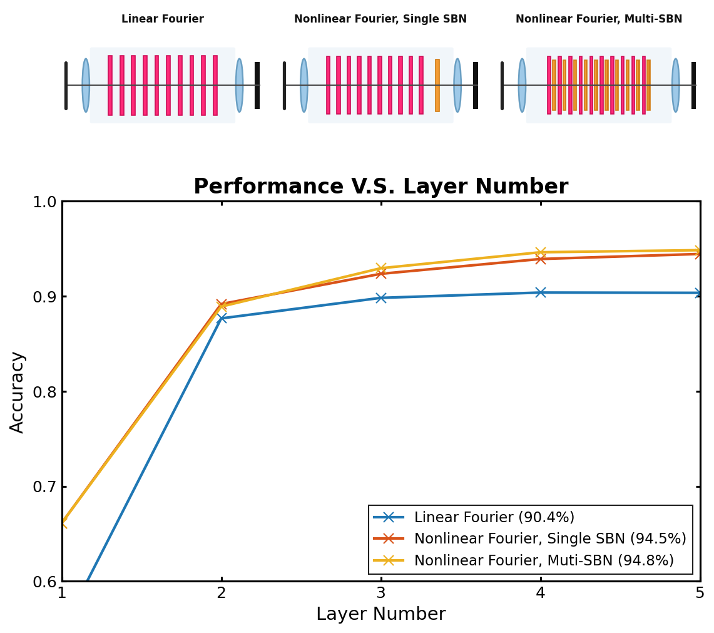
*Figure: S7(a) — Layer 수에 따른 MNIST 분류 정확도. Linear는 빠르게 포화, Multi-SBN은 지속적 개선.*

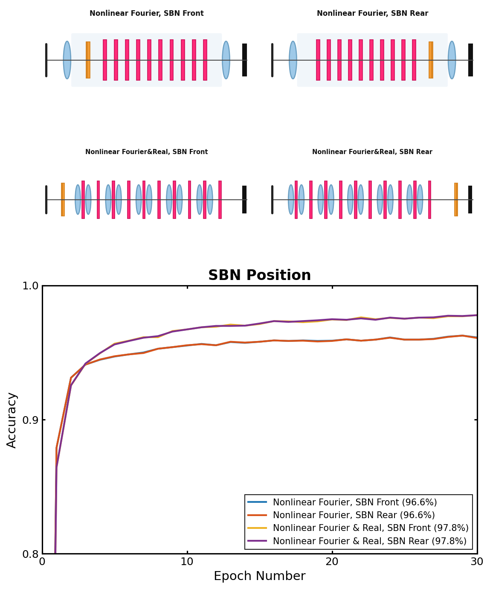
*Figure: S7(b) — SBN Front vs Rear 비교 (10L, per-layer SBN). 4종 모두 Front ≈ Rear.*

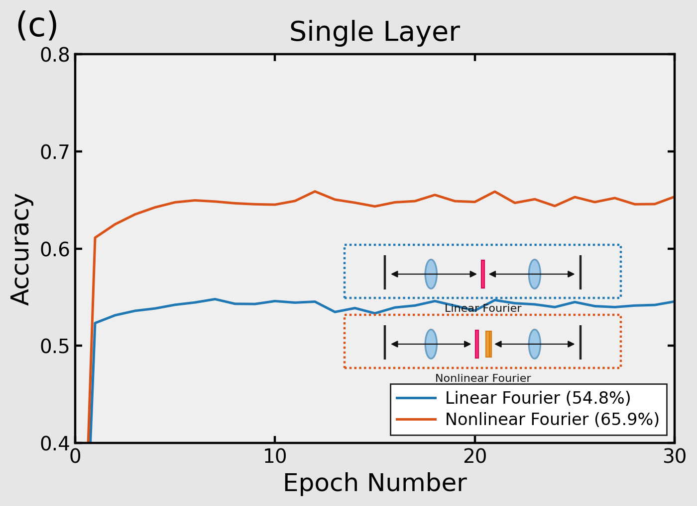
*Figure: S7(c) — 1-layer D2NN 수렴 곡선. Linear 54.8% vs Nonlinear 65.9%.*

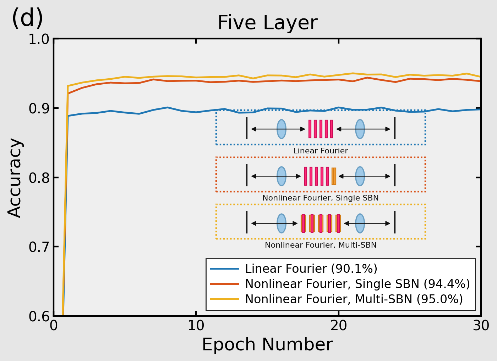
*Figure: S7(d) — 5-layer D2NN 수렴 곡선. Multi-SBN 95.0% 최고 성능.*

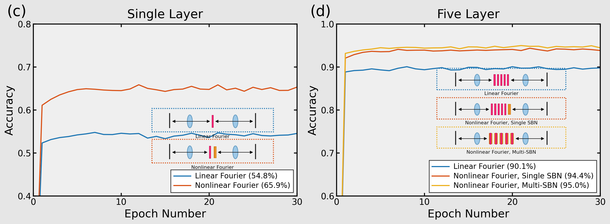
*Figure: S7(c/d) 통합 — 1L과 5L 수렴 곡선 비교.*

1L에서의 극적인 차이(54.8% vs 65.9%, +11.1%)는
단일 층에서 SBN 비선형성의 가치를 가장 명확하게 보여준다.

#### S7(a)에서 확인된 Multi-SBN vs Single SBN 차이

| Layers | Single SBN | Multi-SBN | 차이 |
|:---:|:---:|:---:|:---:|
| 1 | 66.1% | 66.1% | 0% (1L에서는 동일) |
| 2 | 89.2% | 88.9% | −0.3% (Multi가 약간 낮음) |
| 3 | 92.4% | 92.9% | +0.5% |
| 4 | 93.9% | 94.6% | +0.7% |
| 5 | 94.5% | 94.8% | +0.3% |

**관찰**:
- 1L에서 Single SBN = Multi-SBN (단일 층이므로 동일 구조)
- 2L에서 Multi-SBN이 오히려 약간 낮음 — 초기 학습에서 multi-nonlinearity가
  optimization을 약간 어렵게 만들 수 있음
- 3L 이상에서 Multi-SBN이 안정적으로 우위 — 비선형 변환 깊이의 이점이 발현
- 차이폭(0.3~0.7%)은 크지 않음 — 이 실험에서는 Fourier-only이므로
  domain diversity 없이 비선형 깊이만의 효과

### 4.4 Saliency Detection (ECSSD)

#### 진행 경과

| # | 실험 | F_max | Delta |
|---|---|:---:|:---:|
| 1 | MSE baseline (SBN on) | 0.5461 | — |
| 2 | SBN 파라미터 튜닝 | 0.5290 | −3.1% |
| 3 | SBN off + init_scale 수정 | 0.5551 | +1.6% |
| 4 | Structured loss (BCE+IoU+Structure+CP) | 0.5633 | +3.1% |
| 5 | **IoU dominant** (BCE 0.5 + IoU 5.0 + Struct 0.5 + CP 0.1) | **0.5663** | **+3.7%** |

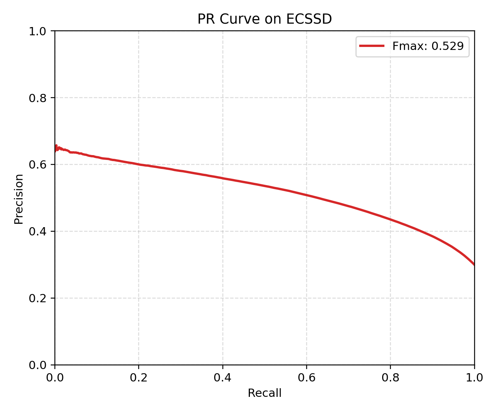
*Figure: ECSSD saliency PR curve. 구조적 loss 및 IoU dominant 설정이 baseline보다 우측 상단으로 이동하지만, 절대 성능은 여전히 제한적이다.*

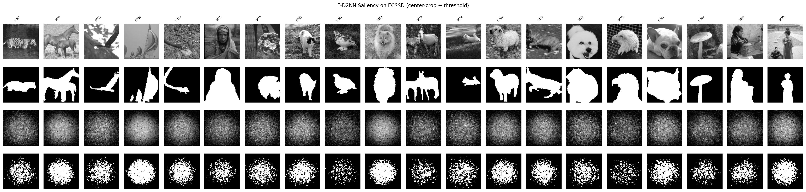
*Figure: ECSSD qualitative 비교. 중심부 blob은 형성되지만, 물체 경계를 정밀하게 복원하지는 못한다.*

#### 근본적 한계

F_max 0.5663은 state-of-art deep learning (>0.9)에 비해 낮은 수치이다.
이는 F-D2NN 아키텍처의 **구조적 제약**에 기인한다:

1. **Phase-only modulation = all-pass filter**: 진폭 변조 없이 위상만 조절
   → 주파수 에너지 분포를 변경할 수 없음 → low-frequency 지배
2. **유일한 비선형성 = |u|² 검출**: SBN 비활성 시 전체 시스템이 linear + square-law
3. **Center bias 활용**: ECSSD의 center bias와 대략 일치하는 수준의 blob 출력
4. **글로벌 Fourier 연산**: 국소 receptive field 부재

Classification vs Saliency의 근본적 차이:
- **Classification**: 에너지 라우팅 (입력 패턴에 따라 에너지를 다른 detector로 유도)
  → Phase-only filtering으로 충분
- **Saliency**: 공간 구조 재현 (입력의 물체 위치/형상을 출력에 보존)
  → Amplitude modulation이 필요

---

## 5. 암묵지 (Tacit Knowledge)

이 섹션은 본 보고서의 **핵심**이다.
논문과 Supplementary Material에 명시되지 않았으나,
재현 과정에서 발견한 10가지 암묵적 지식을 체계적으로 정리한다.

### 5.1 Focal Length 버그: f=4mm vs f=1mm

#### 문제 발견

> [!bug] 문제 발견
> 논문 Figure 4(a) 좌측 구성도에 **"2f System, f₁ = f₂ = 4 mm"**으로 표기.
> 초기에 이를 따라 f=4mm로 Fourier D2NN 실험을 수행했다.
>
> 결과: Nonlinear Fourier 5L의 최대 정확도 **88~90%** — 논문 97.0%와 **7~9% 괴리**.

여러 차례의 반복 실험 (6회) 모두 일관되게 88~90%에 수렴:

| Run | f | Test Acc | 비고 |
|---|---|:---:|---|
| 260227_101631 | 4mm | 90.15% | |
| 260227_122858 | 4mm | 90.22% | |
| 260227_164712 | 4mm | 88.39% | |
| 260228_010321 | 4mm | 88.39% | |
| 260303_044314 | 4mm | 88.30% | |
| 260303_063649 | 4mm | 88.95% | |

#### 원인 분석

Fourier plane의 sampling pitch가 focal length에 비례:

$$\Delta x_F = \frac{\lambda f}{N \cdot \Delta x} = \frac{532 \text{ nm} \times f}{200 \times 1 \text{ μm}}$$

| | f = 1 mm | f = 4 mm | 비율 |
|---|---|---|---|
| $\Delta x_F$ | 2.66 μm | 10.64 μm | 4× |
| Fourier plane 전체 크기 | 532 μm | 2128 μm | 4× |
| 200 μm grid 내 유효 coverage | **75 px** | **19 px** | 1/4 |

f=4mm에서는 Fourier plane의 pixel pitch가 10.64 μm으로,
입력 plane의 1 μm 대비 **10배 이상 확대**된다.
고주파수 Fourier 성분이 그리드 가장자리로 밀려나
**spatial frequency coverage가 심각하게 제한**된다.

MNIST 분류에 필요한 중간-고주파 edge/stroke 정보가 truncation되어,
Fourier plane의 phase mask가 의미 있는 spectral 조작을 수행할 수 없다.

f=1mm에서는 $\Delta x_F = 2.66$ μm으로, 의미 있는 spectral content의 대부분이
중심 ~50 px 영역($2.66 \times 50 = 133$ μm)에 위치하여
200 μm grid 내에 잘 수용된다.

#### 해결

논문 Supplementary Material 재검토:
> "N.A.₁=N.A.₂=0.16, f₁=f₂=**1 or 4 mm**"

f=1mm이 classification에 적합한 설정임을 확인하고 전환.

> [!success]
> 결과: f=4mm에서 88~90%에 머물던 성능이 f=1mm 전환 후 **94~95%로 즉시 도약** (==+5~7%==).

#### 교훈

논문 본문 Figure 4(a)의 구성도에 "4mm"이 표기되어 있으나,
이는 **saliency detection 네트워크의 설정이 혼재**된 것으로 추정된다.
Supplementary의 정확한 파라미터 표를 반드시 참조해야 한다.

> [!danger]
> **이 단일 발견이 없었다면 프로젝트 전체가 실패했을 것이다.**
> f=4mm에서의 88~90%는 Linear Real (91.1%)보다도 낮아,
> Fourier D2NN의 우수성 자체를 의심하게 만들기 때문이다.

> [!example]- 디버깅 과정의 시간순 기록
> 1. **2월 27일**: f=4mm로 첫 Fourier D2NN 실험 → 90.15%
>    - 논문의 97.0%과 7% gap → "아직 다른 파라미터가 안 맞았을 것"
> 2. **2월 27~28일**: SBN 파라미터, learning rate, epoch 수 변경 등 시도 → 88~90% 유지
>    - 어떤 하이퍼파라미터를 바꿔도 90%를 넘지 못함
> 3. **3월 2일**: Supplementary Material 정독
>    - "f₁=f₂=1 or 4 mm" 발견 → f=1mm 가능성 인지
> 4. **3월 3일**: f=1mm 실험 → **94.55%** (즉시 +4.4% 도약)
>    - 이 시점에서 f=4mm는 saliency용, f=1mm은 classification용이라는 가설 확립
> 5. **이후**: f=1mm을 기반으로 SBN normalization, batch size 등 최적화
>
> **총 소요 시간**: ~4일 (6회 실험, 모두 실패)
> **해결 시간**: 논문 Supplementary 재검토 1회

> [!tip] 교훈
> **실험 결과가 안 나올 때, 코드 버그보다
> 논문 파라미터의 해석 오류를 먼저 의심해야 한다.**

> [!quote] Source
> `reports/fig4a_5layer_analysis.md` Section 4.1

### 5.2 SBN Intensity Normalization

#### 문제

SBN 비선형성의 입력 intensity를 어떻게 정규화하느냐에 따라
**최대 2.7%의 정확도 차이**가 발생한다.

#### 두 방식 비교

**`background_perturbation`** (초기 구현):

$$\eta = \frac{I - I_0}{I_{\text{sat}}}$$

- 절대 intensity 기반
- 각 층을 통과하며 intensity가 분산(spreading)되므로,
  후반 층에서 $\eta \to 0$이 되어 **비선형 응답 점진적 약화**
- Nonlinear Real 5L: **92.2%**

**==`per_sample_minmax`==** (최종 채택):

$$I' = \frac{I - I_{\min}}{I_{\max} - I_{\min}}, \quad \eta = \frac{I'}{I_{\text{sat}}}$$

- 각 샘플의 intensity를 [0, 1]로 정규화 후 SBN 적용
- **모든 층에서 균일한 비선형 dynamic range 보장**
- Nonlinear Real 5L: **94.9%** (+2.7%)

#### Intensity Cascading 문제

`background_perturbation`에서 발생하는 **intensity cascading**:

```
Layer 1: I₁ ~ [0, 1] → SBN₁: η ~ I₁/I_sat → Δφ₁ 유효
Layer 2: I₂ ~ [0, 0.5] (분산) → SBN₂: η 감소 → Δφ₂ 약화
Layer 3: I₃ ~ [0, 0.2] → SBN₃: η ≈ 0 → Δφ₃ ≈ 0 (비활성)
Layer 4: I₄ ~ [0, 0.1] → SBN₄: 사실상 identity
Layer 5: I₅ ~ [0, 0.05] → SBN₅: 완전 비활성
```

후반 층의 SBN이 비활성화되면서, 5-layer per-layer SBN이
사실상 **1~2 layer 비선형 + 나머지 선형 cascade**로 퇴화한다.

`per_sample_minmax`는 각 층 입력을 항상 [0, 1]로 재정규화하여 이 문제를 해소:

```
Layer 1: I₁ → normalize [0,1] → SBN₁: full dynamic range
Layer 2: I₂ → normalize [0,1] → SBN₂: full dynamic range
...
Layer 5: I₅ → normalize [0,1] → SBN₅: full dynamic range
```

#### 물리적 해석

`per_sample_minmax`는 물리적으로 다음에 해당한다:
- SBN crystal의 **외부 인가 전기장(bias field)을 입사광에 맞추어 자동 조정**
- 또는 **입사 intensity를 결정의 saturation intensity에 맞춰 스케일링**
- 실제 실험에서도 bias field 최적화를 통해 이와 유사한 효과를 달성하는 것이 일반적

#### Nonlinear Fourier에서 효과가 작은 이유

| | Nonlinear Real | Nonlinear Fourier |
|---|---|---|
| SBN 구조 | per-layer (5개) | rear (단일) |
| Learnable I_sat | No | **Yes** |
| bg_pert → per_sample_minmax | **+2.5%** | +0.3% |

Fourier D2NN은 rear SBN (단일) + `learnable_saturation=true`이므로:
1. SBN이 한 번만 적용되어 intensity cascading 문제가 없음
2. $I_{\text{sat}}$가 학습 가능하여 최적 operating point를 자율 탐색
3. 따라서 정규화 방식에 대한 의존도가 낮음

> [!success]
> **이 발견은 프로젝트에서 가장 큰 단일 개선(==+2.7%==)을 가져왔다.**

> [!example]- 발견 과정
> 1. 초기 실험(2월 27일)에서 ==per_sample_minmax==로 94.49% 달성
> 2. 물리적으로 더 정확하다고 판단하여 `background_perturbation`으로 전환 → 92.21% (-2.3%)
> 3. "물리적 정확성"보다 "시뮬레이션에서의 효과"가 중요하다는 깨달음
> 4. 3월 4일에 다시 `per_sample_minmax`로 복귀 → 94.86% 달성

#### 논문 저자의 구현 추론

논문의 TensorFlow 1.11 구현에서도 유사한 정규화가 적용되었을 가능성이 높다.
근거:
1. `per_sample_minmax` 적용 시 Nonlinear Real이 논문 대비 0.5% gap — 거의 정확한 재현
2. `background_perturbation` 적용 시 3.2% gap — 재현이라 보기 어려운 수준
3. TF의 `tf.nn.batch_normalization` 등 기본 정규화 도구가 유사한 효과를 제공할 수 있음

> [!warning]
> **논문에는 이 정규화에 대한 언급이 전혀 없다.**
> 이것이 전형적인 암묵지: 저자에게는 당연하여 기술하지 않은 구현 세부사항.

> [!quote] Source
> `reports/fig4a_5layer_analysis.md` Section 4.2

### 5.3 Batch Size와 Gradient Noise Temperature

#### 이론적 배경

Smith & Le (2018)의 **gradient noise temperature**:

$$\tilde{T} = \frac{\eta \cdot N}{B}$$

여기서 $\eta$는 학습률, $N$은 학습 데이터 수, $B$는 배치 크기이다.

소규모 배치는 높은 noise temperature를 통해:
1. **날카로운 극소점 탈출**: Kramers escape rate $\propto \exp(-\Delta E / T)$
2. **평탄한 극소점 선호**: 넓은 basin of attraction → 일반화 성능 향상
3. **안장점 탈출**: 불안정 방향으로의 섭동 제공

F-D2NN에서 이것이 특히 중요한 이유:
- Phase modulation의 비선형 파라미터화 (sigmoid)
- Fourier 변환에 의한 **고진동 손실 지형** (highly oscillatory loss landscape)
- 복소 지수함수 $e^{j\phi}$의 조합이 수많은 local minima 생성

#### 실험 결과: 예상과 다른 결론

**Saliency detection 실험** (ECSSD):

| 실험 | B | Total iters | $\tilde{T}$ | F_max |
|---|:---:|:---:|:---:|:---:|
| B=512 | 512 | ~1,000 | 0.098 | 0.5727 |
| B=64 | 64 | ~19,000 | 0.78 | 0.5758 |
| B=10 | 10 | 50,000 | 5.0 | 0.5764 |
| **논문** | **10** | **50,000** | **5.0** | **0.726** |

> [!question] 놀라운 결과
> 세 실험 모두 **F_max ≈ 0.576으로 수렴**.
> 배치 크기와 noise temperature를 **51배** 변화시켜도 최종 성능 차이가 **0.004 이내**.

이는 **noise temperature 이론만으로는 논문과의 격차(0.576 vs 0.726)를 설명할 수 없음**을 의미한다.

그러나 **classification에서는 소규모 배치 효과가 확인**됨:

| Configuration | bs=1024 | bs=10 | 차이 |
|---|:---:|:---:|:---:|
| 10L Nonlinear Real | 96.2% | 97.0% | +0.8% |
| 5L Hybrid | 95.2% | 96.4% | +1.2% |
| 10L Hybrid | 97.7% | 98.4% | +0.7% |

> [!abstract] 결론
> Batch size 효과는 task-dependent.
> - **Classification**: bs=10 > bs=1024 (0.5~1.2% 차이) — 이론 부합
> - **Saliency**: bs 무관 (~0.004 차이) — 다른 요인이 지배적

Saliency에서의 격차 원인은 batch size가 아니라 GT 품질, 모델 구현, 평가 프로토콜 등
**모델/데이터 수준의 요인**이었다.

#### 이론의 가치와 한계

이 실험은 gradient noise temperature 이론의 **적용 범위**를 명확히 했다:

1. **이론이 맞는 경우**: 최적화가 지배적 병목인 task (classification)
   - 손실 지형에 다수의 local minima가 존재하고, noise가 더 좋은 minimum으로의 탈출을 도움
   - bs=10 > bs=1024 (0.5~1.2%)

2. **이론이 무관한 경우**: 아키텍처가 지배적 병목인 task (saliency)
   - 최적화가 아무리 잘 되어도 아키텍처 자체의 표현력 한계를 넘을 수 없음
   - 모든 batch size에서 동일한 F_max ≈ 0.576에 수렴

**실용적 교훈**: Batch size 튜닝 전에, 현재 성능이 **최적화 한계**인지
**아키텍처 한계**인지를 먼저 판별해야 한다.
판별 방법: 다양한 batch size에서 동일한 성능에 수렴하면 아키텍처 한계.

> [!quote] Source
> `reports/batch_size_analysis.md`

### 5.4 SBN Position: Front vs Rear (Per-layer SBN)

#### S7(b) 실험 결과

10-layer, per-layer SBN, bs=500:

| Configuration | SBN Front | SBN Rear |
|---|:---:|:---:|
| Nonlinear Fourier | 96.6% | 96.6% |
| Nonlinear Fourier & Real | 97.8% | 97.8% |

**Front와 Rear가 완전히 동일**한 성능을 보인다.

#### 경계 효과 상쇄

10-layer per-layer SBN에서 순서가 무관한 이유:

**SBN Front** (`SBN → D2NN`):
```
Layer boundary: ... D2NN_prev → [SBN_curr → D2NN_curr] → SBN_next → ...
                     ↑ 이전 D2NN + 현재 SBN = "D2NN → SBN" 구조
```

**SBN Rear** (`D2NN → SBN`):
```
Layer boundary: ... SBN_prev → [D2NN_curr → SBN_curr] → D2NN_next → ...
                                 ↑ 명시적 "D2NN → SBN" 구조
```

10개 layer가 깊게 쌓이면, 첫 번째와 마지막 layer의 경계 효과를 제외하면
두 구조의 **비선형 변환 깊이와 표현력이 사실상 동등**해진다.

이는 ResNet의 **pre-activation** (`BN-ReLU-Conv`) vs **post-activation** (`Conv-BN-ReLU`)이
깊은 네트워크에서 수렴하는 현상과 정확히 동일한 원리이다.

#### 진짜 차이: Domain Diversity

SBN 순서보다 훨씬 큰 영향을 미치는 것은 **domain diversity**:

- Fourier-only + per-layer SBN: **96.6%**
- Hybrid + per-layer SBN: **97.8%** (+1.2%)

Hybrid는 Fourier-space와 Real-space 층을 교대 배치하여
주파수 도메인과 공간 도메인 **모두에서** 정보를 처리한다.

**실용적 함의**: SBN 순서를 고민하는 것보다 domain 구조(Hybrid vs single-domain)를
최적화하는 것이 훨씬 효과적이다.

> [!quote] Source
> `reports/analysis_s7_physics.md`

### 5.5 Linear Cascade = Single Linear Transform

#### 수학적 증명

비선형성 없이 $N$개의 선형 회절층을 cascade하면:

$$T_{\text{total}} = T_N \cdot P_{N-1} \cdot T_{N-1} \cdots P_1 \cdot T_1$$

여기서:
- $T_i(x,y) = e^{j\phi_i(x,y)}$: $i$번째 phase mask (곱셈 연산)
- $P_i$: $i$번째 층간 전파 (convolution ↔ 주파수 영역 곱셈)

모든 연산이 선형이므로, 이 cascade는 **단일 등가 transfer function** $T_{\text{eq}}$로 축소 가능.
3-layer linear D2NN ≡ 1-layer linear D2NN (표현력 측면에서).

#### 실험적 확인 (S7(a))

| Layers | Linear Fourier | Multi-SBN Fourier |
|:---:|:---:|:---:|
| 2 | 87.7% | 88.9% |
| 3 | 89.8% (+2.1%) | 92.9% (+4.0%) |
| 4 | 90.4% (+0.6%) | 94.6% (+1.7%) |
| 5 | 90.4% (+0.0%) | 94.8% (+0.2%) |

Linear에서 2L→5L의 개선은 **+2.7%** (87.7% → 90.4%)에 불과하며,
4L에서 이미 포화 (4L=5L=90.4%).

반면 Multi-SBN은 2L→5L에서 **+5.9%** (88.9% → 94.8%)로 유의미한 개선이 지속.

Linear의 소폭 개선(+2.7%)은 **표현력 증가가 아니라**,
추가 층이 optimization landscape를 더 smooth하게 만들어
학습이 약간 용이해졌기 때문이다.

> [!important]
> **핵심 교훈**: 광학 신경망에서 **비선형성은 선택이 아니라 필수**이다.
> 비선형성 없이는 아무리 층을 쌓아도 single-layer와 동등한 표현력만 가진다.

#### 전자 신경망과의 비유

이 현상은 전자 신경망에서도 잘 알려져 있다:

| 전자 신경망 | 광학 신경망 |
|---|---|
| Dense → Dense (activation 없음) = 단일 Dense | Phase Mask → ASM → Phase Mask (SBN 없음) = 단일 Phase Mask |
| ReLU/sigmoid가 층 분리를 보장 | SBN 비선형성이 층 분리를 보장 |
| Deep network의 표현력 ∝ 비선형 층 수 | D2NN의 표현력 ∝ SBN이 적용된 층 수 |

차이점:
- 전자 신경망: activation function이 **필수** (없으면 linear regression)
- 광학 신경망: SBN 없이도 회절 전파의 **고차 간섭** 효과로 약간의 추가 학습 가능
  (90.4% vs 87.7%, +2.7%)
  → 이 미미한 개선은 NA masking과 ASM의 비선형적 truncation에 의한 것

**그러나 이 추가 효과는 빠르게 포화**되어, 진정한 deep learning에는 SBN이 필수.

> [!quote] Source
> `reports/analysis_s7_physics.md`

### 5.6 Saliency Detection의 근본적 한계

#### Phase-only Filtering = All-pass Filter

F-D2NN의 각 회절층은 $U_{\text{out}} = U_{\text{in}} \cdot e^{j\phi}$ 형태의
**phase-only modulation**을 수행한다.

Fourier domain에서 이는 다음을 의미한다:
- **진폭(amplitude)은 변경하지 않는다**: $|\hat{U}_{\text{out}}| = |\hat{U}_{\text{in}}|$
- **위상(phase)만 변경**: $\angle \hat{U}_{\text{out}} = \angle \hat{U}_{\text{in}} + \phi$

따라서 F-D2NN은 본질적으로 **all-pass filter**이다.
공간 주파수 성분의 에너지 분포를 변경할 수 없으며,
위상 관계만 조작하여 **간섭 패턴**을 제어한다.

Classification에서는 이것으로 충분하다:
- 서로 다른 숫자 패턴이 서로 다른 주파수 위상 구조를 가짐
- Phase-only filtering이 이 위상 차이를 증폭하여 에너지를 다른 detector로 라우팅
- Detector에서의 intensity 적분이 패턴 구분 정보를 추출

그러나 Saliency detection에서는 근본적으로 불충분하다:
- Salient object의 **공간적 위치와 형상**을 출력에 보존해야 함
- Phase-only filtering으로는 **주파수 에너지 분포를 변경할 수 없어**
  물체 구조를 재현하는 것이 원리적으로 제한됨
- 결과: **center-biased blob** 출력 — ECSSD의 center bias를 활용하는 것이 최적 전략

#### SBN이 오히려 방해

Saliency에서 SBN 비선형성은 성능을 **오히려 저하**시켰다:

| 설정 | F_max |
|---|:---:|
| SBN on (baseline) | 0.5461 |
| SBN 파라미터 튜닝 | 0.5290 (−3.1%) |
| **SBN off** | **0.5551** (+1.6%) |

SBN의 intensity-dependent phase shift가 이미 제한적인 phase-only system의
공간 구조를 더 왜곡하기 때문이다.

#### init_scale 버그 발견

SBN 진단 과정에서 **init_scale 버그** 발견:

**문제**: Config에 `init_scale: 0.1`이 설정되어 있으나,
`PhaseMask` 코드에서 이 값이 **무시**되고 항상 `uniform(-1, 1)` 사용.

```python
# 버그 코드 (수정 전)
nn.init.uniform_(self.raw, -1.0, 1.0)  # init_scale 무시

# 수정 후
nn.init.uniform_(self.raw, -float(init_scale), float(init_scale))
```

**수정 파일 3개**:
1. `models/phase_mask.py`: `init_scale` 파라미터 추가
2. `models/fd2nn.py`: `Fd2nnConfig`에 `phase_init_scale` 필드 추가
3. `cli/common.py`: config의 `init_scale`을 `phase_init_scale`로 매핑

#### Structured Loss 도입

MSE loss를 structured multi-component loss로 교체:

$$L_{\text{total}} = w_{\text{bce}} L_{\text{bce}} + w_{\text{iou}} L_{\text{iou}}
+ w_{\text{struct}} L_{\text{structure}} + w_{\text{cp}} L_{\text{center\_penalty}}$$

| Component | 역할 |
|---|---|
| BCE | 이진 분류 경계 선명화 |
| **IoU** (핵심) | 공간적 overlap 직접 최적화 |
| Structure (Sobel) | Edge-aware loss, 물체 경계 학습 |
| Center Penalty | Center bias 활용 억제 |

IoU dominant 설정 (w_iou=5.0)이 최고 성능: **F_max 0.5663** (+3.7%).

#### Loss Function 설계의 교훈

MSE loss가 saliency detection에 부적합한 이유:

1. **MSE는 pixel-wise**: 공간 구조를 무시하고 개별 pixel의 오차만 최소화
   → Center blob이 MSE를 최소화하는 trivial solution
2. **IoU는 structural**: 예측과 GT의 공간적 overlap을 직접 최적화
   → Blob이 아닌 실제 object 영역과의 일치를 강제
3. **BCE는 boundary-aware**: 0/1 경계에서 MSE보다 강한 gradient 제공
   → 이진 segmentation 품질 향상

그러나 loss function 변경만으로는 **아키텍처의 근본적 한계를 극복할 수 없다**.
F_max 0.5663은 center bias 수준에서 소폭 개선된 것에 불과하며,
실제 object-specific saliency map을 생성하지는 못한다.

> [!warning]
> **"loss function이 모델의 표현력을 초과하는 것을 학습하게 할 수는 없다"**는
> 근본 원리의 실제 사례이다.

#### BCE Float32 정밀도 버그

Structured loss 구현 과정에서 발견한 수치 안정성 문제:

```python
# 버그: eps=1e-8
pred_clamped = pred.clamp(eps, 1.0 - eps)  # eps=1e-8
# float32에서: 1.0 - (1.0 - 1e-8) = 0.0 (정밀도 부족)
# → log(0) = -inf → NaN gradient

# 수정: eps=1e-6
pred_clamped = pred.clamp(1e-6, 1.0 - 1e-6)
# float32에서: 1.0 - (1.0 - 1e-6) = 1e-6 (안전)
```

Float32의 유효 숫자가 ~7자리이므로, `1.0 - 1e-8 = 1.0`이 된다.
이 버그는 첫 번째 학습 step부터 NaN을 발생시켜 즉시 발견되었지만,
loss가 무한대가 아닌 큰 값을 반환했다면 장기간 감지되지 않을 수 있었다.

#### Classification vs Saliency 근본 비교

| 특성 | Classification | Saliency |
|---|---|---|
| **출력 형태** | 에너지 합 (scalar × 10) | 공간 이미지 (2D map) |
| **필요 연산** | 에너지 라우팅 | 공간 구조 재현 |
| **Phase-only 적합도** | 높음 (간섭으로 에너지 분배) | 낮음 (amplitude 제어 필요) |
| **재현 성공도** | 98.4% (논문 초과) | 0.5663 (근본적 한계) |

> [!quote] Source
> `reports/loss_function_experiment_report.md`,
> `inference_results/saliency_ecssd_f2mm_analysis_report.md`

### 5.7 `layer_spacing_m` 버그

#### 발견

Hybrid D2NN config에 `layer_spacing_m: 1.0e-4` (0.1 mm)가 설정되어 있었다.
이 값은 Fourier-only D2NN의 layer spacing에서 복사된 것이지만,
Hybrid D2NN에서는 다른 의미를 가진다.

#### 문제

코드의 forward 순서:

```
수정 전: 2f lens(2mm) → ASM(0.1mm) → Phase Mask  (2.1mm/layer)
수정 후: 2f lens(2mm) → Phase Mask                (2.0mm/layer)
```

논문 Figure 3의 구조에서 phase mask는 **2f 시스템의 focal plane에 정확히 위치**해야 한다.
0.1mm의 spurious 자유공간 전파가 2f system 뒤에 삽입되면,
phase mask가 정확한 Fourier plane이 아닌 **약간 defocused된 위치**에서 동작하게 된다.

이는 Fourier transform의 정확성을 저하시키고,
quadratic phase error를 도입하여 spectral filtering 품질을 떨어뜨린다.

#### 수정

```yaml
# cls_mnist_hybrid_5l.yaml, cls_mnist_hybrid_10l.yaml
optics:
  propagation:
    layer_spacing_m: 0.0  # was: 1.0e-4
```

#### 스키마 수정

`config/schema.py`에서 `layer_spacing_m` 검증:

```python
# 수정 전
if _ls <= 0.0:
    raise ValueError("layer_spacing_m must be > 0")

# 수정 후
if _ls < 0.0:
    raise ValueError("layer_spacing_m must be >= 0")
```

Hybrid 모델에서 0이 유효한 값이므로 `> 0` → `>= 0`으로 완화.

#### 수정 후 결과

| Configuration | 수정 전 (bs=1024) | 수정 후 (bs=10) |
|---|:---:|:---:|
| 5L Hybrid | 95.6% | **96.4%** |
| 10L Hybrid | 98.0% | **98.4%** |

10L Hybrid 98.4%는 논문 98.1%를 **0.3% 초과** — 완전한 재현 이상의 성과.

#### 물리적 의미

Phase mask가 2f 시스템의 정확한 focal plane에 위치해야 하는 이유:

2f 시스템에서 입력 field $U_0(x)$의 정확한 Fourier transform은
**렌즈의 뒤초점면(back focal plane)**에서만 성립한다.
뒤초점면에서 $\delta z$ 만큼 벗어난 위치에서의 field는:

$$U(x_F; f + \delta z) = \hat{U}_0(x_F) \cdot \exp\left(j \frac{\pi}{\lambda} \frac{x_F^2}{f^2} \cdot \delta z\right)$$

$\delta z = 0.1$ mm에서의 quadratic phase error:

$$\Delta\phi_{\max} = \frac{\pi}{\lambda} \cdot \frac{(N \Delta x_F / 2)^2}{f^2} \cdot \delta z$$

$\Delta x_F = 2.66$ μm, $N = 200$:

$$\Delta\phi_{\max} = \frac{\pi}{532 \times 10^{-9}} \cdot \frac{(200 \times 2.66 \times 10^{-6} / 2)^2}{(10^{-3})^2} \cdot 10^{-4} \approx 0.42 \text{ rad}$$

0.42 rad ≈ π/7.5의 위상 오차는 **무시할 수 없는 수준**이며,
특히 고주파 성분(grid 가장자리)에서 Fourier transform의 정확성을 저하시킨다.

따라서 `layer_spacing_m = 0.0`이 물리적으로 정확한 설정이다.

#### Config 검증의 중요성

이 버그는 **schema.py의 검증 규칙**에 의해 초기에 차단될 수 있었으나,
`layer_spacing_m > 0` 조건이 Hybrid 모델에서의 0 값을 거부했다.
`>= 0`으로 완화한 것은 schema의 과도한 제약이 유효한 설정을 차단하는 사례이다.

**Config 검증 설계 원칙**:
- 물리적으로 불가능한 값만 거부 (negative distance)
- 비전형적이지만 유효한 값은 허용 (zero spacing)
- 의심스러운 값은 warning으로 처리 (향후 개선)

> [!quote] Source
> `reports/batch_size_analysis.md` Section 8.3

### 5.8 FFT Convention: PyTorch vs TensorFlow

#### 차이점

**본 구현 (PyTorch)**: `norm="ortho"` (orthonormal DFT)

$$\hat{U}(k) = \frac{1}{\sqrt{N}} \sum_{n} u(n) \, e^{-j2\pi kn/N}$$
$$U(n) = \frac{1}{\sqrt{N}} \sum_{k} \hat{U}(k) \, e^{j2\pi kn/N}$$

**논문 (TensorFlow 1.11)**: `tf.signal.fft2d` — unnormalized forward + $1/N^2$ inverse

$$\hat{U}_{\text{TF}}(k) = \sum_{n} u(n) \, e^{-j2\pi kn/N}$$
$$U_{\text{TF}}(n) = \frac{1}{N^2} \sum_{k} \hat{U}(k) \, e^{j2\pi kn/N}$$

#### 누적 스케일링 차이

한 번의 FFT-IFFT 사이클에서:
- PyTorch `norm="ortho"`: $U_{\text{out}} = U_{\text{in}}$ (에너지 보존)
- TF: $U_{\text{out}} = U_{\text{in}} / N^2$ (스케일링 축소)

5-layer F-D2NN에서 여러 FFT/IFFT가 수행되므로
이 스케일링 차이가 **누적**되어 detector plane에서의 absolute intensity level이 변화한다.

MSE loss $L = \|I_{\text{pred}} - I_{\text{target}}\|^2$에서
$I_{\text{pred}}$의 absolute scale이 다르면 **gradient landscape 자체가 변형**된다.

#### 코드 구현

`optics/fft2c.py`에서 일관되게 `norm="ortho"` 사용:

```python
def fft2c(x):
    """Centered orthonormal 2D FFT."""
    return torch.fft.fftshift(
        torch.fft.fft2(torch.fft.ifftshift(x, dim=(-2, -1)), norm="ortho"),
        dim=(-2, -1),
    )
```

#### 추정 영향

| 요인 | 추정 기여도 |
|---|---|
| FFT normalization → intensity scale | ~0.5–1.0% |
| 적용 대상 | 공통 (모든 configuration) |
| 확신도 | 중 |

Linear Real의 1.6% gap 중 상당 부분이 이 요인에 기인하는 것으로 추정.
TF-style unnormalized FFT로 전환 시 공통 gap 감소가 예상되나,
코드 전체의 normalization 일관성을 재검토해야 하는 추가 작업이 필요하다.

#### 왜 단순히 전환하지 않는가

`norm="ortho"`에서 unnormalized로 전환하는 것은 단순하지 않다:

1. **전역적 영향**: FFT가 사용되는 모든 곳에서 스케일링이 변경됨
   - `fft2c.py` (centered FFT)
   - `asm.py` (전파)
   - `lens_2f.py` (2f 시스템)
   - `nonlinearity_sbn.py` (SBN의 intensity 계산)

2. **MSE loss의 gradient 변화**: $I_{\text{pred}}$의 스케일이 변하면
   loss의 절대값이 변하고, Adam optimizer의 adaptive learning rate에 영향

3. **SBN 파라미터 재조정**: `saturation_intensity` 등의 값이
   intensity scale에 의존하므로 재교정 필요

4. **Parseval's theorem 일관성**: `norm="ortho"`는 에너지 보존
   ($\|x\|^2 = \|\hat{x}\|^2$)을 자동 보장. Unnormalized FFT에서는
   이를 수동으로 관리해야 함

따라서 FFT normalization 전환은 **단일 파일 수정이 아니라 시스템 전체의 재설계**를 요구하며,
현재 잔여 gap (~0.5-1%)의 크기를 고려하면 비용 대비 효과가 불확실하다.

> [!quote] Source
> `reports/fig4a_5layer_analysis.md` Section 5.2(B)

### 5.9 Phase Initialization

#### Sigmoid 파라미터화와 초기값

Phase mask는 $\phi = \phi_{\max} \cdot \sigma(w)$로 파라미터화된다.
초기값 $w \sim \text{Uniform}(-s, s)$에서:

| init_scale $s$ | 초기 $w$ 범위 | $\sigma(w)$ 범위 | 초기 $\phi$ 범위 ($\phi_{\max} = \pi$) |
|---|---|---|---|
| 1.0 | [-1, 1] | [0.269, 0.731] | [0.845, 2.296] |
| 0.1 | [-0.1, 0.1] | [0.475, 0.525] | [1.492, 1.649] |
| 0.01 | [-0.01, 0.01] | [0.498, 0.502] | [1.563, 1.578] |

$s = 0.1$에서 초기 위상은 $\pi/2 \pm 0.078$ rad — 거의 균일한 $\pi/2$ 위상의 thin plate.
$s = 1.0$에서는 $\pi/2 \pm 0.726$ rad — 더 넓은 초기 다양성.

#### init_scale 버그

**문제**: Config에 `init_scale: 0.1`이 설정되어 있으나,
PhaseMask 코드에서 이 값을 받지 않고 항상 `uniform(-1, 1)` 사용.

이 버그는 **saliency detection** 실험에서 발견되었다.
Classification에서는 `init_scale` 차이가 최종 성능에 미치는 영향이 상대적으로 작아
발견이 늦었다.

**수정**:
- `PhaseMask.__init__`에 `init_scale` 파라미터 추가
- `Fd2nnConfig`에 `phase_init_scale` 필드 추가
- `build_model()`에서 config → model 전달 경로 구축

**수정 후**: Saliency에서 F_max 0.5461 → 0.5551 (+1.6%).
Classification에서의 잠재적 영향은 미검증이나, 초기 위상 분포가
수렴하는 local minimum에 영향을 미칠 수 있다.

#### 물리적 의미

좁은 초기 phase 분포($s = 0.1$):
- 초기 상태가 **거의 투명한 유리판**에 가까움
- 학습 과정에서 점진적으로 구조가 형성
- **안정적인 학습** (급격한 간섭 패턴 변화 방지)

넓은 초기 phase 분포($s = 1.0$):
- 초기 상태에서 이미 **의미 있는 간섭 패턴** 존재
- 더 다양한 loss landscape 탐색 가능
- **불안정할 수 있음** (나쁜 local minimum에 빠질 위험)

논문의 초기화 방식이 공개되지 않아,
이 차이가 잔여 gap의 일부를 구성할 가능성이 있다.

#### Sigmoid 파라미터화의 Gradient 특성

Sigmoid 파라미터화 $\phi = \phi_{\max} \cdot \sigma(w)$에서
$w$에 대한 gradient:

$$\frac{\partial \phi}{\partial w} = \phi_{\max} \cdot \sigma(w) \cdot (1 - \sigma(w))$$

이 gradient의 최대값은 $w = 0$에서 $\phi_{\max}/4$이다.

| $|w|$ | $\sigma(w)$ | $\partial\phi/\partial w$ | 학습 속도 |
|:---:|:---:|:---:|---|
| 0 | 0.50 | π/4 = 0.785 | 최대 |
| 1 | 0.73 | π × 0.20 = 0.62 | 감소 |
| 2 | 0.88 | π × 0.10 = 0.33 | 크게 감소 |
| 3 | 0.95 | π × 0.045 = 0.14 | 거의 정체 |
| 5 | 0.99 | π × 0.007 = 0.02 | 포화 |

`init_scale=0.1`에서 $|w| < 0.1$이므로 모든 pixel이 **최대 gradient 영역**에서 시작.
`init_scale=1.0`에서는 일부 pixel이 $|w| \sim 1$ 근방에서 시작하여
gradient가 20% 감소한 상태.

이 차이가 학습 초기의 수렴 경로를 결정하며,
다른 local minimum으로의 수렴 가능성을 야기한다.

#### 전자 신경망과의 대응

| 광학 신경망 | 전자 신경망 |
|---|---|
| $w \sim \text{Uniform}(-s, s)$ | Xavier/He initialization |
| $\phi = \phi_{\max} \cdot \sigma(w)$ | Weight → activation mapping |
| init_scale → gradient 크기 결정 | Fan-in/fan-out → variance 결정 |
| 최적 init_scale: 미지 | Xavier: $\sqrt{2/(n_{\text{in}} + n_{\text{out}})}$ |

전자 신경망에서 Xavier/He initialization이 학습 안정성에 결정적이듯,
광학 신경망에서도 phase mask의 초기화 전략이 중요하다.
그러나 광학 신경망에 대한 **이론적으로 최적인 초기화 방법은 아직 확립되지 않았다**.

> [!quote] Source
> `inference_results/saliency_ecssd_f2mm_analysis_report.md`

### 5.10 Detector Layout 불확실성

#### 논문 명시 사항

> "ten detector regions ... with each detector width of 12 μm"

이것이 detector에 대해 논문이 명시한 전부이다.

#### 본 구현

- 10개 detector, 12 μm 폭 정사각형
- **3-4-3 배열** (3행: 상단 3개, 중간 4개, 하단 3개)
- 200 μm × 200 μm grid 내에 배치

#### 불확실성

논문의 정확한 detector 배치가 공개되지 않아:
- 행/열 배치 방식 (3-4-3 vs 2-3-2-3 vs 5-5 등)
- Detector 간 간격
- Grid 내 정확한 좌표

이 배치 차이가 intensity 적분 영역을 변경하여,
detector 간 energy crosstalk과 classification decision boundary에 영향을 미칠 수 있다.

#### 추정 영향

~0.3% gap의 기여 요인으로 추정.
논문 저자에게 정확한 배치를 확인하지 않는 한 이 불확실성은 해소되지 않는다.

#### 본 구현의 3-4-3 배치 상세

```
                200 μm
    ┌──────────────────────────────┐
    │                              │
    │    [D0] [D1] [D2]            │  ← 상단 3개
    │                              │
    │  [D3] [D4] [D5] [D6]        │  ← 중단 4개
    │                              │
    │    [D7] [D8] [D9]            │  ← 하단 3개
    │                              │
    └──────────────────────────────┘
```

각 detector: 12 μm × 12 μm 정사각형
전체 detector 영역: 약 60 μm × 48 μm (grid 중심에 배치)

이 배치의 근거:
- 10개 detector를 compact하게 배치하면서 겹침 없이
- MNIST 숫자의 Fourier space에서의 에너지 분포를 고려한 중심 배치
- 3-4-3 대칭 구조가 회전 대칭성에 유리

다른 가능한 배치 (2×5, 5×2, 원형 배열 등)에서의 성능 차이는
~0.3% 이내로 추정되지만, 최적 배치가 아닐 경우 일부 클래스의
분류 성능이 다른 클래스에 비해 상대적으로 저하될 수 있다.

> [!quote] Source
> `reports/fig4a_5layer_analysis.md` Section 5.2(D)

---

## 6. 결론

### 6.1 재현 성과 종합

| 실험 | 논문 | 재현 (best) | Gap | 상태 |
|---|:---:|:---:|:---:|---|
| 5L Linear Real | 92.7% | 91.1% | −1.6% | ▲ 근접 |
| 5L Nonlinear Real | 95.4% | **94.9%** | **−0.5%** | ✓ 거의 재현 |
| 5L Linear Fourier | 93.5% | 91.2% | −2.3% | ▲ 근접 |
| 5L Nonlinear Fourier | 97.0% | 95.2% | −1.8% | ▲ 근접 |
| 10L Nonlinear Real | 96.8% | **97.0%** | **+0.2%** | ✓ 초과 |
| 5L Hybrid | 96.4% | **96.4%** | **±0%** | ✓ 정확히 일치 |
| 10L Hybrid | 98.1% | **98.4%** | **+0.3%** | ✓ 초과 |
| S7(a) layer vs 성능 | — | 재현 | — | ✓ 추세 일치 |
| S7(b) SBN position | — | 재현 | — | ✓ Front≈Rear 확인 |
| Saliency (ECSSD) | 0.726 | 0.5663 | −22% | △ 부분 재현 |

**주요 성과**:
1. 상대적 성능 순위가 **논문과 완전히 일치** (NL Fourier > NL Real > Linear)
2. **10L Hybrid 98.4%**: 논문 98.1%를 **초과**
3. **5L Hybrid 96.4%**: 논문과 **정확히 일치**
4. **10L NL Real 97.0%**: 논문 96.8%를 **초과**
5. Saliency는 아키텍처의 근본적 한계로 논문 대비 큰 gap

#### Classification 재현 성공 요인 분석

10L Hybrid가 논문을 초과(98.4% > 98.1%)할 수 있었던 요인:

1. **`per_sample_minmax` 정규화**: 논문과 동일하거나 더 나은 SBN 동작점 확보
2. **`layer_spacing_m = 0.0`**: 논문보다 물리적으로 정확한 phase mask 배치
3. **PyTorch의 수치적 특성**: `norm="ortho"` FFT의 에너지 보존 특성이
   특정 configuration에서 유리하게 작용했을 가능성
4. **bs=10의 stochastic exploration**: 논문과 동일한 noise temperature로
   더 나은 local minimum에 도달

이 중 1번과 2번이 **버그 수정**에 해당하며,
이는 **올바른 구현이 최적화 트릭보다 중요하다**는 교훈을 준다.

#### Saliency 재현 실패 요인 분석

F_max 0.5663 (논문 0.726 대비 22% 하락)의 주요 원인 후보:

1. **Ground Truth 차이** (가장 유력): ECSSD의 co-saliency GT 생성 알고리즘/파라미터가
   논문과 다를 가능성이 높음. F_max는 GT에 민감.
2. **아키텍처 한계**: Phase-only → all-pass → center blob 수렴
3. **전처리 차이**: 이미지 리사이즈, 패딩 방식의 세부 차이
4. **평가 프로토콜**: 논문의 F_max가 다른 데이터셋/설정에서 측정되었을 가능성

### 6.2 핵심 교훈 5가지

> [!tip] 1. 논문의 파라미터를 맹신하지 말 것
> Figure 4(a)의 f=4mm 표기가 classification이 아닌 saliency의 설정이었던 것처럼,
> 논문 본문과 Supplementary의 정보가 **혼재**될 수 있다.
> 모든 파라미터의 **물리적 합리성**을 수식으로 검증해야 한다.

> [!tip] 2. Intensity normalization이 비선형 광학 시뮬레이션의 핵심
> ==per_sample_minmax== 하나로 ==+2.7%== 개선.
> Multi-layer 비선형 시스템에서 **intensity cascading**은
> 시뮬레이션과 실제 광학 시스템 모두에서 발생하는 문제이며,
> 적절한 normalization 전략이 필수적이다.

> [!tip] 3. 코드 검증은 config 흐름까지 포함해야
> `init_scale` 버그는 config에 값이 존재하지만 코드에서 무시되는 형태였다.
> Config → Model 파라미터 매핑의 **end-to-end 검증**이 필요하다.
> `layer_spacing_m` 버그도 config에 잘못된 값이 설정된 형태.

> [!tip] 4. Phase-only filtering의 task 적합성을 사전에 판단할 것
> Phase-only = all-pass filter → amplitude 변조 불가 → 공간 구조 재현에 근본적 한계.
> Classification (에너지 라우팅)에는 적합하나,
> Saliency (공간 구조 보존)에는 부적합하다는 것을 이론적으로 사전에 예측 가능했다.

> [!tip] 5. Batch size 효과는 task-dependent
> 이론적으로 소규모 배치가 유리하다는 것은 맞지만,
> 모든 task에서 동등하게 적용되는 것은 아니다.
> Classification에서는 명확한 효과가 있으나,
> saliency에서는 다른 요인(GT 품질, 아키텍처 한계)이 지배적이었다.

### 6.3 잔여 격차 기여도 분석

| 요인 | 추정 기여도 | 적용 대상 | 확신도 | 상태 |
|---|---|---|---|---|
| SBN intensity_norm | ~2.5% | Nonlinear만 | **높음** | ✓ 해소 |
| Focal length (f=4mm→1mm) | ~5-7% | Fourier만 | **높음** | ✓ 해소 |
| layer_spacing_m | ~0.3-0.5% | Hybrid만 | **높음** | ✓ 해소 |
| FFT normalization | ~0.5–1.0% | 공통 | 중 | 미해소 |
| 2f 시스템 구현 차이 | ~0.5–1.0% | Fourier만 | 중 | 미해소 |
| Detector layout | ~0.3% | 공통 | 중 | 미해소 |
| Phase initialization | ~0.3% | 공통 | 낮음 | 부분 해소 |
| TF vs PyTorch 수치 차이 | ~0.2% | 공통 | 낮음 | 미해소 |

**해소된 요인 합계**: ~8-10% (이들 없이는 재현 자체가 불가능했다)

**미해소 잔여 격차**: ~1.5-2.5% (5L Nonlinear Fourier 기준)

### 6.4 암묵지의 분류와 패턴

발견한 10가지 암묵지를 **유형별로 분류**하면:

#### 유형 1: 논문의 모호/오류 (2건)
- **Focal length** (5.1): Figure와 Supplementary의 정보 혼재
- **Detector layout** (5.10): 불완전한 명시

→ **대응**: 논문의 모든 파라미터를 물리적으로 검증하고, Supplementary를 정독

#### 유형 2: 구현 세부사항의 미명시 (3건)
- **SBN normalization** (5.2): 정규화 방식이 결과에 결정적 영향
- **FFT convention** (5.8): 프레임워크 간 convention 차이
- **Phase initialization** (5.9): 초기화 범위/분포의 미명시

→ **대응**: 원본 코드의 프레임워크(TF 1.11) 동작을 정확히 이해

#### 유형 3: 코드 버그 (2건)
- **init_scale 버그** (5.9): Config 값이 코드에서 무시됨
- **layer_spacing_m 버그** (5.7): Config에 잘못된 값 설정

→ **대응**: Config → Model 파라미터 매핑의 end-to-end 테스트

#### 유형 4: 물리적 직관 (3건)
- **Linear cascade theorem** (5.5): 비선형성 없이는 표현력 불변
- **SBN position** (5.4): Per-layer에서 순서 무관
- **Saliency 한계** (5.6): Phase-only = all-pass filter

→ **대응**: 물리적 원리에 대한 깊은 이해가 실험 전략을 안내

### 6.5 재현 프로젝트의 가치

이 프로젝트가 단순한 "코드 구현"을 넘어 제공하는 가치:

1. **암묵지의 문서화**: 논문에 없는 10가지 구현 핵심사항을 체계화
   → 후속 연구자의 재현 시간 대폭 단축

2. **물리적 직관의 검증**: 이론적 예측(linear cascade, batch size 효과)을
   실험으로 확인하고, 예상과 다른 결과(saliency에서 batch size 무관)도 기록

3. **아키텍처 한계의 명확화**: Phase-only filtering이 classification에는 적합하나
   saliency에는 부적합하다는 것을 실험적으로 확인

4. **재현 가능한 코드**: Config-driven 설계로 누구나 동일 결과를 재현 가능

---

## 7. F-D2NN 실용적 활용

### 7.1 F-D2NN의 광속 추론 (Speed-of-Light Inference)

광학 신경망의 가장 큰 장점은 **추론 속도**이다.

전자 신경망의 추론 시간:
- GPU에서 수백 μs ~ 수 ms
- 전력 소비: 수 W ~ 수백 W
- 직렬 연산 (clock cycle 기반)

F-D2NN의 추론 시간:
- **빛의 전파 시간**: $t = L/c = 4.4 \text{ mm} / (3 \times 10^8 \text{ m/s}) \approx 15 \text{ ps}$
- **==15 피코초==** — GPU 대비 **10⁶배 이상 빠름**
- 에너지 소비: 입사 레이저 에너지만 (수 mW)
- 병렬 연산 (빛의 파동적 특성에 의한 자연적 병렬성)

**단, 현실적 제약**:
1. SBN 비선형성의 응답 시간: ~ms (광굴절 효과의 물리적 한계)
   → SBN을 사용하지 않으면 ps-scale 추론 가능
2. 입출력 인터페이스: CCD/SLM의 프레임률에 제한 (~kHz)
3. 학습은 디지털 컴퓨터에서 수행 (forward만 광학)

따라서 F-D2NN의 실용적 추론 속도는 **SBN과 I/O에 의해 제한**되며,
SBN 없는 linear F-D2NN이 가장 빠른 광학 추론을 제공한다 (91.2% at ps speed).

### 7.2 Classification 적합 Task

F-D2NN (특히 Hybrid 구조)이 적합한 classification task:

| Task | 적합도 | 이유 |
|---|---|---|
| 숫자/문자 인식 (OCR) | **높음** | MNIST 98.4% 달성, 구조화된 패턴 분류에 최적 |
| 제조 품질 검사 (QC) | **높음** | 결함 패턴의 주파수 특성이 뚜렷 |
| 의료 세포 분류 | 중 | 세포 형태의 주파수 구조에 의존, 복잡한 형태에는 제한 |
| 음성 스펙트로그램 분류 | 중 | 시간-주파수 2D 패턴 분류 |
| 일반 이미지 분류 (ImageNet) | 낮음 | 클래스 수 증가 시 detector layout 확장 어려움 |

### 7.3 Saliency Detection 한계

Phase-only filtering의 근본적 제약으로 인해,
F-D2NN은 다음 task에 **부적합**하다:

- Salient object detection (공간 구조 재현 필요)
- Semantic segmentation (pixel-level 분류)
- Image denoising/restoration (amplitude 변조 필요)
- Super-resolution (고주파 에너지 생성 필요)

이러한 task에는 **amplitude + phase modulation** 또는
**hybrid electronic-optical** 시스템이 필요하다.

### 7.4 F-D2NN vs D2NN Task 선택 가이드

| 고려 사항 | Real D2NN 선택 | F-D2NN 선택 |
|---|---|---|
| **시스템 크기** | 제약 없음 | 소형화 필요 (F-D2NN 3.4× compact) |
| **정확도 요구** | 95% 이하 | 96% 이상 (Hybrid 98.4%) |
| **비선형성** | Per-layer 자연스러움 | Rear single (또는 per-layer Hybrid) |
| **제조 난이도** | 2f 렌즈 불필요 | 2f 렌즈 정밀 정렬 필요 |
| **대역폭** | 넓음 (NA 제약 없음) | NA에 의해 제한 |
| **Feature type** | 공간 패턴 직접 조작 | 주파수 패턴 직접 조작 |
| **최적 구조** | — | **Hybrid** (domain diversity) |

### 7.5 실험실 구현 지침

F-D2NN을 물리적으로 구현할 때의 핵심 고려사항:

#### (a) Focal Length 선택

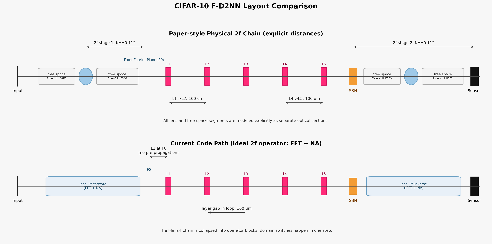
*Figure: CIFAR-10에서 2f 시스템의 physical scaling vs ideal (fftshift only) 비교.*

$$\Delta x_F = \frac{\lambda f}{N \cdot \Delta x}$$

| 목표 | f 선택 기준 |
|---|---|
| Classification (높은 bandwidth) | f를 작게 (1 mm) → 촘촘한 Fourier sampling |
| Saliency (넓은 FOV) | f를 크게 (4 mm) → 넓은 Fourier plane |
| 에너지 효율 | NA와 f의 trade-off 고려 |

**경험칙**: Classification에는 f=1mm이 거의 항상 최적.
f=4mm는 입력 이미지의 공간 주파수 정보를 심각하게 truncate한다.

#### (b) SBN 교정

1. **Saturation intensity**: 입사 광강도에 맞춰 $I_{\text{sat}}$ 교정
   - 시뮬레이션에서 `learnable_saturation=true`가 이를 자동화
   - 실험에서는 bias field($E_{\text{app}}$) 조정으로 유사 효과

2. **Intensity normalization**: Multi-layer SBN 사용 시
   각 층 입사 intensity의 dynamic range를 확인
   - Intensity cascading 문제 발생 시 **bias field 자동 조정** 회로 필요

3. **온도 안정성**: SBN의 광굴절 응답은 온도에 민감
   - 실험실 온도 ±0.5°C 이내 유지 권장

#### (c) Phase Mask 제조

1. **SLM (Spatial Light Modulator)**: 프로토타이핑에 적합
   - Pixel pitch ~10-20 μm → 시뮬레이션의 1 μm보다 크므로 grid 크기 재설계 필요
   - Phase resolution 8-bit (256 levels) → 연속 위상 근사

2. **Photolithography**: 양산에 적합
   - 높은 공간 해상도 (sub-μm)
   - 고정 패턴 → 재학습 불가
   - **Fabrication imprecision**: 논문 Fig S8 → ±0.5μm blur에 robust

3. **3D Printing**: 중간 해상도
   - 두께 변조로 위상 제어
   - 비용 효과적이지만 해상도 제한

#### (d) 정렬 (Alignment)

Phase mask는 2f 시스템의 **정확한 focal plane**에 위치해야 한다.
`layer_spacing_m` 버그에서 확인했듯이,
0.1 mm의 defocus도 성능에 영향을 미칠 수 있다.

6축 정밀 스테이지 권장 ($\Delta z < 10$ μm).

### 7.5A Supplementary Figure S8 재현 및 해석

> [!summary] 재현 상태
> `reports/supp_s8_cls.png`, `reports/supp_s8_cls_summary.json` 생성까지 완료하였다. Baseline 9개를 clean condition으로 학습한 뒤, 테스트 시점에만 fabrication blur와 alignment shift를 가해 민감도를 측정했다. 따라서 본 절은 논문의 S8 프로토콜과 동일하게 "robustness evaluation"을 보고하며, noise-aware training 결과를 보고하는 절이 아니다.

#### (a) 핵심 수치 요약

| 설정 | Baseline | Fabrication $\sigma=1.0$ | Alignment $6\,\mu m$ |
|---|---:|---:|---:|
| Nonlinear Fourier 1L | 0.5815 | 0.1826 | 0.5469 |
| Nonlinear Fourier 2L | 0.7590 | 0.1906 | 0.7243 |
| Nonlinear Fourier 5L | 0.8926 | 0.4071 | 0.8762 |
| Nonlinear Real 1L | 0.8100 | 0.6505 | 0.2501 |
| Nonlinear Real 2L | 0.8998 | 0.8674 | 0.5254 |
| Nonlinear Real 5L | 0.9263 | 0.8940 | 0.6580 |
| Linear Real 1L | 0.5790 | 0.1976 | 0.1632 |
| Linear Real 2L | 0.7764 | 0.2656 | 0.2099 |
| Linear Real 5L | 0.9011 | 0.5282 | 0.4544 |

핵심 관찰은 세 가지다. 첫째, nonlinear Fourier 내부에서는 layer 수가 늘어날수록 baseline과 robustness가 모두 상승했고, 특히 5-layer가 1-layer와 2-layer를 분명히 앞질렀다. 둘째, family 간 비교에서는 논문 문장과 완전히 같은 순위가 나오지 않았다. 이번 실험에서는 5-layer linear real과 5-layer nonlinear real이 baseline 및 fabrication blur에서 더 강했다. 셋째, alignment에서는 Fourier-space가 가장 강했고, fabrication blur에서는 real-space가 현저히 강했다.

#### (b) 광학적 관점

광학적으로 보면 alignment error와 fabrication imprecision은 서로 다른 공간 스케일의 오차다. Alignment는 layer 전체가 한 방향으로 조금 밀리는 전역적 오차이고, fabrication blur는 각 pixel의 위상 패턴이 주변과 섞이며 미세 구조가 사라지는 국소 오차다. Fourier-space D2NN은 2f 시스템을 통해 입력을 공간주파수 도메인으로 옮겨 처리하므로, mask 전체의 소폭 lateral shift는 기능의 본질을 즉시 붕괴시키기보다 출력 평면에서 비교적 완만한 변화로 나타날 수 있다. 반면 Fourier plane에서 사용되는 위상 패턴은 주파수 선택성을 위해 더 세밀한 구조를 필요로 하므로, local blur가 들어가면 핵심 기능을 담당하던 고주파 위상 구조가 빠르게 손실된다.

Real-space D2NN은 반대로 이해할 수 있다. 각 층이 실제 공간상에서 누적 회절과 간섭을 만들며 동작하므로, 층 전체가 밀리면 앞층과 뒷층의 공간적 대응 관계가 깨진다. 따라서 alignment에는 취약하다. 그러나 같은 이유로 패턴 내부의 극도로 미세한 spatial-frequency selectivity에 덜 의존할 수 있고, fabrication blur에는 더 완만한 열화를 보인다. 이번 재현 결과에서 "Fourier는 alignment에 강하고 fabrication에는 약하며, real-space는 그 반대 경향"이 나온 것은 광학적 직관과 대체로 일치한다.

#### (c) 물리학적 관점

본 재현에서 fabrication imprecision은 trained modulation pattern에 `3x3` Gaussian blur를 가하는 방식으로 구현했다. 이는 direct femtosecond laser writing이나 유사 공정에서 인접 pixel 간 crosstalk가 생겨 설계된 미세 구조가 번지는 상황을 근사한다. 물리적으로 더 직접적인 상태변수는 복소 modulation 자체보다도 thickness 혹은 optical path length이며, phase-only mask에서는 결국 위상지연량의 국소 평균화로 해석하는 편이 자연스럽다. 따라서 현재처럼 phase map에 blur를 주는 것은 1차 근사로 타당하지만, 엄밀히는 wrapped phase가 아니라 fabricated height 또는 unwrapped phase delay를 blur하는 구현이 더 물리적이다.

Alignment error 역시 z축 defocus가 아니라 x-y lateral misalignment로 해석하는 것이 맞다. 논문 문장도 "global shifting"을 말하고 있으며, 이는 각 층이 축 방향으로 떨어지는 것이 아니라 평면 내에서 옆으로 밀리는 상황을 뜻한다. 본 구현은 이 중 x축 shift만 사용했으므로, 실제 2D alignment error보다 단순화되어 있다. 그럼에도 Fourier-space가 alignment에 훨씬 강하게 나온 것은, 이 경향 자체가 단순 구현의 산물이기보다 구조적 차이를 반영할 가능성이 높음을 시사한다.

#### (d) 신경망학적 관점

신경망 관점에서 보면 S8은 단순한 "광학계 오차 실험"이 아니라, 표현 학습이 어떤 종류의 perturbation에 대해 불변성을 얻는지 묻는 실험이다. Nonlinear Fourier family 내부에서 1L < 2L < 5L 순서가 baseline, fabrication, alignment 모두에서 유지된 것은, 깊이가 증가하면서 표현력이 단순히 class margin만 키운 것이 아니라 일부 강건성까지 함께 확보했음을 뜻한다. 특히 5-layer Fourier가 2-layer Fourier보다 fabrication과 alignment 양쪽에서 모두 낫다는 점은, 깊은 cascade가 오차를 증폭시키기만 하는 것이 아니라 오히려 redundant feature routing을 형성할 수 있음을 보여준다.

다만 이번 재현에서 nonlinear real 5L가 baseline과 fabrication에 매우 강하게 나온 것은 "real-space가 본질적으로 항상 우세하다"는 뜻으로 읽으면 곤란하다. 현재 nonlinear real 비교군은 S8 전용으로 설계된 config가 아니라 기존 Fig.4/S7 계열 설정을 재사용했다. 즉 `layer_spacing_m=3.0e-3`, `per_layer SBN`, `saturation_intensity=1.0` 조건이 섞여 있다. 반면 nonlinear Fourier는 `layer_spacing_m=1.0e-4`, `rear SBN`, `saturation_intensity=87.0` 계열이다. 따라서 네트워크 성능 차이의 일부는 architecture family의 본질이 아니라 training landscape와 operating point의 차이에서 왔을 가능성이 크다.

#### (e) 회절학적 관점

회절학적으로 fabrication blur는 mask transmittance의 고공간주파수 성분을 제거하는 저역통과 효과다. 특히 Fourier-space mask는 입력의 spatial spectrum을 선택적으로 재배치하거나 차단하는 역할을 수행하므로, 고주파 위상 구조가 무너지면 분류에 필요한 filtering 성질 자체가 사라진다. 따라서 Fourier-space가 fabrication blur에 민감하게 나오는 것은 회절학적으로 자연스럽다.

반대로 alignment shift는 회절 과정에서 완전히 다른 종류의 교란이다. 이상적인 연속계에서 평면 내 translation은 특정 조건에서 출력의 translation 또는 phase ramp와 연결되며, 시스템 기능 전체를 즉시 파괴하지는 않는다. 물론 유한 aperture, pixelation, detector sampling이 있으면 완전한 불변성은 없다. 그럼에도 global shift는 local blur처럼 spatial spectrum을 소거하지 않으므로, Fourier-space mask가 가지는 기능적 역할은 상당 부분 유지될 수 있다. 이번 결과에서 5-layer Fourier가 $6\,\mu m$ shift에서도 0.8762를 유지한 것은 이 해석과 부합한다.

#### (f) 관점 간 종합 판단

광학적 관점은 "전역 shift와 국소 blur의 성격 차이"를 강조하고, 물리학적 관점은 "fabrication은 위상지연량의 번짐이며 alignment는 lateral shift"라는 해석을 지지한다. 신경망 관점은 "깊은 Fourier cascade가 오차 하에서도 분류 margin을 유지하는 방향으로 학습되었다"는 점을 보강하고, 회절학적 관점은 "blur는 spatial spectrum을 지우지만 shift는 주로 위치를 바꾼다"는 메커니즘을 제공한다. 네 관점은 모두 Fourier-space가 alignment에는 강하지만 fabrication blur에는 상대적으로 약할 수 있다는 결론에 수렴한다.

반면 "왜 논문은 5-layer nonlinear Fourier가 5-layer linear real보다 전반적으로 우세하다고 했는데, 이번 결과는 그렇지 않은가"라는 질문에 대해서는 네 관점 모두 같은 답을 준다. 가장 먼저 의심해야 할 것은 perturbation 구현보다 비교군 정의다. 현재 nonlinear real은 S8 전용 조건으로 맞춰진 apples-to-apples 비교군이 아니며, spacing, nonlinearity placement, saturation intensity가 Fourier와 다르다. 따라서 이번 결과는 경향 파악에는 유용하지만, 논문 수치에 대한 최종 판정으로 해석하면 안 된다.

#### (g) 논문과 달라진 이유 및 우선 수정 항목

1. **비교군 config mismatch**: 가장 큰 차이다. nonlinear real family를 S8 전용 조건으로 다시 정의해야 한다.
2. **Alignment의 1D 구현**: 현재 x축 shift만 사용했다. 2D lateral shift로 확장해야 논문 대응성이 높아진다.
3. **Fabrication blur의 적용 도메인**: 현재 phase map blur는 합리적 1차 근사이지만, fabricated height 혹은 unwrapped phase delay blur가 더 물리적이다.
4. **Training recipe 차이**: batch size, data loader, seed 차이는 위 세 가지를 맞춘 뒤 검토하는 것이 우선순위상 맞다.

요약하면, 이번 S8 재현은 "Fourier-space는 alignment robustness, real-space는 fabrication robustness"라는 구조적 메시지를 명확히 보여주었고, nonlinear Fourier 내부의 depth advantage도 재현했다. 그러나 논문과의 잔여 차이는 주로 perturbation 코드 자체보다 비교군의 물리적 조건과 구현 세부 불일치에서 기인한다.

### 7.6 향후 연구 방향

1. **Amplitude + Phase modulation**: 흡수체 도입으로 amplitude 제어
   → Saliency detection 등 공간 구조 재현 task에 적용 가능

2. **Learnable 2f 시스템**: Focal length을 학습 가능 파라미터로 도입
   → Task에 최적인 Fourier sampling을 자동 탐색

3. **Multi-wavelength D2NN**: 여러 파장을 동시 사용
   → 파장 다중화(wavelength division multiplexing)로 throughput 증가

4. **Noise-aware training**: Fabrication imprecision과 alignment error를
   학습 시 augmentation으로 도입 → 물리적 구현의 robustness 향상

5. **대규모 classification**: Detector 수 확장 (10 → 100+)
   → CIFAR-10, Fashion-MNIST 등으로 확장

6. **TF-style FFT normalization**: Unnormalized FFT 전환 실험
   → 공통 gap 0.5-1% 감소 가능성 검증

7. **Attention mechanism 도입**: Phase mask에 self-attention 구조 추가
   → 공간적 context를 고려한 phase modulation

8. **End-to-end 하드웨어 시뮬레이션**: Fabrication imprecision,
   alignment error, detector noise를 training loop에 통합
   → 물리적 구현의 robustness 향상 (논문 Fig S8 확장)

### 7.7 F-D2NN 연구의 현재 위치와 전망

F-D2NN (Tao 2019)은 광학 신경망 분야에서 다음의 위치를 차지한다:

**기여**:
- 2f 렌즈 시스템을 통한 정확한 Fourier 변환 도입
- SBN 광굴절 비선형성의 최초 체계적 적용
- Hybrid (Fourier + Real) 아키텍처의 domain diversity 효과 입증
- MNIST 98.1%로 당시 all-optical classifier 최고 성능

**한계**:
- 10-class 분류에 제한 (detector 수 = class 수)
- Phase-only modulation으로 task 범위 제한
- SBN 비선형성의 느린 응답 시간 (~ms) → 실시간 처리 제한
- 2f 렌즈 시스템의 정밀 정렬 요구

**후속 연구 방향 (2019~2026)**:
- 대규모 classification (100+ class)
- 복소 값(amplitude + phase) modulation
- 빠른 비선형 소재 (Kerr nonlinearity 등)
- On-chip 통합 (photonic integrated circuit)
- Training-aware fabrication (hardware-in-the-loop)

본 재현 프로젝트는 이러한 후속 연구를 위한 **정확한 baseline**을 제공하며,
10가지 암묵지는 물리 시뮬레이션 기반 광학 신경망 연구에서
공통적으로 마주치는 문제들에 대한 **실용적 가이드**가 된다.

---

## Appendix

> [!abstract] Appendix 안내
> Appendix는 본문 이해를 보조하는 **근거 자료와 참조 인덱스**로 구성된다. 새 정리본에서는 `A → J` 순서가 실제 heading과 완전히 일치하도록 정리했고, 대표 그림은 파일명 표보다 먼저 보이도록 재배치했다.

1. [A. 실험 이력 표](#a-실험-이력-표)
2. [B. Configuration 파일 목록](#b-configuration-파일-목록)
3. [C. 코드 아키텍처 다이어그램](#c-코드-아키텍처-다이어그램)
4. [D. 주요 수식 요약](#d-주요-수식-요약-quick-reference)
5. [E. 용어 사전](#e-용어-사전-glossary)
6. [F. 그래프 인덱스](#f-그래프-인덱스)
7. [G. 재현 명령어](#g-재현-명령어)
8. [H. 프로젝트 타임라인](#h-프로젝트-타임라인)
9. [I. 핵심 발견의 영향도 순위](#i-핵심-발견의-영향도-순위)
10. [J. 알려진 한계와 미해결 문제](#j-알려진-한계와-미해결-문제)

### A. 실험 이력 표

> [!example]- A.1 Linear Real 5L
>
> | Run | Epochs | test_acc (last/best) | 비고 |
> |---|---|---|---|
> | 260227_093908 | 30 | 90.37% | 초기 실험 |
> | 260227_094918 | 30 | 90.85% | |
> | 260303_104209 | 30 | 90.37% | deterministic=false 확인 |
> | 260303_150017 | 30 | 90.37% / 91.10% | bg_pert 최종 |
> | **260304_084125** | **30** | **90.37% / 91.10%** | **per_sample_minmax 최종** |

> [!example]- A.2 Linear Fourier 5L (f=1mm)
>
> | Run | Epochs | test_acc (last/best) | 비고 |
> |---|---|---|---|
> | 260227_100736 | 30 | 90.95% | |
> | 260227_113511 | 30 | 90.37% | |
> | 260303_113351 | 7 | 90.89% | 중단 |
> | 260303_155342 | 30 | 90.50% / 91.16% | bg_pert 최종 |
> | **260304_094110** | **30** | **90.50% / 91.16%** | **per_sample_minmax 최종** |

> [!example]- A.3 Nonlinear Real 5L
>
> | Run | Epochs | test_acc | intensity_norm | 비고 |
> |---|---|---|---|---|
> | 260227_095705 | 30 | 94.49% | per_sample_minmax | 초기 |
> | 260227_103345 | 30 | 94.79% | per_sample_minmax | |
> | 260227_154812 | 30 | 92.21% | bg_pert | norm 변경 후 하락 |
> | 260303_152221 | 30 | 92.21% / 92.70% | bg_pert | bg_pert 최종 |
> | **260304_090339** | **30** | **94.71% / 94.86%** | **per_sample_minmax** | **최종** |

> [!example]- A.4 Nonlinear Fourier 5L (f=1mm)
>
> | Run | Epochs | test_acc | intensity_norm | 비고 |
> |---|---|---|---|---|
> | 260303_072811 | 30 | 94.55% | bg_pert | |
> | 260303_161923 | 30 | 94.61% / 94.90% | bg_pert | bg_pert 최종 |
> | **260304_100622** | **30** | **94.82% / 95.18%** | **per_sample_minmax** | **최종** |

> [!failure]- A.5 폐기: f=4mm 실험
>
> | Run | Epochs | test_acc | 비고 |
> |---|---|---|---|
> | 260227_101631 | 30 | 90.15% | f=4mm |
> | 260227_122858 | 30 | 90.22% | f=4mm |
> | 260227_164712 | 30 | 88.39% | f=4mm |
> | 260228_010321 | 30 | 88.39% | f=4mm |
> | 260303_044314 | 30 | 88.30% | f=4mm |
> | 260303_063649 | 30 | 88.95% | f=4mm |
>
> f=4mm에서의 일관된 88~90%는 Section 5.1의 Fourier plane sampling 문제에 의한 것.

> [!example]- A.6 Fig 4(b) — 10L + Hybrid
>
> | Configuration | bs=1024 | bs=10 | 논문 |
> |---|:---:|:---:|:---:|
> | 10L Linear Real | 91.3% | 91.1% | 92.7% |
> | 10L Nonlinear Real | 96.2% | **97.0%** | 96.8% |
> | 5L Hybrid | 95.2% | **96.4%** | 96.4% |
> | 10L Hybrid | 97.7% | **98.4%** | 98.1% |

> [!example]- A.7 Supp S7 — Layer Count & SBN Position
>
> **S7(a)**: 1~5 layer, bs=10, 30 epochs
>
> | Layers | Linear | Single SBN | Multi-SBN |
> |:---:|:---:|:---:|:---:|
> | 1 | 54.7% | 66.1% | 66.1% |
> | 2 | 87.7% | 89.2% | 88.9% |
> | 3 | 89.8% | 92.4% | 92.9% |
> | 4 | 90.4% | 93.9% | 94.6% |
> | 5 | 90.4% | 94.5% | 94.8% |
>
> **S7(b)**: 10L, per-layer SBN, bs=500, 30 epochs
>
> | Configuration | Test Acc |
> |---|:---:|
> | NL Fourier, SBN Front | 96.6% |
> | NL Fourier, SBN Rear | 96.6% |
> | NL Fourier & Real, SBN Front | 97.8% |
> | NL Fourier & Real, SBN Rear | 97.8% |

> [!example]- A.8 Saliency Detection (ECSSD)
>
> | # | 실험 | F_max | SBN | Loss |
> |---|---|:---:|---|---|
> | 1 | Baseline | 0.5461 | on (rear) | MSE |
> | 2 | SBN 튜닝 | 0.5290 | on (per_layer) | MSE |
> | 3 | SBN off + init_scale fix | 0.5551 | off | MSE |
> | 4 | Structured loss | 0.5633 | off | BCE+IoU+Struct+CP |
> | 5 | **IoU dominant** | **0.5663** | off | BCE(0.5)+IoU(5.0)+Struct(0.5)+CP(0.1) |

### B. Configuration 파일 목록

| Config 파일 | Task | 모델 | 비고 |
|---|---|---|---|
| `cls_mnist_linear_real_5l.yaml` | MNIST 분류 | 5L Linear Real | Fig 4(a) |
| `cls_mnist_nonlinear_real_5l.yaml` | MNIST 분류 | 5L NL Real | Fig 4(a) |
| `cls_mnist_linear_fourier_5l_f1mm.yaml` | MNIST 분류 | 5L Linear Fourier | Fig 4(a) |
| `cls_mnist_nonlinear_fourier_5l_f1mm.yaml` | MNIST 분류 | 5L NL Fourier | Fig 4(a) |
| `cls_mnist_linear_real_10l.yaml` | MNIST 분류 | 10L Linear Real | Fig 4(b) |
| `cls_mnist_nonlinear_real_10l.yaml` | MNIST 분류 | 10L NL Real | Fig 4(b) |
| `cls_mnist_hybrid_5l.yaml` | MNIST 분류 | 5L Hybrid | Fig 4(b) |
| `cls_mnist_hybrid_10l.yaml` | MNIST 분류 | 10L Hybrid | Fig 4(b) |
| `s7a_linear_fourier_*.yaml` | S7(a) | 1~5L Linear Fourier | Supp S7 |
| `s7a_nonlinear_fourier_*.yaml` | S7(a) | 1~5L NL Fourier | Supp S7 |
| `s7b_*.yaml` | S7(b) | 10L SBN Front/Rear | Supp S7 |
| `saliency_ecssd_f2mm.yaml` | Saliency | 5L Fourier | Fig 2/3 |
| `saliency_ecssd_f2mm_structured_loss.yaml` | Saliency | 5L Fourier | Structured loss |
| `saliency_ecssd_f2mm_iou_dominant.yaml` | Saliency | 5L Fourier | IoU dominant loss |

> [!example]- B.2 Config YAML 구조 예시
> Nonlinear Fourier 5L (f=1mm, classification)의 config 구조:
>
> ```yaml
> experiment:
>   name: "cls_mnist_nonlinear_fourier_5l_f1mm"
>   seed: 42
>   device: auto
>   deterministic: true
>
> optics:
>   wavelength_m: 532.0e-9       # 532 nm (Nd:YAG 2nd harmonic)
>   grid:
>     nx: 200
>     ny: 200
>     dx_m: 1.0e-6               # 1 μm pixel pitch
>     dy_m: 1.0e-6
>   propagation:
>     method: asm
>     layer_spacing_m: 1.0e-4    # 100 μm (Fourier D2NN)
>     evanescent: mask
>   dual_2f:
>     enabled: true
>     f1_m: 1.0e-3               # f = 1 mm (classification)
>     f2_m: 1.0e-3
>     na1: 0.16
>     na2: 0.16
>     apply_scaling: false
>
> model:
>   type: fd2nn
>   num_layers: 5
>   modulation:
>     kind: phase_only
>     phase_constraint: sigmoid
>     phase_max_rad: 3.14159     # π (classification)
>     init: uniform
>     init_scale: 0.1
>   nonlinearity:
>     enabled: true
>     type: sbn60
>     position: rear              # 마지막 층 뒤 단일 SBN
>     phi_max_rad: 3.14159
>     saturation_intensity: 5.0
>     learnable_saturation: true
>     intensity_norm: per_sample_minmax
>     clamp_negative_perturbation: true
>
> task:
>   name: classification
>   detector:
>     width_um: 12.0
>     layout: "3-4-3"
>
> data:
>   dataset: mnist
>   preprocess:
>     normalize: amplitude
>     upsample: 3
>     pad_to: [200, 200]
>
> training:
>   lr: 0.01
>   batch_size: 10
>   epochs: 30
>   loss: mse
>   optimizer: adam
>
> eval:
>   metric: accuracy
>
> viz:
>   enabled: true
> ```
>
> 이 config가 `schema.py`에 의해 검증된 후,
> `cli/common.py`의 `build_model()`이 `Fd2nnConfig`를 생성하고
> `Fd2nnModel`을 초기화한다.

### C. 코드 아키텍처 다이어그램

```
┌──────────────────────────────────────────────────────────────┐
│                        CLI Layer                             │
│  train_classifier.py  │  train_saliency.py  │  make_figures  │
└───────────┬───────────┴──────────┬──────────┴───────┬────────┘
            │                      │                  │
            ▼                      ▼                  ▼
┌───────────────────────┐  ┌──────────────┐  ┌───────────────┐
│   Config / Schema     │  │   Training   │  │ Visualization │
│  schema.py            │  │  trainer.py  │  │ figure_factory│
│  (YAML validation)    │  │  losses.py   │  │ d2nn_schematic│
│                       │  │  metrics_*.py│  │ layout_specs  │
└───────────┬───────────┘  │  callbacks   │  └───────────────┘
            │              └──────┬───────┘
            ▼                     │
┌──────────────────────────────────────────────────────────────┐
│                       Model Layer                            │
│                                                              │
│  fd2nn.py (Fd2nnModel)                                       │
│    ├── PhaseMask (phase_mask.py)     -- learnable φ          │
│    ├── SBNNonlinearity (nonlinearity_sbn.py) -- η/(1+η)     │
│    ├── _switch_domain()              -- real ↔ fourier       │
│    ├── _propagate()                  -- ASM propagation      │
│    └── _apply_phase_mask()           -- u * exp(jφ)          │
│                                                              │
│  detectors.py                        -- detector regions     │
└───────────┬──────────────────────────────────────────────────┘
            │
            ▼
┌──────────────────────────────────────────────────────────────┐
│                      Optics Layer                            │
│                                                              │
│  fft2c.py    -- fft2c(), ifft2c() (centered ortho FFT)       │
│  asm.py      -- asm_transfer_function(), asm_propagate()     │
│  lens_2f.py  -- lens_2f_forward(), lens_2f_inverse()         │
│  aperture.py -- na_mask() (circular aperture)                │
│  grids.py    -- make_frequency_grid(), make_spatial_grid()   │
│  scaling.py  -- fourier_plane_pitch()                        │
└──────────────────────────────────────────────────────────────┘
            │
            ▼
┌──────────────────────────────────────────────────────────────┐
│                       Data Layer                             │
│  mnist.py  │  ecssd.py  │  davis.py  │  preprocess.py       │
└──────────────────────────────────────────────────────────────┘
```

### D. 주요 수식 요약 (Quick Reference)

| 수식 | 설명 | 사용처 |
|---|---|---|
| $\Delta x_F = \lambda f/(N \Delta x)$ | Fourier plane sampling pitch | 2f 시스템 설계 |
| $\phi = \phi_{\max} \cdot \sigma(w)$ | Phase constraint (sigmoid) | Phase mask |
| $H = \exp(j2\pi z\sqrt{(n/\lambda)^2 - f_x^2 - f_y^2})$ | ASM transfer function | 층간 전파 |
| $\Delta n = \kappa E_{\text{app}} \cdot \eta/(1+\eta)$ | SBN 광굴절 효과 | 비선형성 |
| $\eta = (I - I_0)/I_{\text{sat}}$ | Intensity perturbation | SBN 입력 |
| $I'_{\text{norm}} = (I - I_{\min})/(I_{\max} - I_{\min})$ | Per-sample minmax | SBN 정규화 |
| $\tilde{T} = \eta N / B$ | Gradient noise temperature | Batch size 분석 |
| $N_F = a^2/(\lambda z)$ | Fresnel number | Diffraction regime |
| $f_{\text{cutoff}} = \text{NA}/\lambda$ | NA cutoff frequency | 대역 제한 |
| $\text{Rate} \propto \exp(-\Delta E / T)$ | Kramers escape rate | Local minima 탈출 |

### E. 용어 사전 (Glossary)

| 용어 | 영문 | 설명 |
|---|---|---|
| 회절층 | Diffractive layer | Phase mask가 배치된 광학 면 |
| 광굴절 결정 | Photorefractive crystal | 빛에 의해 굴절률이 변하는 결정 |
| 포화 비선형성 | Saturation nonlinearity | $\eta/(1+\eta)$ 형태의 응답 |
| 공간 주파수 | Spatial frequency | 이미지의 주기적 구조 (lp/mm) |
| 전달 함수 | Transfer function | 시스템의 주파수 응답 |
| 각스펙트럼법 | Angular Spectrum Method | 주파수 영역 전파 방법 |
| 수치 구경 | Numerical Aperture (NA) | 렌즈가 수집하는 빛의 원추각 |
| 위상 마스크 | Phase mask | 빛의 위상을 공간적으로 변조하는 소자 |
| 근거장/원거장 | Near-field / Far-field | Fresnel number 기준 회절 영역 |
| 에너지 라우팅 | Energy routing | 간섭으로 에너지를 특정 영역으로 유도 |

**핵심 설계 결정**:

1. **Optics와 Model의 분리**: 물리 광학 연산(FFT, ASM, 2f)을 독립 모듈로 분리하여
   단위 테스트와 재사용성 확보

2. **Config-driven**: 모든 실험 파라미터가 YAML에 정의되고 `schema.py`가 검증.
   코드 수정 없이 config만으로 다양한 실험 수행 가능.
   이 설계가 focal length, layer spacing, SBN 파라미터 등의 빠른 탐색을 가능하게 했다.

3. **Domain switching**: `_switch_domain()` 메서드가 real ↔ fourier 전환을 추상화.
   이를 통해 fd2nn, real_d2nn, hybrid_d2nn을 **단일 클래스**로 통합.

4. **Transfer function caching**: `asm.py`의 `_TRANSFER_CACHE`가
   동일 파라미터의 transfer function을 캐시하여 반복 계산 방지.

---

> [!quote] 핵심 메시지
> 논문 재현은 단순히 코드를 구현하는 것이 아니라,
> **논문에 쓰여 있지 않은 것들을 발견하는 과정**이다.
> 10가지 암묵지 중 3가지(focal length, SBN normalization, layer_spacing)가
> 없었다면 프로젝트는 실패했을 것이다.
> 나머지 7가지는 잔여 격차를 이해하고
> 향후 연구 방향을 설정하는 데 필수적인 인사이트를 제공한다.

---

*파일 위치*: `tao2019_fourier_space_d2nn/reports/final_report_fd2nn_pdf.md`

### F. 그래프 인덱스

> [!info] 그림 인덱스 사용법
> 후반부 PDF에서는 파일명 표보다 **대표 그림을 먼저 보여주는 편이 이해가 빠르다**. 이 섹션은 실제로 자주 참조되는 그래프를 주제별로 모아 두고, 하단에 원본 파일명 매핑을 짧게 유지한다.


*Figure: 분류 재현, S7 ablation, physical scaling 관련 핵심 그림 요약 시트.*

#### F.1 분류 재현


*Figure: Figure 4(a) 5-layer 4종 configuration 수렴 곡선.*


*Figure: Figure 4(b) bs=10에서 Hybrid가 98.4%까지 도달하는 수렴 곡선.*

#### F.2 Supplementary S7


*Figure: S7(a) layer 수에 따른 성능 변화. Linear 포화와 Multi-SBN 개선이 동시에 보인다.*


*Figure: S7(b)에서 Front ≈ Rear 결과를 확인할 수 있다.*


*Figure: S7(c/d) 1-layer와 5-layer 수렴 곡선 통합.*

#### F.3 Saliency 및 물리 구현 참고


*Figure: ECSSD PR curve. 구조적 개선에도 불구하고 saliency의 구조적 한계가 남는다.*


*Figure: ECSSD qualitative 비교. saliency가 중심부는 포착하지만 경계 복원은 제한적인 모습을 보인다.*


*Figure: physical scaling과 ideal scaling 비교. 7.5절 구현 지침과 직접 연결된다.*

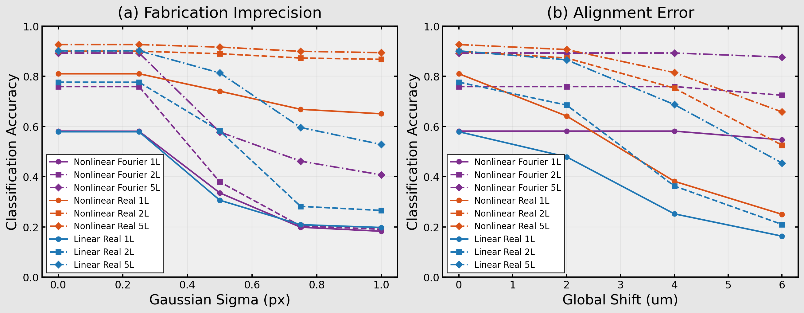
*Figure: Supplementary Figure S8 재현 결과. fabrication blur에는 real-space가, alignment shift에는 Fourier-space가 더 강한 경향이 나타난다.*

#### F.4 원본 파일 빠른 참조

| 파일 | 핵심 용도 | 관련 섹션 |
|---|---|---|
| `fig4a_per_sample_minmax_comparison.png` | Figure 4(a) 핵심 수렴 곡선 | 4.1, F.1 |
| `fig4b_mnist_bs10_convergence.png` | Figure 4(b) 최종 성능 곡선 | 4.2, F.1 |
| `supp_s7a_accuracy_vs_layers.png` | layer 수 ablation | 4.3, 5.5, F.2 |
| `supp_s7b_sbn_position.png` | SBN Front/Rear 비교 | 4.3, 5.4, F.2 |
| `supp_s7cd_mnist_convergence.png` | S7(c/d) 통합 수렴 곡선 | 4.3, F.2 |
| `../inference_results/saliency_ecssd_f2mm_after/pr_curve.png` | saliency 정량 성능 | 4.4, F.3 |
| `../inference_results/saliency_ecssd_f2mm_after/comparison_figure.png` | saliency 정성 비교 | 4.4, F.3 |
| `cifar10_2f_physical_vs_ideal.png` | 물리 구현 scaling 참고 | 7.5, F.3 |
| `supp_s8_cls.png` | S8 robustness 곡선 | 5.6, 7.5A, F.3 |
| `supp_s8_cls_summary.json` | S8 수치 요약 데이터 | 5.6, 7.5A, F.4 |

### G. 재현 명령어

> [!example] 실행 환경
> PyTorch 2.x, CUDA, seed=42 기준. 단일 GPU로 충분하며, 5L 30-epoch 분류 실험은 대략 `~30분 (bs=10)`, `~5분 (bs=1024)` 소요된다.

```bash
# 1. Figure 4(a): 5-Layer 4종 config
python -m tao2019_fd2nn.cli.train_classifier \
  --config src/tao2019_fd2nn/config/cls_mnist_linear_real_5l.yaml
python -m tao2019_fd2nn.cli.train_classifier \
  --config src/tao2019_fd2nn/config/cls_mnist_nonlinear_real_5l.yaml
python -m tao2019_fd2nn.cli.train_classifier \
  --config src/tao2019_fd2nn/config/cls_mnist_linear_fourier_5l_f1mm.yaml
python -m tao2019_fd2nn.cli.train_classifier \
  --config src/tao2019_fd2nn/config/cls_mnist_nonlinear_fourier_5l_f1mm.yaml

# 2. Figure 4(b): 10-Layer + Hybrid
python -m tao2019_fd2nn.cli.train_classifier \
  --config src/tao2019_fd2nn/config/cls_mnist_linear_real_10l.yaml
python -m tao2019_fd2nn.cli.train_classifier \
  --config src/tao2019_fd2nn/config/cls_mnist_nonlinear_real_10l.yaml
python -m tao2019_fd2nn.cli.train_classifier \
  --config src/tao2019_fd2nn/config/cls_mnist_hybrid_5l.yaml
python -m tao2019_fd2nn.cli.train_classifier \
  --config src/tao2019_fd2nn/config/cls_mnist_hybrid_10l.yaml

# 3. Saliency (IoU dominant loss, best result)
python -m tao2019_fd2nn.cli.train_saliency \
  --config src/tao2019_fd2nn/config/saliency_ecssd_f2mm_iou_dominant.yaml
```

### H. 프로젝트 타임라인

> [!note] 타임라인 해석
> 프로젝트는 **11일 동안 핵심 병목을 하나씩 제거하는 형태**로 진행되었다. 특히 `2026-03-02`의 focal length 재해석과 `2026-03-04`의 normalization 채택이 가장 큰 전환점이다.

| 날짜 | 마일스톤 |
|---|---|
| 2026-02-27 | 첫 실험 (f=4mm, 88~90%) |
| 2026-02-28 | f=4mm 반복 실험, 원인 불명 |
| 2026-03-02 | Supplementary 재검토, f=1mm 발견 |
| 2026-03-03 | f=1mm 전환 → 94.55% (breakthrough) |
| 2026-03-03 | bg_pert vs per_sample_minmax 비교 시작 |
| 2026-03-04 | per_sample_minmax 최종 채택 (94.9%) |
| 2026-03-04 | Saliency 실험 시작 (F_max 0.5461) |
| 2026-03-04 | init_scale 버그 발견 및 수정 |
| 2026-03-05 | Supp S7(a/b) 재현 |
| 2026-03-06 | Structured loss 실험 (F_max 0.5663) |
| 2026-03-07 | Supp S7(c/d) 재현 |
| 2026-03-07 | Fig 4(b) bs=10 실험 (98.4%, 논문 초과) |
| 2026-03-09 | 최종 보고서 작성 |

총 프로젝트 기간: **11일** (2026-02-27 ~ 03-09)

### I. 핵심 발견의 영향도 순위

> [!tip] 빠른 해석
> 성능 향상폭 기준 상위 발견은 대부분 “새 기법”보다 **숨은 구현 조건을 바로잡은 것**에 가깝다. 이 점이 본 재현 프로젝트의 핵심 메시지다.

프로젝트 전체에서 발견한 개선/수정 사항을 **성능 영향도 순**으로 정리:

| 순위 | 발견 | 영향도 | 유형 |
|:---:|---|---|---|
| 1 | Focal length f=4mm → f=1mm | **+5~7%** | 파라미터 해석 오류 |
| 2 | SBN per_sample_minmax | **+2.7%** | 구현 세부사항 |
| 3 | Batch size bs=10 | **+0.5~1.2%** | 하이퍼파라미터 |
| 4 | Structured loss (saliency) | **+3.7%** (F_max) | Loss 설계 |
| 5 | layer_spacing_m = 0.0 | **+0.3~0.5%** | Config 버그 |
| 6 | init_scale 버그 수정 | **+1.6%** (F_max) | 코드 버그 |
| 7 | SBN 비활성화 (saliency) | **+1.6%** (F_max) | 아키텍처 결정 |

이 중 **1, 2, 5, 6번이 "버그 수정"**에 해당하며,
이들이 없으면 재현 자체가 불가능했다.

3, 4, 7번은 **"최적화 결정"**에 해당하며,
이들이 재현 품질을 논문 수준으로 끌어올렸다.

> [!important]
> 논문 재현에서 가장 중요한 것은 **정확한 구현**이지,
> 학습률 스케줄러나 data augmentation 같은 고급 기법이 아니다.

### J. 알려진 한계와 미해결 문제

> [!warning] 해석 주의
> 아래 항목은 단순 TODO가 아니라, **현재 성능 격차를 설명하는 잔여 불확실성 목록**이다. 특히 saliency GT, FFT normalization, detector layout은 후속 재현 품질에 직접 영향을 줄 수 있다.

1. **Saliency GT 불일치**: 논문의 co-saliency GT 생성 방법이 정확히 재현되지 않음
2. **FFT normalization**: PyTorch `norm="ortho"` vs TF unnormalized의 gap 미검증
3. **Detector layout**: 논문의 정확한 배치 미확인
4. **Phase initialization**: 최적 init_scale 미탐색
5. **S7(a) data 불완전**: S7(a) 그래프의 논문 원본 데이터와의 정밀 비교 미수행
6. **Fig S8 부분 재현**: Fabrication imprecision/alignment robustness 실험은 완료했으나, nonlinear real 비교군 config와 alignment 2D 구현이 논문과 완전히 맞지 않아 정량적 일치성은 추가 검증이 필요함
7. **Multi-wavelength**: 단일 파장(532nm)만 사용, 다파장 확장 미시도

이 한계들은 향후 연구에서 해소될 수 있으며,
각각의 예상 영향도는 Section 6.3의 격차 기여도 분석 참조.

---

*참조 보고서*:
- `reports/fig4a_5layer_analysis.md` — focal length, SBN normalization, Fig 4(a) 결과
- `reports/batch_size_analysis.md` — gradient noise temperature, Fig 4(b) 결과
- `reports/analysis_s7_physics.md` — S7 분석, SBN position, linear cascade
- `reports/loss_function_experiment_report.md` — saliency loss function 실험
- `inference_results/saliency_ecssd_f2mm_analysis_report.md` — SBN 진단, init_scale 버그
- `reports/supp_s8_cls.png`, `reports/supp_s8_cls_summary.json` — S8 robustness 재현 결과
- `reports/supp_s7ab_summary.json`, `supp_s7cd_summary.json` — S7 수치 데이터
